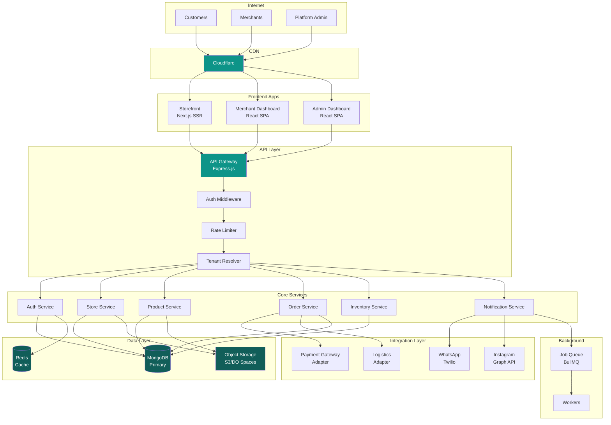
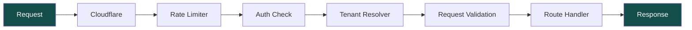
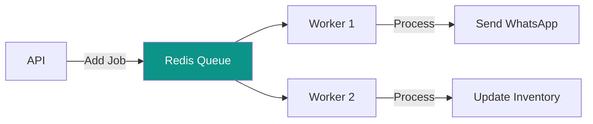
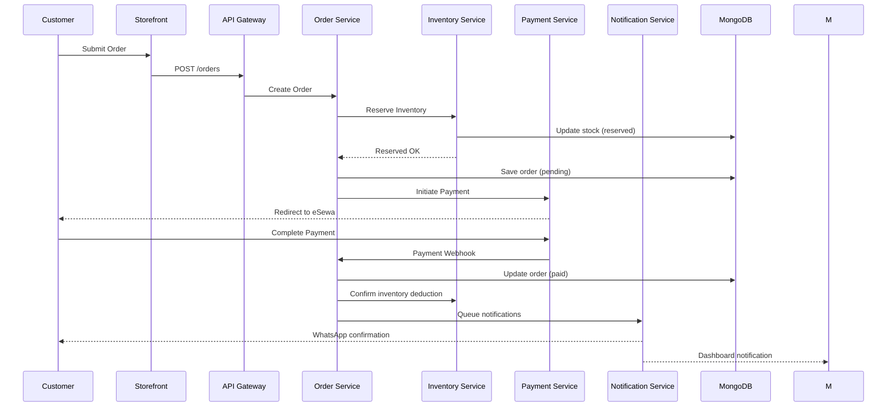
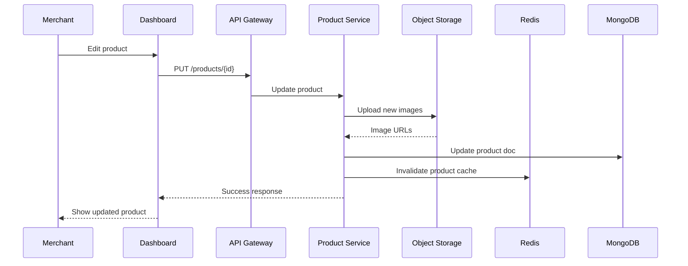
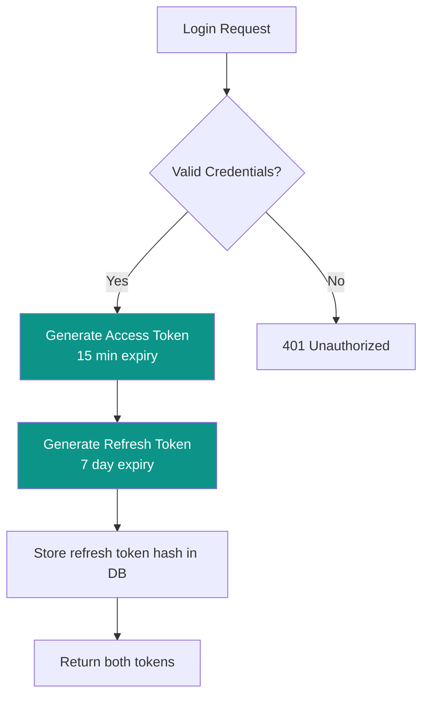

# System Architecture

[← Back to Vision](./vision.md) | [Next: Tech Stack →](./tech-stack.md)

---

## High-Level Architecture



---

## Component Breakdown

### Frontend Layer

| App                    | Technology   | Purpose                | Deployment       |
| ---------------------- | ------------ | ---------------------- | ---------------- |
| **Storefront**         | Next.js 14   | Customer-facing stores | Vercel / Railway |
| **Merchant Dashboard** | React + Vite | Store management       | Static hosting   |
| **Admin Dashboard**    | React + Vite | Platform management    | Static hosting   |

#### Storefront Routing

```
https://{store-slug}.baazarify.com/           → Store homepage
https://{store-slug}.baazarify.com/products   → Product listing
https://{store-slug}.baazarify.com/p/{slug}   → Product detail
https://{store-slug}.baazarify.com/cart       → Shopping cart
https://{store-slug}.baazarify.com/checkout   → Checkout flow
https://custom-domain.com/                    → Custom domain (premium)
```

---

### API Layer

Single Express.js application with modular service structure:

```
/api
├── /auth           → Authentication endpoints
├── /stores         → Store management
├── /products       → Product CRUD
├── /orders         → Order management
├── /inventory      → Stock management
├── /customers      → Customer data
├── /analytics      → Reporting endpoints
├── /integrations   → External service webhooks
└── /admin          → Platform administration
```

#### Middleware Stack



**Tenant Resolution Flow:**

1. Extract subdomain from request host
2. Lookup store by subdomain in Redis cache
3. If cache miss, query MongoDB
4. Attach `storeId` to request context
5. All subsequent queries scoped to tenant

---

### Service Layer

Services are **modules within the monolith**, not separate microservices:

```javascript
// Directory structure
/src
├── /services
│   ├── /auth
│   │   ├── auth.service.js
│   │   ├── auth.controller.js
│   │   └── auth.routes.js
│   ├── /store
│   ├── /product
│   ├── /order
│   ├── /inventory
│   └── /notification
├── /integrations
│   ├── /payment
│   │   ├── payment.adapter.js
│   │   ├── esewa.provider.js
│   │   ├── khalti.provider.js
│   │   └── fonepay.provider.js
│   ├── /logistics
│   └── /messaging
└── /shared
    ├── /middleware
    ├── /utils
    └── /errors
```

---

### Data Layer

#### MongoDB (Primary Database)

- **Shared database** for free/basic/premium/business plans
- **Dedicated database** for platinum/enterprise (isolated)
- All collections indexed on `storeId` for tenant isolation

#### Redis (Cache & Sessions)

| Use Case            | TTL    | Key Pattern                 |
| ------------------- | ------ | --------------------------- |
| Session tokens      | 7 days | `session:{token}`           |
| Store config        | 1 hour | `store:{subdomain}`         |
| Product cache       | 15 min | `products:{storeId}:{page}` |
| Rate limit counters | 1 min  | `ratelimit:{ip}:{endpoint}` |

#### Object Storage (S3/DO Spaces)

```
/baazarify-assets
├── /stores/{storeId}
│   ├── /logo/
│   ├── /favicon/
│   └── /pages/          → Page builder assets
├── /products/{storeId}
│   └── /{productId}/    → Product images
└── /temp/               → Upload staging
```

---

### Background Jobs

Using **BullMQ** with Redis for job queues:

| Queue           | Jobs                                    | Priority |
| --------------- | --------------------------------------- | -------- |
| `notifications` | SMS, WhatsApp, Email                    | High     |
| `orders`        | Status sync, inventory update           | High     |
| `analytics`     | Daily reports, aggregations             | Low      |
| `cleanup`       | Temp file deletion, log rotation        | Low      |
| `sync`          | External service sync (Instagram, etc.) | Medium   |



---

## Request Flow Examples

### Customer Places Order



### Merchant Updates Product



---

## Security Architecture

### Authentication

- **JWT tokens** for API authentication
- **Refresh token rotation** for extended sessions
- **Role-based access control** (RBAC)



### Authorization Roles

| Role             | Scope  | Permissions                 |
| ---------------- | ------ | --------------------------- |
| `platform_admin` | Global | Full platform access        |
| `store_owner`    | Store  | Full store access           |
| `store_manager`  | Store  | Orders, products, customers |
| `store_staff`    | Store  | Orders only                 |
| `customer`       | Store  | Own orders, profile         |

### Data Isolation

```javascript
// Every database query includes tenant scope
const products = await Product.find({
  storeId: req.tenant.id, // Injected by middleware
  status: 'active',
});
```

---

## Scalability Considerations

### MVP (0-50 stores)

- Single server deployment
- Shared MongoDB instance
- Single Redis instance

### Growth (50-500 stores)

- Horizontal API scaling (2-3 instances)
- MongoDB replica set
- Redis cluster for sessions

### Scale (500+ stores)

- Kubernetes deployment
- Dedicated MongoDB for enterprise tenants
- CDN for static assets
- Read replicas for analytics queries

---

[Next: Tech Stack →](./tech-stack.md)
