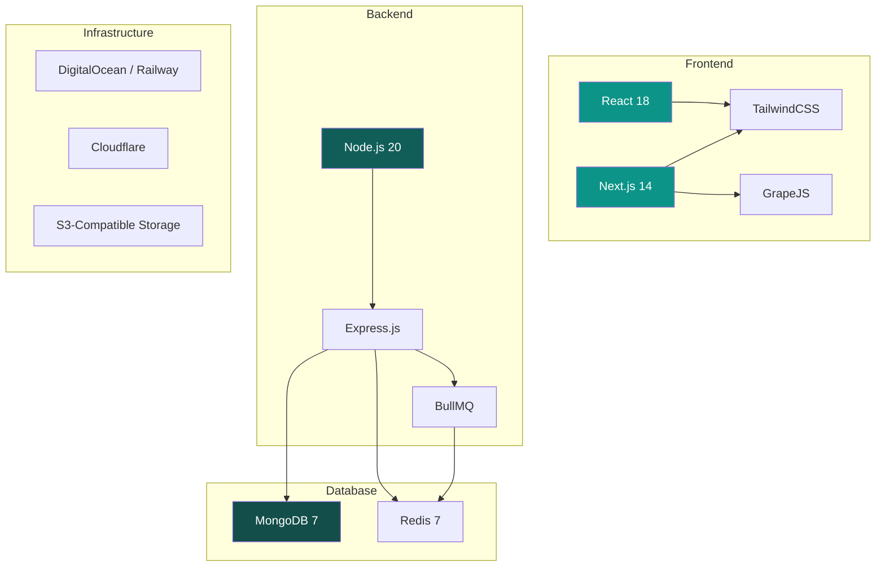
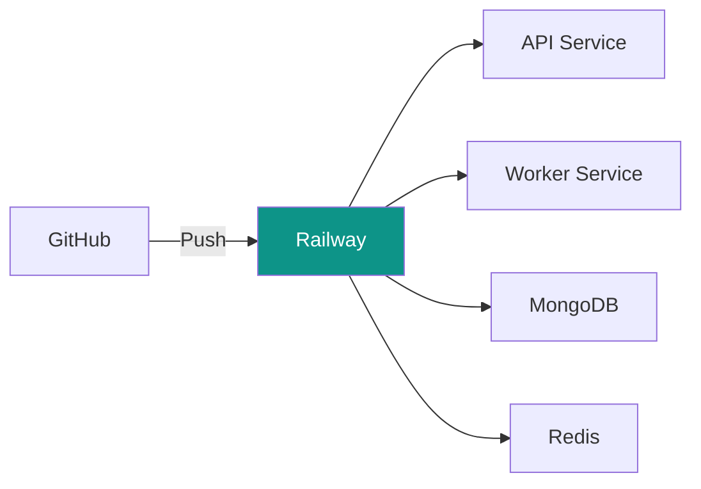
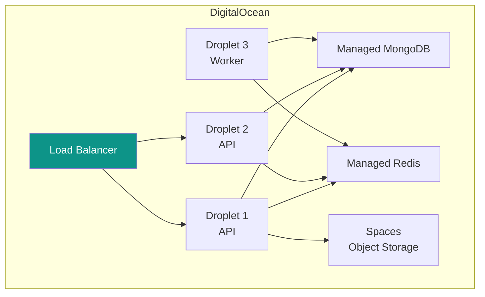

# Technology Stack

[← Back to Architecture](./architecture.md) | [Next: Database Schema →](../02-database/schema.md)

---

## Stack Overview



---

## Frontend Stack

### React 18

**Why React:**

- Large ecosystem and community
- Familiar to most developers (easy to hire)
- Excellent tooling (React DevTools, testing libraries)
- Component-based architecture fits our needs

**Key Libraries:**

| Library                 | Purpose                 |
| ----------------------- | ----------------------- |
| `react-router-dom`      | Client-side routing     |
| `@tanstack/react-query` | Server state management |
| `zustand`               | Client state management |
| `react-hook-form`       | Form handling           |
| `zod`                   | Schema validation       |

### Next.js 14 (Storefront Only)

**Why Next.js for Storefront:**

- Server-side rendering for SEO (product pages need to be indexed)
- Automatic code splitting
- Image optimization built-in
- Edge caching for fast global delivery

**Why NOT Next.js for Dashboard:**

- Dashboard doesn't need SEO
- SPA is simpler for authenticated apps
- Faster development iteration

### TailwindCSS

**Why Tailwind:**

- Rapid UI development
- Consistent design system
- Small production bundle (purged CSS)
- Works great with component libraries

**Supporting UI Libraries:**

| Library             | Purpose                  |
| ------------------- | ------------------------ |
| `@headlessui/react` | Accessible UI primitives |
| `lucide-react`      | Icon library             |
| `recharts`          | Analytics charts         |
| `@dnd-kit/core`     | Drag and drop            |

### GrapeJS (Page Builder)

**Why GrapeJS:**

- Mature, battle-tested (used by Mailchimp, others)
- Extensible block system
- Storage adapter for any backend
- Active community and documentation

**Custom Blocks We'll Create:**

```javascript
const ecommerceBlocks = [
  'product-grid',
  'product-card',
  'featured-product',
  'category-list',
  'cart-widget',
  'checkout-button',
  'hero-banner',
  'testimonials',
  'store-info',
  'contact-form',
];
```

---

## Backend Stack

### Node.js 20 LTS

**Why Node.js:**

- JavaScript everywhere (frontend + backend)
- Excellent for I/O-heavy workloads (our use case)
- Huge npm ecosystem
- Easy to find developers in Nepal

**Runtime Configuration:**

```json
{
  "node": "20.x",
  "packageManager": "pnpm@8.x"
}
```

### Express.js

**Why Express (vs. Fastify, Koa, etc.):**

- Most popular, well-documented
- Massive middleware ecosystem
- Simple mental model
- Good enough performance for our scale

**Express Setup:**

```javascript
// Key middleware stack
app.use(helmet()); // Security headers
app.use(cors(corsOptions)); // CORS handling
app.use(compression()); // Gzip responses
app.use(express.json()); // JSON parsing
app.use(rateLimiter); // Rate limiting
app.use(tenantResolver); // Multi-tenancy
app.use(authMiddleware); // JWT verification
```

### BullMQ (Job Queue)

**Why BullMQ:**

- Redis-backed (already using Redis)
- Reliable job processing with retries
- Dashboard for monitoring (Bull Board)
- Priority queues, rate limiting

**Queue Configuration:**

```javascript
const queues = {
  notifications: { priority: 1, attempts: 3 },
  orders: { priority: 1, attempts: 5 },
  analytics: { priority: 3, attempts: 2 },
  sync: { priority: 2, attempts: 3 },
};
```

---

## Database Stack

### MongoDB 7

**Why MongoDB:**

- Flexible schema (good for evolving product)
- Native JSON (matches our API responses)
- Good for document-heavy data (products, orders)
- Easy horizontal scaling when needed
- Strong Node.js driver

**Configuration:**

```javascript
// Connection options
{
  maxPoolSize: 50,
  minPoolSize: 10,
  maxIdleTimeMS: 30000,
  retryWrites: true,
  w: 'majority'
}
```

**Indexing Strategy:**

```javascript
// Every tenant collection has compound index
{ storeId: 1, createdAt: -1 }
{ storeId: 1, status: 1 }
{ storeId: 1, slug: 1 }  // Unique within store
```

### Redis 7

**Why Redis:**

- Fast in-memory cache
- Session storage
- BullMQ job queue backend
- Pub/sub for real-time features (future)

**Memory Planning:**

| Use Case                   | Estimated Memory |
| -------------------------- | ---------------- |
| Sessions (1000 concurrent) | ~50 MB           |
| Store cache (500 stores)   | ~25 MB           |
| Rate limiting              | ~10 MB           |
| Job queues                 | ~50 MB           |
| **Total**                  | **~150 MB**      |

---

## Infrastructure Stack

### Hosting Options

#### MVP: Railway



**Why Railway for MVP:**

- Simple deployment from Git
- Managed MongoDB and Redis
- Automatic HTTPS
- Reasonable pricing (~$20-50/month)

#### Scale: DigitalOcean



### CDN: Cloudflare

**Why Cloudflare:**

- Free tier is generous
- DDoS protection
- SSL termination
- Edge caching for static assets
- DNS management

**Caching Strategy:**

| Content Type                    | Cache Duration     |
| ------------------------------- | ------------------ |
| Static assets (JS, CSS, images) | 1 year             |
| Product images                  | 1 week             |
| API responses                   | No cache (dynamic) |
| Storefront pages                | 5 min (edge)       |

### Object Storage: S3-Compatible

**Options:**

- DigitalOcean Spaces (preferred - cheaper)
- AWS S3
- Cloudflare R2

**Bucket Structure:**

```
baazarify-assets/
├── stores/
│   └── {storeId}/
│       ├── logo/
│       ├── favicon/
│       └── pages/
├── products/
│   └── {storeId}/
│       └── {productId}/
└── temp/
```

---

## Development Tools

### Code Quality

| Tool        | Purpose           |
| ----------- | ----------------- |
| ESLint      | Linting           |
| Prettier    | Code formatting   |
| Husky       | Git hooks         |
| lint-staged | Pre-commit checks |

### Testing

| Tool       | Purpose               |
| ---------- | --------------------- |
| Vitest     | Unit tests            |
| Supertest  | API integration tests |
| Playwright | E2E tests             |
| MSW        | API mocking           |

### Monitoring (Post-MVP)

| Tool            | Purpose           |
| --------------- | ----------------- |
| Sentry          | Error tracking    |
| Logtail         | Log aggregation   |
| UptimeRobot     | Uptime monitoring |
| Railway Metrics | Basic metrics     |

---

## Version Decisions

| Technology | Version | Reason                       |
| ---------- | ------- | ---------------------------- |
| Node.js    | 20 LTS  | Long-term support until 2026 |
| React      | 18.x    | Stable, concurrent features  |
| Next.js    | 14.x    | App Router stable            |
| MongoDB    | 7.x     | Latest features              |
| Redis      | 7.x     | Latest stable                |
| Express    | 4.x     | Stable, v5 still RC          |

---

## Alternatives Considered

### Why Not Microservices?

- **Complexity** — Overkill for solo developer
- **Latency** — Inter-service communication overhead
- **Deployment** — Managing multiple services is harder
- **Debugging** — Distributed tracing is complex

**Decision:** Modular monolith. Services are code modules, not separate deployments.

### Why Not PostgreSQL?

- **Schema migrations** — More friction during rapid iteration
- **JSON handling** — MongoDB is more natural for our document-heavy data
- **Scaling** — MongoDB sharding is simpler than Postgres partitioning

**Decision:** MongoDB for flexibility. Can always add Postgres for specific needs later.

### Why Not Serverless?

- **Cold starts** — Bad for user experience
- **Complexity** — Lambda + API Gateway setup is more complex
- **Cost** — Can be expensive at scale
- **Vendor lock-in** — Harder to migrate

**Decision:** Traditional server deployment. Simpler, more predictable.

---

[Next: Database Schema →](../02-database/schema.md)
