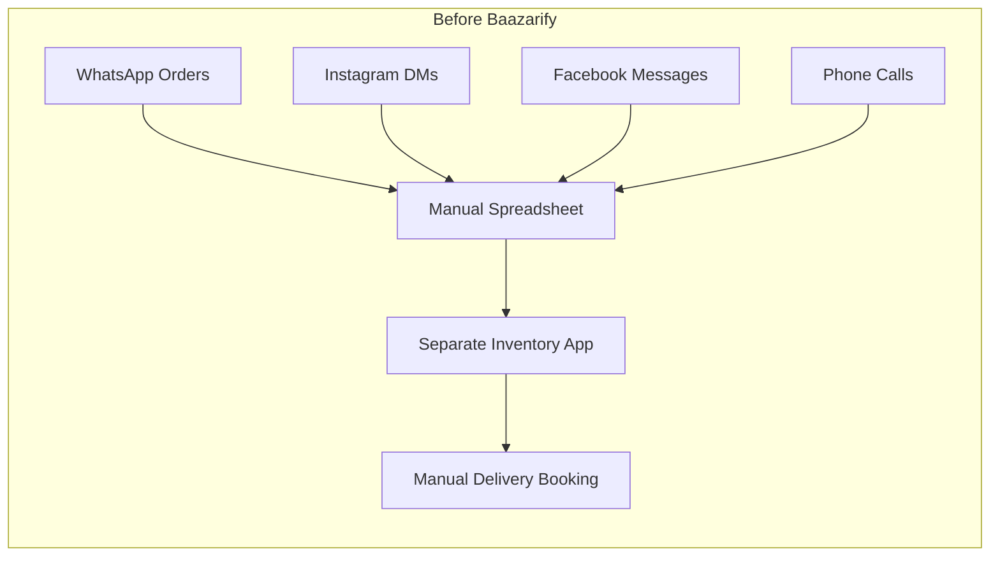
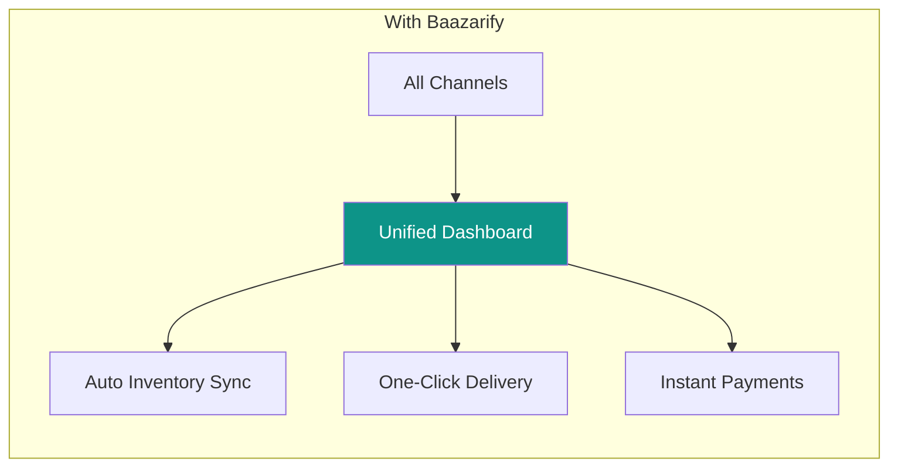

# Product Vision

[← Back to Index](../index.md) | [Next: Architecture →](./architecture.md)

---

## The Problem

Small businesses in Nepal face significant barriers to selling online:

1. **Technical Complexity** — Existing platforms (WooCommerce, Shopify) require technical knowledge
2. **Fragmented Tools** — Merchants juggle WhatsApp, Instagram, spreadsheets, separate inventory apps
3. **Payment Friction** — International platforms don't support Nepali payment gateways
4. **Logistics Gap** — No integrated shipping with local delivery partners
5. **Cost** — International SaaS pricing is prohibitive for small Nepali businesses

---

## The Solution

Baazarify is an **all-in-one e-commerce platform** designed specifically for Nepal:

---

## Target Users

### Primary: Small-Medium Online Sellers

- **Who**: Individuals and small teams selling on social media
- **Size**: 10-500 orders/month
- **Pain**: Managing orders across WhatsApp, Instagram, manually tracking inventory
- **Goal**: Professional online presence without hiring developers

### Secondary: Growing D2C Brands

- **Who**: Established businesses wanting to scale
- **Size**: 500-5000 orders/month
- **Pain**: Outgrowing manual processes, need automation
- **Goal**: Streamlined operations, analytics, multiple staff accounts

### Tertiary: Enterprise Retailers

- **Who**: Large retailers with physical + online presence
- **Size**: 5000+ orders/month
- **Pain**: Need POS integration, dedicated infrastructure
- **Goal**: Unified commerce across all channels

---

## Success Metrics

| Metric | MVP Target | Year 1 Target |
|--------|------------|---------------|
| Active Stores | 50 | 500 |
| Monthly Orders Processed | 5,000 | 100,000 |
| Merchant Retention (90-day) | 60% | 75% |
| Average Store Monthly GMV | NPR 50,000 | NPR 100,000 |
| Platform Uptime | 99% | 99.5% |

---

## Competitive Landscape

| Platform | Strengths | Weaknesses |
|----------|-----------|------------|
| **Blanxer** | Local focus, established | Limited customization |
| **Shopify** | Powerful, extensive apps | Expensive, no NPR payments |
| **WooCommerce** | Flexible, open source | Requires technical skills |
| **Daraz Seller** | Large marketplace traffic | High commission, no branding |

### Baazarify Differentiation

1. **Superior Page Builder** — GrapeJS-powered drag-and-drop (vs. limited themes)
2. **Unified Messaging** — WhatsApp + Instagram in one inbox
3. **Fair Pricing** — NPR-based pricing, no percentage commission
4. **Developer-Friendly** — API access, webhooks, custom integrations

---

## Product Principles

### 1. Zero to Selling in 10 Minutes

A new merchant should be able to:
- Sign up
- Add first product
- Share store link
- Receive first order

All within 10 minutes, no technical knowledge required.

### 2. Mobile-First Dashboard

The merchant dashboard must be fully functional on mobile. Many Nepali merchants manage their business entirely from their phone.

### 3. Works on Slow Internet

- Optimistic UI updates
- Offline queue for actions
- Compressed images
- Minimal JavaScript payload

### 4. Nepali Language Support

- Full UI translation in Nepali
- Nepali Rupee formatting
- Local date/time formats
- Nepali keyboard support for product descriptions

---

[Next: Architecture →](./architecture.md)
