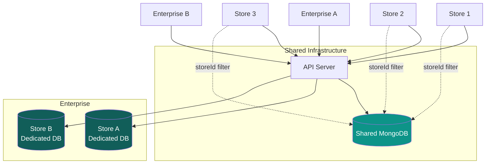
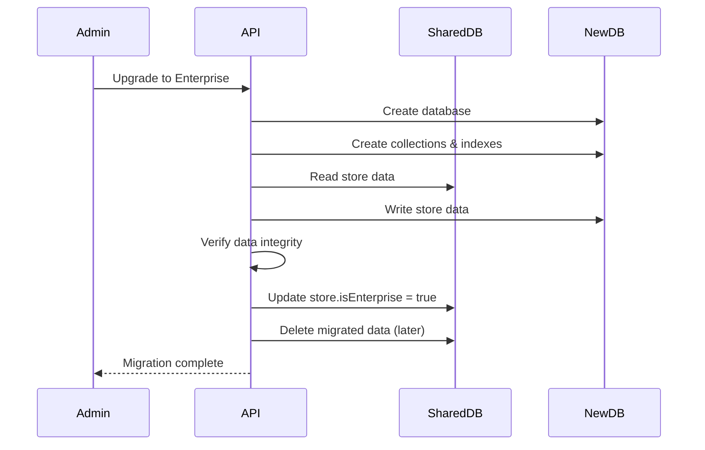

# Multi-Tenancy Strategy

[← Back to Indexing](./indexing.md) | [Next: API Overview →](../03-api/overview.md)

---

## Overview

Baazarify uses a **hybrid multi-tenancy** model:

| Tier                | Isolation          | Use Case                      |
| ------------------- | ------------------ | ----------------------------- |
| Free → Business     | Shared Database    | 95% of merchants              |
| Platinum/Enterprise | Dedicated Database | High-volume, compliance needs |



---

## Shared Database (Default)

### How It Works

All tenant data lives in the same collections, isolated by `storeId`:

```javascript
// Products collection contains all stores' products
{
  _id: ObjectId('...'),
  storeId: ObjectId('store_1'),  // Tenant identifier
  name: 'Product A',
  // ...
}
{
  _id: ObjectId('...'),
  storeId: ObjectId('store_2'),  // Different tenant
  name: 'Product B',
  // ...
}
```

### Tenant Resolution

```javascript
// middleware/tenantResolver.js
const tenantResolver = async (req, res, next) => {
  // Extract subdomain from host
  // e.g., "mystore.baazarify.com" → "mystore"
  const host = req.hostname;
  const subdomain = extractSubdomain(host);

  // Check Redis cache first
  let store = await redis.get(`store:${subdomain}`);

  if (!store) {
    // Cache miss - query database
    store = await Store.findOne({
      $or: [{ subdomain }, { customDomain: host }],
      status: 'active',
    });

    if (store) {
      // Cache for 1 hour
      await redis.setex(`store:${subdomain}`, 3600, JSON.stringify(store));
    }
  } else {
    store = JSON.parse(store);
  }

  if (!store) {
    return res.status(404).json({ error: 'Store not found' });
  }

  // Attach to request
  req.tenant = {
    id: store._id,
    subdomain: store.subdomain,
    plan: store.plan,
    isEnterprise: store.isEnterprise,
    dedicatedDb: store.dedicatedDb,
  };

  next();
};
```

### Query Scoping

Every database query is automatically scoped to the tenant:

```javascript
// services/product.service.js
class ProductService {
  constructor(tenantId) {
    this.tenantId = tenantId;
  }

  async findAll(filters = {}) {
    return Product.find({
      storeId: this.tenantId, // Always scoped
      ...filters,
    });
  }

  async findById(id) {
    return Product.findOne({
      _id: id,
      storeId: this.tenantId, // Prevents cross-tenant access
    });
  }

  async create(data) {
    return Product.create({
      ...data,
      storeId: this.tenantId, // Auto-assign tenant
    });
  }
}
```

### Security: Preventing Cross-Tenant Access

```javascript
// middleware/tenantSecurity.js
const tenantSecurity = (model) => {
  // Pre-find hook: Always add storeId filter
  model.schema.pre(/^find/, function () {
    if (this._tenantId) {
      this.where({ storeId: this._tenantId });
    }
  });

  // Pre-save hook: Always set storeId
  model.schema.pre('save', function (next) {
    if (this._tenantId && !this.storeId) {
      this.storeId = this._tenantId;
    }
    next();
  });

  // Prevent updates without storeId
  model.schema.pre(/^update/, function () {
    if (this._tenantId) {
      this.where({ storeId: this._tenantId });
    }
  });
};
```

---

## Dedicated Database (Enterprise)

### When to Use

- **High volume**: 10,000+ orders/month
- **Compliance**: Data isolation requirements
- **Performance**: Dedicated resources
- **Custom features**: Schema modifications

### How It Works

```javascript
// Database connection manager
class DatabaseManager {
  constructor() {
    this.connections = new Map();
    this.sharedDb = mongoose.createConnection(process.env.SHARED_DB_URI);
  }

  async getConnection(tenant) {
    if (!tenant.isEnterprise) {
      return this.sharedDb;
    }

    // Check existing connection
    if (this.connections.has(tenant.dedicatedDb)) {
      return this.connections.get(tenant.dedicatedDb);
    }

    // Create new connection
    const uri = `${process.env.MONGODB_BASE_URI}/${tenant.dedicatedDb}`;
    const connection = await mongoose.createConnection(uri);

    this.connections.set(tenant.dedicatedDb, connection);
    return connection;
  }

  async closeConnection(dbName) {
    if (this.connections.has(dbName)) {
      await this.connections.get(dbName).close();
      this.connections.delete(dbName);
    }
  }
}
```

### Provisioning New Enterprise Database

```javascript
// services/enterprise.service.js
const provisionEnterpriseDb = async (storeId) => {
  const store = await Store.findById(storeId);
  const dbName = `baazarify_${store.slug}`;

  // Create database with collections
  const conn = await mongoose.createConnection(`${process.env.MONGODB_BASE_URI}/${dbName}`);

  // Create collections with indexes
  await createCollections(conn);
  await createIndexes(conn);

  // Migrate data from shared DB
  await migrateStoreData(store._id, conn);

  // Update store record
  await Store.updateOne(
    { _id: storeId },
    {
      isEnterprise: true,
      dedicatedDb: dbName,
    }
  );

  // Clear from shared DB (after verification)
  // await cleanupSharedData(store._id);

  return dbName;
};
```

---

## Data Migration (Shared → Dedicated)



### Migration Script

```javascript
const migrateToEnterprise = async (storeId) => {
  const collections = [
    'products',
    'categories',
    'customers',
    'orders',
    'inventory',
    'conversations',
  ];

  const store = await Store.findById(storeId);
  const targetDb = mongoose.connection.useDb(store.dedicatedDb);

  for (const collName of collections) {
    const sourceModel = mongoose.model(collName);
    const targetColl = targetDb.collection(collName);

    // Stream data to avoid memory issues
    const cursor = sourceModel.find({ storeId }).cursor();

    const batch = [];
    const BATCH_SIZE = 1000;

    for await (const doc of cursor) {
      batch.push(doc.toObject());

      if (batch.length >= BATCH_SIZE) {
        await targetColl.insertMany(batch);
        batch.length = 0;
      }
    }

    // Insert remaining
    if (batch.length > 0) {
      await targetColl.insertMany(batch);
    }

    console.log(`Migrated ${collName}`);
  }
};
```

---

## Cross-Tenant Operations (Admin Only)

Platform admins need to query across all tenants:

```javascript
// middleware/adminAccess.js
const adminAccess = (req, res, next) => {
  if (req.user.role !== 'platform_admin') {
    return res.status(403).json({ error: 'Admin only' });
  }

  // Remove tenant scoping for admin
  req.skipTenantScope = true;
  next();
};

// Usage in service
class AdminService {
  async getAllStores(filters) {
    // No storeId filter - queries all
    return Store.find(filters);
  }

  async getGlobalStats() {
    return Order.aggregate([
      // No $match on storeId
      {
        $group: {
          _id: null,
          totalOrders: { $sum: 1 },
          totalRevenue: { $sum: '$totals.total' },
        },
      },
    ]);
  }
}
```

---

## Tenant Limits Enforcement

```javascript
// middleware/planLimits.js
const checkPlanLimits = (resource) => async (req, res, next) => {
  const store = await Store.findById(req.tenant.id);
  const limits = PLAN_LIMITS[store.plan];

  switch (resource) {
    case 'products':
      const productCount = await Product.countDocuments({
        storeId: req.tenant.id,
      });
      if (productCount >= limits.products) {
        return res.status(403).json({
          error: 'Product limit reached',
          limit: limits.products,
          current: productCount,
          upgrade: true,
        });
      }
      break;

    case 'staff':
      const staffCount = await User.countDocuments({
        storeId: req.tenant.id,
        role: 'staff',
      });
      if (staffCount >= limits.staff) {
        return res.status(403).json({
          error: 'Staff limit reached',
          limit: limits.staff,
        });
      }
      break;

    case 'orders':
      const monthStart = startOfMonth(new Date());
      const orderCount = await Order.countDocuments({
        storeId: req.tenant.id,
        createdAt: { $gte: monthStart },
      });
      if (orderCount >= limits.ordersPerMonth) {
        return res.status(403).json({
          error: 'Monthly order limit reached',
        });
      }
      break;
  }

  next();
};

// Plan limits configuration
const PLAN_LIMITS = {
  free: { products: 15, staff: 1, ordersPerMonth: 50 },
  basic: { products: 1000, staff: 5, ordersPerMonth: 10000 },
  premium: { products: 2500, staff: 25, ordersPerMonth: 50000 },
  business: { products: 3000, staff: 25, ordersPerMonth: 75000 },
  platinum: { products: 5000, staff: 50, ordersPerMonth: Infinity },
  enterprise: { products: Infinity, staff: Infinity, ordersPerMonth: Infinity },
};
```

---

## Cache Isolation

```javascript
// Redis key patterns include tenant ID
const cacheKeys = {
  store: (subdomain) => `store:${subdomain}`,
  products: (storeId, page) => `products:${storeId}:${page}`,
  product: (storeId, slug) => `product:${storeId}:${slug}`,
  categories: (storeId) => `categories:${storeId}`,
  cart: (storeId, sessionId) => `cart:${storeId}:${sessionId}`,
};

// Cache invalidation on update
const invalidateProductCache = async (storeId) => {
  const pattern = `products:${storeId}:*`;
  const keys = await redis.keys(pattern);
  if (keys.length > 0) {
    await redis.del(keys);
  }
};
```

---

## Testing Multi-Tenancy

```javascript
describe('Multi-tenancy', () => {
  let store1, store2;

  beforeEach(async () => {
    store1 = await createTestStore({ subdomain: 'store1' });
    store2 = await createTestStore({ subdomain: 'store2' });
  });

  it('prevents cross-tenant product access', async () => {
    const product = await Product.create({
      storeId: store1._id,
      name: 'Test Product',
    });

    // Access with correct tenant
    const found = await Product.findOne({
      _id: product._id,
      storeId: store1._id,
    });
    expect(found).toBeTruthy();

    // Access with wrong tenant
    const notFound = await Product.findOne({
      _id: product._id,
      storeId: store2._id,
    });
    expect(notFound).toBeNull();
  });

  it('isolates order counts between tenants', async () => {
    await Order.create({ storeId: store1._id, orderNumber: '001' });
    await Order.create({ storeId: store1._id, orderNumber: '002' });
    await Order.create({ storeId: store2._id, orderNumber: '001' });

    const store1Count = await Order.countDocuments({ storeId: store1._id });
    const store2Count = await Order.countDocuments({ storeId: store2._id });

    expect(store1Count).toBe(2);
    expect(store2Count).toBe(1);
  });
});
```

---

[Next: API Overview →](../03-api/overview.md)
