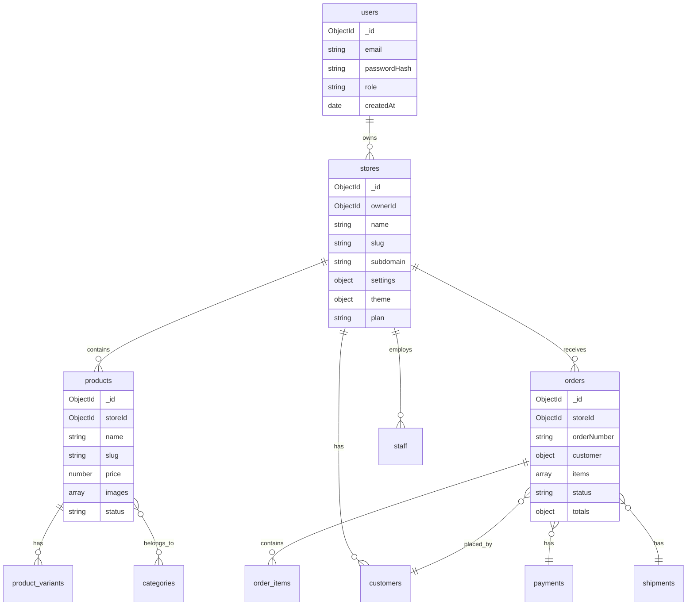

# Database Schema

[← Back to Tech Stack](../01-overview/tech-stack.md) | [Next: Indexing Strategy →](./indexing.md)

---

## Schema Overview



---

## Collections

### users

Platform users (merchants, staff, admins).

```javascript
{
  _id: ObjectId,
  email: String,              // unique, indexed
  passwordHash: String,
  role: {
    type: String,
    enum: ['platform_admin', 'merchant', 'staff']
  },
  profile: {
    firstName: String,
    lastName: String,
    phone: String,
    avatar: String            // URL
  },
  storeId: ObjectId,          // null for platform admins
  permissions: [String],      // for staff: ['orders.read', 'orders.write']
  emailVerified: Boolean,
  lastLoginAt: Date,
  createdAt: Date,
  updatedAt: Date
}
```

**Indexes:**
```javascript
{ email: 1 }                  // unique
{ storeId: 1, role: 1 }
```

---

### stores

Merchant stores (tenants).

```javascript
{
  _id: ObjectId,
  ownerId: ObjectId,          // ref: users

  // Identity
  name: String,
  slug: String,               // unique, URL-safe
  subdomain: String,          // unique, {subdomain}.baazarify.com
  customDomain: String,       // premium feature

  // Plan & Limits
  plan: {
    type: String,
    enum: ['free', 'basic', 'premium', 'business', 'platinum', 'enterprise']
  },
  limits: {
    products: Number,         // max products allowed
    orders: Number,           // max orders per month
    staff: Number             // max staff accounts
  },
  billing: {
    customerId: String,       // payment provider customer ID
    subscriptionId: String,
    currentPeriodEnd: Date,
    status: String            // 'active', 'past_due', 'cancelled'
  },

  // Settings
  settings: {
    currency: { type: String, default: 'NPR' },
    timezone: { type: String, default: 'Asia/Kathmandu' },
    language: { type: String, default: 'en' },
    logo: String,             // URL
    favicon: String,          // URL
    contactEmail: String,
    contactPhone: String,
    address: {
      street: String,
      city: String,
      state: String,
      country: { type: String, default: 'Nepal' }
    },
    socialLinks: {
      facebook: String,
      instagram: String,
      tiktok: String
    }
  },

  // Theme & Design
  theme: {
    templateId: String,
    colors: {
      primary: String,
      secondary: String,
      accent: String,
      background: String,
      text: String
    },
    fonts: {
      heading: String,
      body: String
    }
  },

  // Page Builder Data
  pages: [{
    slug: String,             // 'home', 'about', 'contact', etc.
    title: String,
    content: Object,          // GrapeJS JSON
    isPublished: Boolean,
    updatedAt: Date
  }],

  // Integrations
  integrations: {
    payment: {
      esewa: { enabled: Boolean, merchantId: String, secretKey: String },
      khalti: { enabled: Boolean, publicKey: String, secretKey: String },
      fonepay: { enabled: Boolean, merchantCode: String }
    },
    logistics: {
      pathao: { enabled: Boolean, apiKey: String },
      dash: { enabled: Boolean, apiKey: String }
    },
    messaging: {
      whatsapp: { enabled: Boolean, phoneNumberId: String, accessToken: String },
      instagram: { enabled: Boolean, pageId: String, accessToken: String }
    },
    analytics: {
      googleAnalytics: String,
      facebookPixel: String
    }
  },

  // Multi-tenancy
  isEnterprise: { type: Boolean, default: false },
  dedicatedDb: String,        // database name if enterprise

  // Stats (denormalized for quick access)
  stats: {
    totalProducts: Number,
    totalOrders: Number,
    totalRevenue: Number,
    lastOrderAt: Date
  },

  status: {
    type: String,
    enum: ['active', 'suspended', 'pending_setup'],
    default: 'pending_setup'
  },
  createdAt: Date,
  updatedAt: Date
}
```

**Indexes:**
```javascript
{ slug: 1 }                   // unique
{ subdomain: 1 }              // unique
{ customDomain: 1 }           // unique, sparse
{ ownerId: 1 }
{ plan: 1, status: 1 }
```

---

### products

Store products.

```javascript
{
  _id: ObjectId,
  storeId: ObjectId,          // indexed, required

  // Basic Info
  name: String,
  slug: String,               // unique within store
  description: String,        // rich text / markdown
  shortDescription: String,

  // Pricing
  price: Number,              // in NPR
  compareAtPrice: Number,     // original price for showing discounts
  costPrice: Number,          // for profit calculation

  // Media
  images: [{
    url: String,
    alt: String,
    position: Number
  }],

  // Variants (if applicable)
  hasVariants: Boolean,
  variants: [{
    _id: ObjectId,
    name: String,             // "Red / Large"
    sku: String,
    price: Number,            // override base price
    stock: Number,
    attributes: [{
      name: String,           // "Color"
      value: String           // "Red"
    }]
  }],

  // If no variants, track stock directly
  sku: String,
  stock: Number,
  trackInventory: Boolean,
  allowBackorder: Boolean,

  // Organization
  categories: [ObjectId],     // ref: categories
  tags: [String],

  // SEO
  seo: {
    title: String,
    description: String,
    keywords: [String]
  },

  // Status
  status: {
    type: String,
    enum: ['draft', 'active', 'archived'],
    default: 'draft'
  },
  visibility: {
    type: String,
    enum: ['visible', 'hidden'],
    default: 'visible'
  },

  // Stats
  stats: {
    views: Number,
    orders: Number,
    revenue: Number
  },

  createdAt: Date,
  updatedAt: Date
}
```

**Indexes:**
```javascript
{ storeId: 1, slug: 1 }       // unique compound
{ storeId: 1, status: 1 }
{ storeId: 1, categories: 1 }
{ storeId: 1, createdAt: -1 }
{ storeId: 1, 'variants.sku': 1 }
```

---

### categories

Product categories per store.

```javascript
{
  _id: ObjectId,
  storeId: ObjectId,
  name: String,
  slug: String,               // unique within store
  description: String,
  image: String,              // URL
  parentId: ObjectId,         // for nested categories
  position: Number,           // sort order
  isVisible: Boolean,
  createdAt: Date,
  updatedAt: Date
}
```

**Indexes:**
```javascript
{ storeId: 1, slug: 1 }       // unique compound
{ storeId: 1, parentId: 1 }
```

---

### customers

Store customers.

```javascript
{
  _id: ObjectId,
  storeId: ObjectId,

  // Contact
  email: String,
  phone: String,

  // Profile
  firstName: String,
  lastName: String,

  // Addresses
  addresses: [{
    _id: ObjectId,
    label: String,            // "Home", "Office"
    street: String,
    city: String,
    state: String,
    country: String,
    postalCode: String,
    isDefault: Boolean
  }],

  // Source tracking
  source: {
    type: String,
    enum: ['website', 'whatsapp', 'instagram', 'manual'],
    default: 'website'
  },

  // Stats
  stats: {
    totalOrders: Number,
    totalSpent: Number,
    lastOrderAt: Date
  },

  notes: String,              // merchant notes
  tags: [String],

  createdAt: Date,
  updatedAt: Date
}
```

**Indexes:**
```javascript
{ storeId: 1, email: 1 }      // unique compound (sparse)
{ storeId: 1, phone: 1 }
{ storeId: 1, createdAt: -1 }
```

---

### orders

Store orders.

```javascript
{
  _id: ObjectId,
  storeId: ObjectId,
  orderNumber: String,        // human-readable, unique within store

  // Customer
  customerId: ObjectId,       // ref: customers (optional)
  customer: {                 // denormalized for quick access
    firstName: String,
    lastName: String,
    email: String,
    phone: String
  },

  // Shipping Address
  shippingAddress: {
    street: String,
    city: String,
    state: String,
    country: String,
    postalCode: String
  },

  // Items
  items: [{
    productId: ObjectId,
    variantId: ObjectId,
    name: String,             // denormalized
    sku: String,
    price: Number,
    quantity: Number,
    total: Number,
    image: String             // thumbnail URL
  }],

  // Totals
  totals: {
    subtotal: Number,
    discount: Number,
    discountCode: String,
    shipping: Number,
    tax: Number,
    total: Number
  },

  // Order Source
  source: {
    type: String,
    enum: ['website', 'whatsapp', 'instagram', 'manual'],
    default: 'website'
  },
  sourceRef: String,          // message ID, conversation ID, etc.

  // Status
  status: {
    type: String,
    enum: [
      'pending',              // just placed
      'confirmed',            // merchant confirmed
      'processing',           // being prepared
      'ready_for_pickup',     // ready for delivery partner
      'shipped',              // handed to delivery
      'delivered',            // completed
      'cancelled',            // cancelled
      'refunded'              // refunded
    ],
    default: 'pending'
  },
  statusHistory: [{
    status: String,
    note: String,
    changedBy: ObjectId,      // user who changed it
    changedAt: Date
  }],

  // Payment
  payment: {
    method: {
      type: String,
      enum: ['cod', 'esewa', 'khalti', 'fonepay', 'bank_transfer']
    },
    status: {
      type: String,
      enum: ['pending', 'paid', 'failed', 'refunded'],
      default: 'pending'
    },
    transactionId: String,
    paidAt: Date,
    amount: Number
  },

  // Shipping
  shipping: {
    method: String,           // 'pathao', 'dash', 'self', etc.
    provider: String,
    trackingNumber: String,
    trackingUrl: String,
    cost: Number,
    estimatedDelivery: Date,
    shippedAt: Date,
    deliveredAt: Date
  },

  // Notes
  customerNote: String,       // note from customer
  merchantNote: String,       // internal note

  // Flags
  isArchived: Boolean,

  createdAt: Date,
  updatedAt: Date
}
```

**Indexes:**
```javascript
{ storeId: 1, orderNumber: 1 }    // unique compound
{ storeId: 1, status: 1 }
{ storeId: 1, createdAt: -1 }
{ storeId: 1, customerId: 1 }
{ storeId: 1, 'payment.status': 1 }
{ storeId: 1, source: 1 }
```

---

### inventory

Inventory tracking (separate from products for cleaner updates).

```javascript
{
  _id: ObjectId,
  storeId: ObjectId,
  productId: ObjectId,
  variantId: ObjectId,        // null if no variants
  sku: String,

  // Stock levels
  quantity: Number,           // available stock
  reserved: Number,           // reserved for pending orders

  // Tracking
  lowStockThreshold: Number,

  // History
  history: [{
    type: {
      type: String,
      enum: ['adjustment', 'sale', 'return', 'restock']
    },
    quantity: Number,         // positive or negative
    orderId: ObjectId,
    note: String,
    changedBy: ObjectId,
    changedAt: Date
  }],

  updatedAt: Date
}
```

**Indexes:**
```javascript
{ storeId: 1, productId: 1, variantId: 1 }  // unique compound
{ storeId: 1, sku: 1 }
{ storeId: 1, quantity: 1 }   // for low stock queries
```

---

### conversations

Social channel conversations (WhatsApp, Instagram).

```javascript
{
  _id: ObjectId,
  storeId: ObjectId,

  // Channel info
  channel: {
    type: String,
    enum: ['whatsapp', 'instagram']
  },
  externalId: String,         // WhatsApp conversation ID, Instagram thread ID

  // Contact
  contact: {
    name: String,
    phone: String,            // for WhatsApp
    username: String,         // for Instagram
    profilePic: String
  },

  // Messages
  messages: [{
    _id: ObjectId,
    direction: String,        // 'inbound' or 'outbound'
    type: String,             // 'text', 'image', 'product', 'order'
    content: String,
    media: [{
      url: String,
      type: String
    }],
    sentAt: Date,
    deliveredAt: Date,
    readAt: Date
  }],

  // Status
  status: {
    type: String,
    enum: ['open', 'closed', 'converted'],  // converted = became order
    default: 'open'
  },
  orderId: ObjectId,          // if converted to order

  // Assignment
  assignedTo: ObjectId,       // staff member

  lastMessageAt: Date,
  createdAt: Date,
  updatedAt: Date
}
```

**Indexes:**
```javascript
{ storeId: 1, channel: 1, externalId: 1 }  // unique compound
{ storeId: 1, status: 1, lastMessageAt: -1 }
{ storeId: 1, assignedTo: 1 }
```

---

## Schema Validation

MongoDB schema validation rules:

```javascript
db.createCollection('orders', {
  validator: {
    $jsonSchema: {
      bsonType: 'object',
      required: ['storeId', 'orderNumber', 'customer', 'items', 'totals', 'status'],
      properties: {
        storeId: { bsonType: 'objectId' },
        orderNumber: { bsonType: 'string' },
        status: {
          enum: ['pending', 'confirmed', 'processing', 'ready_for_pickup',
                 'shipped', 'delivered', 'cancelled', 'refunded']
        },
        'totals.total': { bsonType: 'number', minimum: 0 }
      }
    }
  }
});
```

---

[Next: Indexing Strategy →](./indexing.md)
