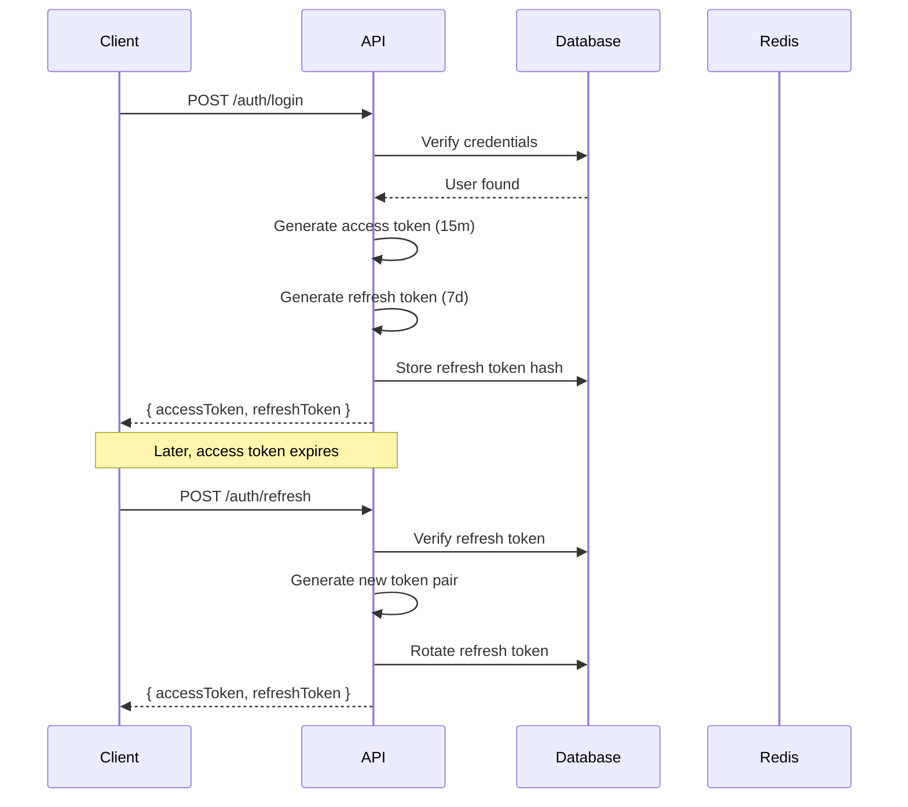

# Authentication API

[← Back to API Overview](./overview.md) | [Next: Stores API →](./stores.md)

---

## Overview

Baazarify uses **JWT-based authentication** with refresh token rotation.



---

## Endpoints

### Register

Create a new merchant account.

```http
POST /v1/auth/register
```

**Request:**

```json
{
  "email": "merchant@example.com",
  "password": "securePassword123",
  "firstName": "Ram",
  "lastName": "Sharma",
  "phone": "+977-9801234567",
  "storeName": "Ram's Fashion",
  "storeSubdomain": "rams-fashion"
}
```

**Response (201):**

```json
{
  "success": true,
  "data": {
    "user": {
      "id": "user_123",
      "email": "merchant@example.com",
      "firstName": "Ram",
      "lastName": "Sharma",
      "role": "merchant"
    },
    "store": {
      "id": "store_456",
      "name": "Ram's Fashion",
      "subdomain": "rams-fashion",
      "url": "https://rams-fashion.baazarify.com"
    },
    "accessToken": "eyJhbGciOiJIUzI1NiIs...",
    "refreshToken": "dGhpcyBpcyBhIHJlZnJl...",
    "expiresIn": 900
  }
}
```

**Errors:**

| Code | Reason |
|------|--------|
| 400 | Validation error |
| 409 | Email or subdomain already exists |

---

### Login

Authenticate existing user.

```http
POST /v1/auth/login
```

**Request:**

```json
{
  "email": "merchant@example.com",
  "password": "securePassword123"
}
```

**Response (200):**

```json
{
  "success": true,
  "data": {
    "user": {
      "id": "user_123",
      "email": "merchant@example.com",
      "firstName": "Ram",
      "lastName": "Sharma",
      "role": "merchant",
      "storeId": "store_456"
    },
    "store": {
      "id": "store_456",
      "name": "Ram's Fashion",
      "subdomain": "rams-fashion",
      "plan": "premium"
    },
    "accessToken": "eyJhbGciOiJIUzI1NiIs...",
    "refreshToken": "dGhpcyBpcyBhIHJlZnJl...",
    "expiresIn": 900
  }
}
```

**Errors:**

| Code | Reason |
|------|--------|
| 401 | Invalid credentials |
| 403 | Account suspended |

---

### Refresh Token

Get new access token using refresh token.

```http
POST /v1/auth/refresh
```

**Request:**

```json
{
  "refreshToken": "dGhpcyBpcyBhIHJlZnJl..."
}
```

**Response (200):**

```json
{
  "success": true,
  "data": {
    "accessToken": "eyJhbGciOiJIUzI1NiIs...",
    "refreshToken": "bmV3IHJlZnJlc2ggdG9r...",
    "expiresIn": 900
  }
}
```

**Note:** Refresh token is rotated on each use. The old token becomes invalid.

**Errors:**

| Code | Reason |
|------|--------|
| 401 | Invalid or expired refresh token |

---

### Logout

Invalidate current session.

```http
POST /v1/auth/logout
Authorization: Bearer <access_token>
```

**Request:**

```json
{
  "refreshToken": "dGhpcyBpcyBhIHJlZnJl..."
}
```

**Response (200):**

```json
{
  "success": true,
  "data": {
    "message": "Logged out successfully"
  }
}
```

---

### Forgot Password

Request password reset email.

```http
POST /v1/auth/forgot-password
```

**Request:**

```json
{
  "email": "merchant@example.com"
}
```

**Response (200):**

```json
{
  "success": true,
  "data": {
    "message": "If the email exists, a reset link has been sent"
  }
}
```

**Note:** Always returns success to prevent email enumeration.

---

### Reset Password

Set new password using reset token.

```http
POST /v1/auth/reset-password
```

**Request:**

```json
{
  "token": "reset_token_from_email",
  "password": "newSecurePassword456"
}
```

**Response (200):**

```json
{
  "success": true,
  "data": {
    "message": "Password reset successful"
  }
}
```

**Errors:**

| Code | Reason |
|------|--------|
| 400 | Invalid or expired token |

---

### Change Password

Change password for authenticated user.

```http
POST /v1/auth/change-password
Authorization: Bearer <access_token>
```

**Request:**

```json
{
  "currentPassword": "oldPassword123",
  "newPassword": "newPassword456"
}
```

**Response (200):**

```json
{
  "success": true,
  "data": {
    "message": "Password changed successfully"
  }
}
```

---

### Get Current User

Get authenticated user profile.

```http
GET /v1/auth/me
Authorization: Bearer <access_token>
```

**Response (200):**

```json
{
  "success": true,
  "data": {
    "id": "user_123",
    "email": "merchant@example.com",
    "firstName": "Ram",
    "lastName": "Sharma",
    "phone": "+977-9801234567",
    "role": "merchant",
    "storeId": "store_456",
    "permissions": ["*"],
    "emailVerified": true,
    "createdAt": "2024-01-15T10:30:00Z"
  }
}
```

---

## Token Structure

### Access Token (JWT)

```json
{
  "header": {
    "alg": "HS256",
    "typ": "JWT"
  },
  "payload": {
    "sub": "user_123",
    "email": "merchant@example.com",
    "role": "merchant",
    "storeId": "store_456",
    "permissions": ["*"],
    "iat": 1640000000,
    "exp": 1640000900
  }
}
```

### Refresh Token

- Random 256-bit token
- Stored as SHA-256 hash in database
- Linked to user and device

---

## Implementation

### Token Generation

```javascript
// services/auth.service.js
const generateTokens = async (user) => {
  // Access token: short-lived, contains user info
  const accessToken = jwt.sign(
    {
      sub: user._id,
      email: user.email,
      role: user.role,
      storeId: user.storeId,
      permissions: user.permissions
    },
    process.env.JWT_SECRET,
    { expiresIn: '15m' }
  );

  // Refresh token: long-lived, random string
  const refreshToken = crypto.randomBytes(32).toString('hex');
  const refreshTokenHash = crypto
    .createHash('sha256')
    .update(refreshToken)
    .digest('hex');

  // Store refresh token hash
  await RefreshToken.create({
    userId: user._id,
    tokenHash: refreshTokenHash,
    expiresAt: new Date(Date.now() + 7 * 24 * 60 * 60 * 1000)
  });

  return { accessToken, refreshToken };
};
```

### Auth Middleware

```javascript
// middleware/auth.js
const authenticate = async (req, res, next) => {
  const authHeader = req.headers.authorization;

  if (!authHeader?.startsWith('Bearer ')) {
    return res.status(401).json({
      success: false,
      error: { code: 'AUTH_REQUIRED', message: 'Authentication required' }
    });
  }

  const token = authHeader.split(' ')[1];

  try {
    const decoded = jwt.verify(token, process.env.JWT_SECRET);

    // Check if user still exists and is active
    const user = await User.findById(decoded.sub).select('-passwordHash');

    if (!user || user.status === 'suspended') {
      throw new Error('User not found or suspended');
    }

    req.user = {
      id: user._id,
      email: user.email,
      role: user.role,
      storeId: user.storeId,
      permissions: user.permissions
    };

    next();
  } catch (error) {
    if (error.name === 'TokenExpiredError') {
      return res.status(401).json({
        success: false,
        error: { code: 'TOKEN_EXPIRED', message: 'Access token expired' }
      });
    }

    return res.status(401).json({
      success: false,
      error: { code: 'AUTH_INVALID', message: 'Invalid token' }
    });
  }
};
```

### Role-Based Access

```javascript
// middleware/authorize.js
const authorize = (...allowedRoles) => {
  return (req, res, next) => {
    if (!allowedRoles.includes(req.user.role)) {
      return res.status(403).json({
        success: false,
        error: { code: 'FORBIDDEN', message: 'Insufficient permissions' }
      });
    }
    next();
  };
};

// Usage
router.delete('/stores/:id',
  authenticate,
  authorize('platform_admin'),
  deleteStore
);
```

### Permission Checking

```javascript
// middleware/checkPermission.js
const checkPermission = (resource, action) => {
  return (req, res, next) => {
    const required = `${resource}.${action}`;

    // Wildcard permission
    if (req.user.permissions.includes('*')) {
      return next();
    }

    // Specific permission
    if (req.user.permissions.includes(required)) {
      return next();
    }

    // Resource wildcard (e.g., "orders.*")
    if (req.user.permissions.includes(`${resource}.*`)) {
      return next();
    }

    return res.status(403).json({
      success: false,
      error: {
        code: 'FORBIDDEN',
        message: `Missing permission: ${required}`
      }
    });
  };
};

// Usage
router.delete('/orders/:id',
  authenticate,
  checkPermission('orders', 'delete'),
  deleteOrder
);
```

---

## Security Considerations

### Password Requirements

- Minimum 8 characters
- At least one uppercase letter
- At least one lowercase letter
- At least one number

```javascript
const passwordSchema = z.string()
  .min(8, 'Password must be at least 8 characters')
  .regex(/[A-Z]/, 'Must contain uppercase letter')
  .regex(/[a-z]/, 'Must contain lowercase letter')
  .regex(/[0-9]/, 'Must contain a number');
```

### Rate Limiting

| Endpoint | Limit |
|----------|-------|
| `/auth/login` | 5 attempts / 15 min |
| `/auth/register` | 3 attempts / hour |
| `/auth/forgot-password` | 3 attempts / hour |
| `/auth/reset-password` | 5 attempts / hour |

### Brute Force Protection

```javascript
// Failed login tracking
const trackFailedLogin = async (email, ip) => {
  const key = `login_attempts:${email}:${ip}`;
  const attempts = await redis.incr(key);

  if (attempts === 1) {
    await redis.expire(key, 15 * 60); // 15 minutes
  }

  if (attempts >= 5) {
    throw new TooManyAttemptsError();
  }
};
```

---

[Next: Stores API →](./stores.md)
