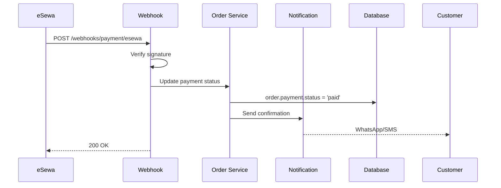

# Integrations API

[← Back to Orders](./orders.md) | [Next: Core Services →](../04-services/core-services.md)

---

## Overview

External integrations for payments, logistics, and messaging channels.

---

## Payment Integrations

### Configure Payment Gateway

```http
POST /v1/integrations/payment/:provider
Authorization: Bearer <token>
```

**Providers:** `esewa`, `khalti`, `fonepay`

**Request (eSewa):**

```json
{
  "merchantId": "EPAYTEST",
  "secretKey": "8gBm/:&EnhH.1/q",
  "enabled": true
}
```

**Request (Khalti):**

```json
{
  "publicKey": "test_public_key_xxx",
  "secretKey": "test_secret_key_xxx",
  "enabled": true
}
```

**Response (200):**

```json
{
  "success": true,
  "data": {
    "provider": "esewa",
    "status": "active",
    "testMode": true
  }
}
```

---

### Payment Webhook

```http
POST /v1/webhooks/payment/:provider
```

**eSewa Webhook:**

```json
{
  "transaction_code": "TXN123456",
  "status": "COMPLETE",
  "total_amount": "2600",
  "product_code": "EPAYTEST",
  "signed_field_names": "transaction_code,status,total_amount,product_code",
  "signature": "xxx"
}
```

**Processing:**



---

## Logistics Integrations

### Configure Logistics Provider

```http
POST /v1/integrations/logistics/:provider
Authorization: Bearer <token>
```

**Providers:** `pathao`, `dash`, `ncm`

**Request (Pathao):**

```json
{
  "apiKey": "pathao_api_key",
  "secretKey": "pathao_secret",
  "pickupAddress": {
    "name": "Ram's Fashion Warehouse",
    "phone": "+977-9801234567",
    "street": "Thamel",
    "city": "Kathmandu",
    "zone": "Bagmati"
  },
  "enabled": true
}
```

---

### Get Shipping Rates

```http
POST /v1/integrations/logistics/rates
Authorization: Bearer <token>
```

**Request:**

```json
{
  "destination": {
    "city": "Pokhara",
    "zone": "Gandaki"
  },
  "weight": 0.5,
  "dimensions": {
    "length": 30,
    "width": 20,
    "height": 10
  }
}
```

**Response (200):**

```json
{
  "success": true,
  "data": {
    "rates": [
      {
        "provider": "pathao",
        "service": "express",
        "price": 150,
        "estimatedDays": 1
      },
      {
        "provider": "pathao",
        "service": "standard",
        "price": 100,
        "estimatedDays": 2
      },
      {
        "provider": "dash",
        "service": "standard",
        "price": 120,
        "estimatedDays": 2
      }
    ]
  }
}
```

---

### Create Shipment

```http
POST /v1/integrations/logistics/shipments
Authorization: Bearer <token>
```

**Request:**

```json
{
  "orderId": "ord_001",
  "provider": "pathao",
  "service": "express",
  "pickup": {
    "date": "2024-02-01",
    "timeSlot": "10:00-12:00"
  }
}
```

**Response (200):**

```json
{
  "success": true,
  "data": {
    "shipmentId": "ship_001",
    "provider": "pathao",
    "trackingNumber": "PTH-123456789",
    "trackingUrl": "https://pathao.com/track/PTH-123456789",
    "label": "https://api.pathao.com/labels/PTH-123456789.pdf",
    "estimatedDelivery": "2024-02-02",
    "pickupScheduled": "2024-02-01T10:00:00Z"
  }
}
```

---

### Track Shipment

```http
GET /v1/integrations/logistics/shipments/:trackingNumber/track
Authorization: Bearer <token>
```

**Response (200):**

```json
{
  "success": true,
  "data": {
    "trackingNumber": "PTH-123456789",
    "status": "in_transit",
    "currentLocation": "Pokhara Hub",
    "estimatedDelivery": "2024-02-02",
    "events": [
      {
        "status": "picked_up",
        "location": "Kathmandu Warehouse",
        "timestamp": "2024-02-01T10:30:00Z"
      },
      {
        "status": "in_transit",
        "location": "Pokhara Hub",
        "timestamp": "2024-02-01T18:00:00Z"
      }
    ]
  }
}
```

---

## Messaging Integrations

### Configure WhatsApp (Twilio)

```http
POST /v1/integrations/messaging/whatsapp
Authorization: Bearer <token>
```

**Request:**

```json
{
  "provider": "twilio",
  "accountSid": "ACxxxx",
  "authToken": "xxxx",
  "phoneNumberSid": "PNxxxx",
  "enabled": true
}
```

---

### Configure Instagram

```http
POST /v1/integrations/messaging/instagram
Authorization: Bearer <token>
```

**Request:**

```json
{
  "pageId": "123456789",
  "accessToken": "EAAxxxx",
  "enabled": true
}
```

---

### WhatsApp Webhook

```http
POST /v1/webhooks/whatsapp
```

**Incoming Message:**

```json
{
  "object": "whatsapp_business_account",
  "entry": [{
    "changes": [{
      "value": {
        "messages": [{
          "from": "9779801234567",
          "type": "text",
          "text": { "body": "Hi, I want to order the blue jacket" },
          "timestamp": "1706600000"
        }]
      }
    }]
  }]
}
```

**Processing:**

1. Find or create conversation
2. Match customer by phone
3. Store message
4. Notify merchant dashboard (WebSocket)

---

### Instagram Webhook

```http
POST /v1/webhooks/instagram
```

**Incoming Message:**

```json
{
  "object": "instagram",
  "entry": [{
    "messaging": [{
      "sender": { "id": "123456789" },
      "message": {
        "mid": "msg_001",
        "text": "Is this available?"
      },
      "timestamp": 1706600000
    }]
  }]
}
```

---

### Send Message

```http
POST /v1/conversations/:id/reply
Authorization: Bearer <token>
```

**Request:**

```json
{
  "type": "text",
  "content": "Yes, it's available! Would you like to order?"
}
```

**Request (Product Card):**

```json
{
  "type": "product",
  "productId": "prod_001"
}
```

**Request (Order Confirmation):**

```json
{
  "type": "order",
  "orderId": "ord_001"
}
```

---

### Create Order from Conversation

```http
POST /v1/conversations/:id/convert
Authorization: Bearer <token>
```

**Request:**

```json
{
  "items": [
    { "productId": "prod_001", "quantity": 1 }
  ],
  "shippingAddress": {
    "street": "Thamel",
    "city": "Kathmandu"
  },
  "payment": {
    "method": "cod"
  }
}
```

**Response (201):**

```json
{
  "success": true,
  "data": {
    "order": {
      "id": "ord_004",
      "orderNumber": "ORD-2024-0004"
    },
    "conversation": {
      "id": "conv_001",
      "status": "converted"
    }
  }
}
```

---

## Integration Adapters

### Payment Gateway Adapter

```javascript
// integrations/payment/adapter.js
class PaymentAdapter {
  constructor(provider, config) {
    this.provider = provider;
    this.config = config;

    switch (provider) {
      case 'esewa':
        this.client = new EsewaClient(config);
        break;
      case 'khalti':
        this.client = new KhaltiClient(config);
        break;
      case 'fonepay':
        this.client = new FonepayClient(config);
        break;
    }
  }

  async initiate(order) {
    return this.client.createPayment({
      amount: order.totals.total,
      orderId: order._id,
      productCode: order.orderNumber,
      successUrl: `${process.env.API_URL}/payment/success`,
      failureUrl: `${process.env.API_URL}/payment/failure`
    });
  }

  async verify(transactionId, signature) {
    return this.client.verifyPayment(transactionId, signature);
  }

  async refund(transactionId, amount) {
    return this.client.initiateRefund(transactionId, amount);
  }
}
```

### Logistics Adapter

```javascript
// integrations/logistics/adapter.js
class LogisticsAdapter {
  constructor(provider, config) {
    this.provider = provider;

    switch (provider) {
      case 'pathao':
        this.client = new PathaoClient(config);
        break;
      case 'dash':
        this.client = new DashClient(config);
        break;
    }
  }

  async getRates(destination, package) {
    return this.client.calculateRates(destination, package);
  }

  async createShipment(order, service) {
    return this.client.createOrder({
      recipientName: `${order.customer.firstName} ${order.customer.lastName}`,
      recipientPhone: order.customer.phone,
      recipientAddress: order.shippingAddress,
      items: order.items.map(i => ({
        name: i.name,
        quantity: i.quantity,
        price: i.price
      })),
      cod: order.payment.method === 'cod' ? order.totals.total : 0
    });
  }

  async getTracking(trackingNumber) {
    return this.client.trackShipment(trackingNumber);
  }
}
```

---

## Webhook Security

### Signature Verification

```javascript
// middleware/webhookAuth.js
const verifyWebhookSignature = (provider) => (req, res, next) => {
  const signature = req.headers['x-signature'];
  const timestamp = req.headers['x-timestamp'];
  const body = JSON.stringify(req.body);

  const secret = getWebhookSecret(provider);
  const expectedSignature = crypto
    .createHmac('sha256', secret)
    .update(`${timestamp}.${body}`)
    .digest('hex');

  if (signature !== expectedSignature) {
    return res.status(401).json({ error: 'Invalid signature' });
  }

  // Prevent replay attacks
  const age = Date.now() - parseInt(timestamp);
  if (age > 5 * 60 * 1000) { // 5 minutes
    return res.status(401).json({ error: 'Request too old' });
  }

  next();
};
```

---

[Next: Core Services →](../04-services/core-services.md)
