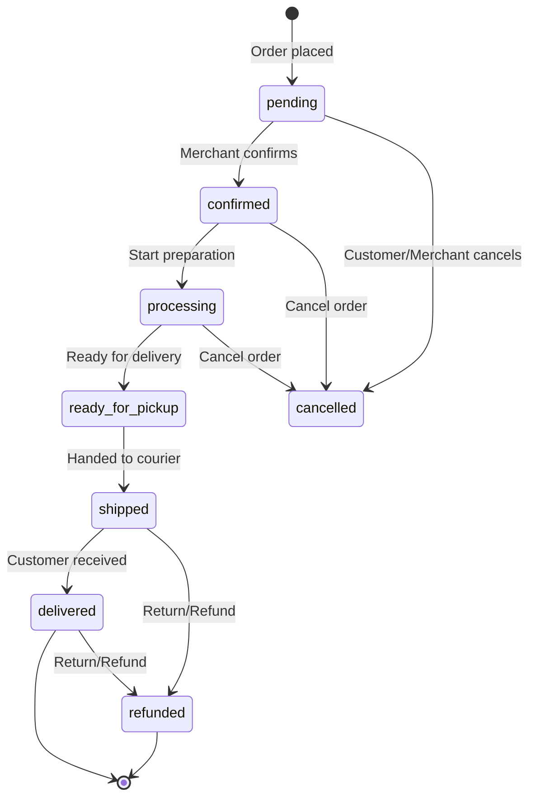

# Orders API

[← Back to Products](./products.md) | [Next: Integrations →](./integrations.md)

---

## Overview

Order management endpoints for processing and fulfilling customer orders.

---

## Order Lifecycle



---

## Endpoints

### List Orders

```http
GET /v1/orders
Authorization: Bearer <token>
```

**Query Parameters:**

| Param     | Type   | Description                                                    |
| --------- | ------ | -------------------------------------------------------------- |
| page      | number | Page number                                                    |
| limit     | number | Items per page                                                 |
| status    | string | Filter by status (comma-separated)                             |
| source    | string | Filter by source: `website`, `whatsapp`, `instagram`, `manual` |
| startDate | string | Filter from date (ISO 8601)                                    |
| endDate   | string | Filter to date                                                 |
| customer  | string | Filter by customer ID                                          |
| search    | string | Search by order number, customer name/phone                    |
| sort      | string | Sort field (default: `-createdAt`)                             |

**Example:**

```http
GET /v1/orders?status=pending,confirmed&source=whatsapp&startDate=2024-01-01
```

**Response (200):**

```json
{
  "success": true,
  "data": [
    {
      "id": "ord_001",
      "orderNumber": "ORD-2024-0001",
      "customer": {
        "firstName": "Sunita",
        "lastName": "Karki",
        "phone": "+977-9801234567"
      },
      "items": [
        {
          "productId": "prod_001",
          "name": "Blue Denim Jacket",
          "quantity": 1,
          "price": 2500,
          "total": 2500,
          "image": "https://cdn.baazarify.com/products/001/thumb.jpg"
        }
      ],
      "totals": {
        "subtotal": 2500,
        "discount": 0,
        "shipping": 100,
        "tax": 0,
        "total": 2600
      },
      "status": "pending",
      "source": "whatsapp",
      "payment": {
        "method": "cod",
        "status": "pending"
      },
      "createdAt": "2024-01-30T10:30:00Z"
    }
  ],
  "meta": {
    "page": 1,
    "limit": 20,
    "total": 156,
    "totalPages": 8
  }
}
```

---

### Get Order

```http
GET /v1/orders/:id
Authorization: Bearer <token>
```

**Response (200):**

```json
{
  "success": true,
  "data": {
    "id": "ord_001",
    "orderNumber": "ORD-2024-0001",
    "customerId": "cust_789",
    "customer": {
      "firstName": "Sunita",
      "lastName": "Karki",
      "email": "sunita@example.com",
      "phone": "+977-9801234567"
    },
    "shippingAddress": {
      "street": "Thamel, Near Garden of Dreams",
      "city": "Kathmandu",
      "state": "Bagmati",
      "country": "Nepal",
      "postalCode": "44600"
    },
    "items": [
      {
        "productId": "prod_001",
        "variantId": "var_002",
        "name": "Blue Denim Jacket",
        "variantName": "Medium",
        "sku": "BDJ-M",
        "quantity": 1,
        "price": 2500,
        "total": 2500,
        "image": "https://cdn.baazarify.com/products/001/main.jpg"
      }
    ],
    "totals": {
      "subtotal": 2500,
      "discount": 0,
      "discountCode": null,
      "shipping": 100,
      "tax": 0,
      "total": 2600
    },
    "source": "whatsapp",
    "sourceRef": "wa_conv_123",
    "status": "pending",
    "statusHistory": [
      {
        "status": "pending",
        "note": "Order placed via WhatsApp",
        "changedAt": "2024-01-30T10:30:00Z"
      }
    ],
    "payment": {
      "method": "cod",
      "status": "pending",
      "transactionId": null,
      "paidAt": null,
      "amount": 2600
    },
    "shipping": {
      "method": "pathao",
      "provider": "Pathao",
      "trackingNumber": null,
      "trackingUrl": null,
      "cost": 100,
      "estimatedDelivery": null,
      "shippedAt": null,
      "deliveredAt": null
    },
    "customerNote": "Please call before delivery",
    "merchantNote": "VIP customer",
    "createdAt": "2024-01-30T10:30:00Z",
    "updatedAt": "2024-01-30T10:30:00Z"
  }
}
```

---

### Create Order (Manual)

Create order manually (for phone orders, walk-ins, etc.)

```http
POST /v1/orders
Authorization: Bearer <token>
```

**Request:**

```json
{
  "customer": {
    "firstName": "Ramesh",
    "lastName": "Shrestha",
    "phone": "+977-9807654321",
    "email": "ramesh@example.com"
  },
  "shippingAddress": {
    "street": "Patan Durbar Square",
    "city": "Lalitpur",
    "state": "Bagmati",
    "country": "Nepal"
  },
  "items": [
    {
      "productId": "prod_001",
      "variantId": "var_001",
      "quantity": 2
    },
    {
      "productId": "prod_002",
      "quantity": 1
    }
  ],
  "shipping": {
    "method": "self",
    "cost": 0
  },
  "payment": {
    "method": "cod"
  },
  "customerNote": "Gift wrap please",
  "source": "manual"
}
```

**Response (201):**

```json
{
  "success": true,
  "data": {
    "id": "ord_002",
    "orderNumber": "ORD-2024-0002"
    // ... full order object
  }
}
```

---

### Update Order Status

```http
PUT /v1/orders/:id/status
Authorization: Bearer <token>
```

**Request:**

```json
{
  "status": "confirmed",
  "note": "Confirmed via phone call"
}
```

**Response (200):**

```json
{
  "success": true,
  "data": {
    "id": "ord_001",
    "status": "confirmed",
    "statusHistory": [
      {
        "status": "pending",
        "changedAt": "2024-01-30T10:30:00Z"
      },
      {
        "status": "confirmed",
        "note": "Confirmed via phone call",
        "changedBy": "user_123",
        "changedAt": "2024-01-30T11:00:00Z"
      }
    ]
  }
}
```

**Valid Status Transitions:**

| From               | To                              |
| ------------------ | ------------------------------- |
| `pending`          | `confirmed`, `cancelled`        |
| `confirmed`        | `processing`, `cancelled`       |
| `processing`       | `ready_for_pickup`, `cancelled` |
| `ready_for_pickup` | `shipped`                       |
| `shipped`          | `delivered`, `refunded`         |
| `delivered`        | `refunded`                      |

---

### Update Shipping

```http
PUT /v1/orders/:id/shipping
Authorization: Bearer <token>
```

**Request:**

```json
{
  "provider": "pathao",
  "trackingNumber": "PTH-123456789",
  "trackingUrl": "https://pathao.com/track/PTH-123456789"
}
```

---

### Mark as Shipped

```http
POST /v1/orders/:id/ship
Authorization: Bearer <token>
```

**Request:**

```json
{
  "provider": "pathao",
  "trackingNumber": "PTH-123456789",
  "estimatedDelivery": "2024-02-02"
}
```

This will:

1. Update status to `shipped`
2. Update shipping details
3. Send notification to customer

---

### Mark as Delivered

```http
POST /v1/orders/:id/deliver
Authorization: Bearer <token>
```

**Request:**

```json
{
  "note": "Delivered to customer at door"
}
```

---

### Process Refund

```http
POST /v1/orders/:id/refund
Authorization: Bearer <token>
```

**Request:**

```json
{
  "reason": "Customer requested return",
  "amount": 2600,
  "restockItems": true
}
```

**Response (200):**

```json
{
  "success": true,
  "data": {
    "id": "ord_001",
    "status": "refunded",
    "refund": {
      "amount": 2600,
      "reason": "Customer requested return",
      "refundedAt": "2024-02-01T14:00:00Z",
      "refundedBy": "user_123"
    }
  }
}
```

---

### Cancel Order

```http
POST /v1/orders/:id/cancel
Authorization: Bearer <token>
```

**Request:**

```json
{
  "reason": "Customer changed mind",
  "restockItems": true
}
```

---

### Add Order Note

```http
POST /v1/orders/:id/notes
Authorization: Bearer <token>
```

**Request:**

```json
{
  "note": "Customer called to confirm address",
  "isInternal": true
}
```

---

### Get Order Timeline

```http
GET /v1/orders/:id/timeline
Authorization: Bearer <token>
```

**Response (200):**

```json
{
  "success": true,
  "data": [
    {
      "type": "status_change",
      "from": null,
      "to": "pending",
      "note": "Order placed via WhatsApp",
      "user": null,
      "timestamp": "2024-01-30T10:30:00Z"
    },
    {
      "type": "status_change",
      "from": "pending",
      "to": "confirmed",
      "note": "Confirmed by merchant",
      "user": { "id": "user_123", "name": "Ram" },
      "timestamp": "2024-01-30T11:00:00Z"
    },
    {
      "type": "note",
      "note": "Customer called to confirm address",
      "user": { "id": "user_123", "name": "Ram" },
      "timestamp": "2024-01-30T11:15:00Z"
    },
    {
      "type": "notification",
      "channel": "whatsapp",
      "message": "Order confirmation sent",
      "timestamp": "2024-01-30T11:00:05Z"
    }
  ]
}
```

---

### Bulk Status Update

```http
POST /v1/orders/bulk/status
Authorization: Bearer <token>
```

**Request:**

```json
{
  "orderIds": ["ord_001", "ord_002", "ord_003"],
  "status": "confirmed"
}
```

---

### Export Orders

```http
GET /v1/orders/export
Authorization: Bearer <token>
```

**Query Parameters:**

| Param     | Type   | Description      |
| --------- | ------ | ---------------- |
| format    | string | `csv` or `xlsx`  |
| startDate | string | From date        |
| endDate   | string | To date          |
| status    | string | Filter by status |

**Response:**

Returns file download.

---

## Storefront Order Endpoints

### Create Order (Customer)

```http
POST /v1/storefront/:subdomain/orders
```

**Request:**

```json
{
  "customer": {
    "firstName": "Asha",
    "lastName": "Tamang",
    "email": "asha@example.com",
    "phone": "+977-9812345678"
  },
  "shippingAddress": {
    "street": "Bouddha, Near Stupa",
    "city": "Kathmandu",
    "state": "Bagmati",
    "country": "Nepal"
  },
  "items": [{ "productId": "prod_001", "variantId": "var_002", "quantity": 1 }],
  "shipping": {
    "method": "standard"
  },
  "payment": {
    "method": "esewa"
  },
  "customerNote": "Please deliver after 5 PM"
}
```

**Response (201):**

```json
{
  "success": true,
  "data": {
    "orderId": "ord_003",
    "orderNumber": "ORD-2024-0003",
    "total": 2600,
    "payment": {
      "method": "esewa",
      "redirectUrl": "https://esewa.com.np/pay?..."
    }
  }
}
```

---

### Track Order (Customer)

```http
GET /v1/storefront/:subdomain/orders/:orderNumber
```

**Query Parameters:**

| Param | Type   | Description                     |
| ----- | ------ | ------------------------------- |
| email | string | Customer email for verification |
| phone | string | OR customer phone               |

**Response (200):**

```json
{
  "success": true,
  "data": {
    "orderNumber": "ORD-2024-0003",
    "status": "shipped",
    "statusLabel": "On the way",
    "items": [
      {
        "name": "Blue Denim Jacket",
        "quantity": 1,
        "price": 2500
      }
    ],
    "total": 2600,
    "shipping": {
      "provider": "Pathao",
      "trackingNumber": "PTH-123456789",
      "trackingUrl": "https://pathao.com/track/...",
      "estimatedDelivery": "2024-02-02"
    },
    "timeline": [
      { "status": "Order Placed", "date": "2024-01-30" },
      { "status": "Confirmed", "date": "2024-01-30" },
      { "status": "Shipped", "date": "2024-01-31" }
    ]
  }
}
```

---

[Next: Integrations →](./integrations.md)
