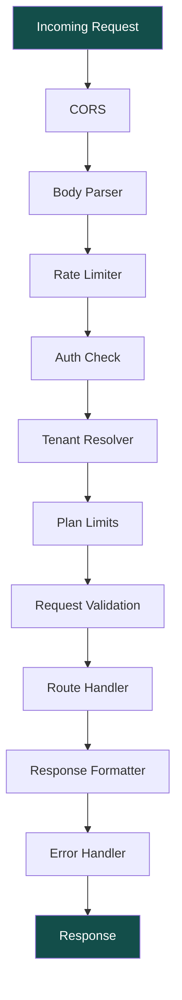

# API Design Overview

[← Back to Multi-Tenancy](../02-database/multi-tenancy.md) | [Next: Authentication →](./auth.md)

---

## API Philosophy

### RESTful Design

- Resource-oriented URLs
- HTTP methods for actions
- Consistent response format
- Stateless authentication

### Base URLs

| Environment | URL                                    |
| ----------- | -------------------------------------- |
| Production  | `https://api.baazarify.com/v1`         |
| Staging     | `https://api.staging.baazarify.com/v1` |
| Development | `http://localhost:3000/v1`             |

### Storefront API

```
https://api.baazarify.com/v1/storefront/{subdomain}/*
```

---

## API Structure

```
/v1
├── /auth                 # Authentication
│   ├── POST /register
│   ├── POST /login
│   ├── POST /refresh
│   ├── POST /logout
│   ├── POST /forgot-password
│   └── POST /reset-password
│
├── /stores               # Store management (merchant)
│   ├── GET /me           # Current store
│   ├── PUT /me           # Update store
│   ├── PUT /me/theme     # Update theme
│   ├── PUT /me/settings  # Update settings
│   └── GET /me/stats     # Dashboard stats
│
├── /products             # Product management
│   ├── GET /             # List products
│   ├── POST /            # Create product
│   ├── GET /:id          # Get product
│   ├── PUT /:id          # Update product
│   ├── DELETE /:id       # Delete product
│   └── POST /:id/images  # Upload images
│
├── /categories           # Category management
│   ├── GET /
│   ├── POST /
│   ├── GET /:id
│   ├── PUT /:id
│   └── DELETE /:id
│
├── /orders               # Order management
│   ├── GET /             # List orders
│   ├── POST /            # Create order (manual)
│   ├── GET /:id          # Get order
│   ├── PUT /:id/status   # Update status
│   └── POST /:id/refund  # Process refund
│
├── /customers            # Customer management
│   ├── GET /
│   ├── POST /
│   ├── GET /:id
│   ├── PUT /:id
│   └── GET /:id/orders
│
├── /inventory            # Inventory management
│   ├── GET /             # List inventory
│   ├── PUT /:productId   # Update stock
│   └── POST /adjust      # Bulk adjustment
│
├── /conversations        # Social inbox
│   ├── GET /             # List conversations
│   ├── GET /:id          # Get conversation
│   ├── POST /:id/reply   # Send reply
│   └── PUT /:id/status   # Close/reopen
│
├── /analytics            # Reports & analytics
│   ├── GET /dashboard    # Dashboard summary
│   ├── GET /sales        # Sales report
│   └── GET /products     # Product performance
│
├── /pages                # Page builder
│   ├── GET /             # List pages
│   ├── POST /            # Create page
│   ├── GET /:slug        # Get page
│   ├── PUT /:slug        # Update page
│   └── DELETE /:slug     # Delete page
│
├── /integrations         # External integrations
│   ├── POST /payment/configure
│   ├── POST /logistics/configure
│   └── POST /messaging/configure
│
├── /webhooks             # Incoming webhooks
│   ├── POST /payment/:provider
│   ├── POST /whatsapp
│   └── POST /instagram
│
├── /storefront           # Public storefront API
│   └── /:subdomain
│       ├── GET /         # Store info
│       ├── GET /products
│       ├── GET /products/:slug
│       ├── GET /categories
│       ├── GET /pages/:slug
│       ├── POST /cart
│       ├── POST /checkout
│       └── GET /orders/:id
│
└── /admin                # Platform admin
    ├── GET /stores
    ├── GET /stores/:id
    ├── PUT /stores/:id/status
    └── GET /stats
```

---

## Request/Response Format

### Request Headers

```http
Content-Type: application/json
Authorization: Bearer <access_token>
X-Store-Subdomain: mystore          # Optional, for cross-store admin
```

### Success Response

```json
{
  "success": true,
  "data": {
    // Response payload
  },
  "meta": {
    "page": 1,
    "limit": 20,
    "total": 150,
    "totalPages": 8
  }
}
```

### Error Response

```json
{
  "success": false,
  "error": {
    "code": "VALIDATION_ERROR",
    "message": "Invalid input data",
    "details": [
      {
        "field": "email",
        "message": "Invalid email format"
      }
    ]
  }
}
```

### HTTP Status Codes

| Code | Meaning           | Usage                 |
| ---- | ----------------- | --------------------- |
| 200  | OK                | Successful GET, PUT   |
| 201  | Created           | Successful POST       |
| 204  | No Content        | Successful DELETE     |
| 400  | Bad Request       | Validation error      |
| 401  | Unauthorized      | Missing/invalid token |
| 403  | Forbidden         | No permission         |
| 404  | Not Found         | Resource not found    |
| 409  | Conflict          | Duplicate resource    |
| 422  | Unprocessable     | Business logic error  |
| 429  | Too Many Requests | Rate limited          |
| 500  | Server Error      | Unexpected error      |

---

## Pagination

### Request

```http
GET /v1/products?page=2&limit=20&sort=-createdAt
```

### Parameters

| Param   | Type   | Default    | Max |
| ------- | ------ | ---------- | --- |
| `page`  | number | 1          | -   |
| `limit` | number | 20         | 100 |
| `sort`  | string | -createdAt | -   |

### Response

```json
{
  "success": true,
  "data": [...],
  "meta": {
    "page": 2,
    "limit": 20,
    "total": 150,
    "totalPages": 8,
    "hasNext": true,
    "hasPrev": true
  }
}
```

---

## Filtering

### Query String Filters

```http
GET /v1/products?status=active&category=123&minPrice=100&maxPrice=500
```

### Common Filters

| Resource      | Filters                                                |
| ------------- | ------------------------------------------------------ |
| Products      | `status`, `category`, `minPrice`, `maxPrice`, `search` |
| Orders        | `status`, `source`, `startDate`, `endDate`, `customer` |
| Customers     | `search`, `source`, `hasOrders`                        |
| Conversations | `status`, `channel`, `assignedTo`                      |

---

## Sorting

```http
GET /v1/products?sort=price        # Ascending
GET /v1/products?sort=-price       # Descending
GET /v1/products?sort=-createdAt,name  # Multiple
```

---

## Search

### Full-Text Search

```http
GET /v1/products?search=blue+shirt
```

Uses MongoDB text index with relevance scoring.

### Autocomplete

```http
GET /v1/products/autocomplete?q=shi&limit=5
```

Returns product names matching prefix.

---

## Versioning

API version in URL path:

```
/v1/products    # Current version
/v2/products    # Future version (when needed)
```

### Deprecation Policy

1. Announce deprecation 6 months before
2. Add `Sunset` header with removal date
3. Add `Deprecation` header with docs link
4. Remove after sunset date

```http
Sunset: Sat, 01 Jan 2027 00:00:00 GMT
Deprecation: Mon, 01 Jul 2026 00:00:00 GMT
Link: <https://docs.baazarify.com/migration/v2>; rel="deprecation"
```

---

## Rate Limiting

### Limits by Plan

| Plan      | Requests/min | Requests/day |
| --------- | ------------ | ------------ |
| Free      | 60           | 1,000        |
| Basic     | 120          | 10,000       |
| Premium   | 300          | 50,000       |
| Business  | 600          | 100,000      |
| Platinum+ | 1,200        | Unlimited    |

### Rate Limit Headers

```http
X-RateLimit-Limit: 120
X-RateLimit-Remaining: 95
X-RateLimit-Reset: 1640000000
```

### Rate Limited Response

```json
{
  "success": false,
  "error": {
    "code": "RATE_LIMITED",
    "message": "Too many requests",
    "retryAfter": 45
  }
}
```

---

## Middleware Stack



```javascript
// app.js
const app = express();

// Security
app.use(helmet());
app.use(cors(corsOptions));

// Parsing
app.use(express.json({ limit: '10mb' }));
app.use(express.urlencoded({ extended: true }));

// Compression
app.use(compression());

// Rate limiting
app.use(rateLimiter);

// Request logging
app.use(requestLogger);

// Routes
app.use('/v1/auth', authRoutes);
app.use('/v1/storefront', storefrontRoutes);
app.use('/v1', authenticate, tenantResolver, apiRoutes);
app.use('/v1/admin', authenticate, adminOnly, adminRoutes);
app.use('/v1/webhooks', webhookRoutes);

// Error handling
app.use(notFoundHandler);
app.use(errorHandler);
```

---

## Error Codes

| Code                | Description               |
| ------------------- | ------------------------- |
| `VALIDATION_ERROR`  | Request validation failed |
| `AUTH_REQUIRED`     | Authentication required   |
| `AUTH_INVALID`      | Invalid credentials       |
| `TOKEN_EXPIRED`     | Access token expired      |
| `FORBIDDEN`         | No permission for action  |
| `NOT_FOUND`         | Resource not found        |
| `DUPLICATE`         | Resource already exists   |
| `PLAN_LIMIT`        | Plan limit exceeded       |
| `RATE_LIMITED`      | Too many requests         |
| `PAYMENT_FAILED`    | Payment processing failed |
| `INTEGRATION_ERROR` | External service error    |
| `SERVER_ERROR`      | Unexpected server error   |

---

[Next: Authentication →](./auth.md)
