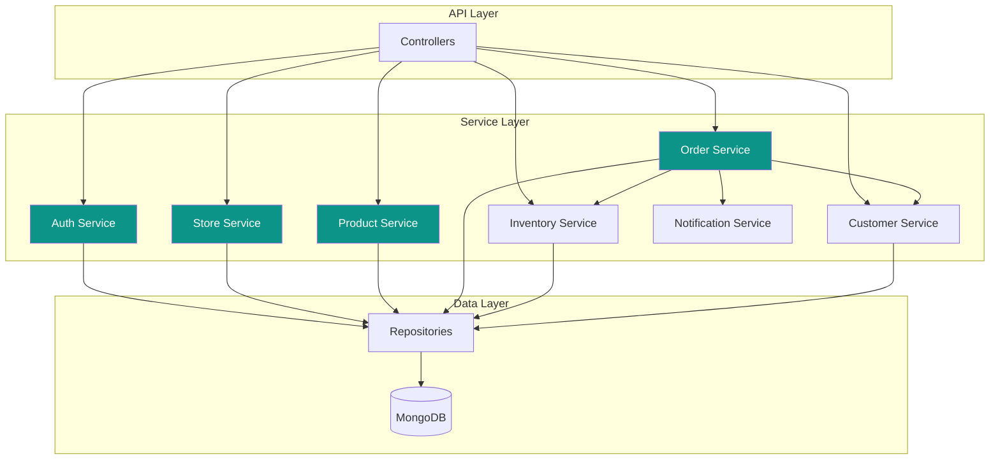

# Core Services

[← Back to Integrations](../03-api/integrations.md) | [Next: Integration Layer →](./integration-layer.md)

---

## Service Architecture



---

## Auth Service

Handles authentication, authorization, and user management.

```javascript
// services/auth.service.js
class AuthService {
  constructor(userRepo, tokenRepo, emailService) {
    this.userRepo = userRepo;
    this.tokenRepo = tokenRepo;
    this.emailService = emailService;
  }

  async register(data) {
    // Check existing user
    const existing = await this.userRepo.findByEmail(data.email);
    if (existing) {
      throw new ConflictError('Email already registered');
    }

    // Hash password
    const passwordHash = await bcrypt.hash(data.password, 12);

    // Create user
    const user = await this.userRepo.create({
      email: data.email,
      passwordHash,
      firstName: data.firstName,
      lastName: data.lastName,
      phone: data.phone,
      role: 'merchant',
    });

    // Create store
    const store = await this.storeService.create({
      name: data.storeName,
      subdomain: data.storeSubdomain,
      ownerId: user._id,
    });

    // Update user with storeId
    await this.userRepo.update(user._id, { storeId: store._id });

    // Generate tokens
    const tokens = await this.generateTokens(user);

    // Send welcome email
    await this.emailService.sendWelcome(user);

    return { user, store, ...tokens };
  }

  async login(email, password) {
    const user = await this.userRepo.findByEmail(email);

    if (!user || !(await bcrypt.compare(password, user.passwordHash))) {
      throw new AuthError('Invalid credentials');
    }

    if (user.status === 'suspended') {
      throw new ForbiddenError('Account suspended');
    }

    // Update last login
    await this.userRepo.update(user._id, { lastLoginAt: new Date() });

    // Get store
    const store = user.storeId ? await this.storeRepo.findById(user.storeId) : null;

    // Generate tokens
    const tokens = await this.generateTokens(user);

    return { user, store, ...tokens };
  }

  async refreshToken(refreshToken) {
    const tokenHash = this.hashToken(refreshToken);
    const storedToken = await this.tokenRepo.findByHash(tokenHash);

    if (!storedToken || storedToken.expiresAt < new Date()) {
      throw new AuthError('Invalid or expired refresh token');
    }

    const user = await this.userRepo.findById(storedToken.userId);
    if (!user) {
      throw new AuthError('User not found');
    }

    // Rotate refresh token
    await this.tokenRepo.delete(storedToken._id);
    const tokens = await this.generateTokens(user);

    return tokens;
  }

  async generateTokens(user) {
    const accessToken = jwt.sign(
      {
        sub: user._id,
        email: user.email,
        role: user.role,
        storeId: user.storeId,
        permissions: user.permissions || ['*'],
      },
      config.jwtSecret,
      { expiresIn: '15m' }
    );

    const refreshToken = crypto.randomBytes(32).toString('hex');
    const tokenHash = this.hashToken(refreshToken);

    await this.tokenRepo.create({
      userId: user._id,
      tokenHash,
      expiresAt: new Date(Date.now() + 7 * 24 * 60 * 60 * 1000),
    });

    return { accessToken, refreshToken, expiresIn: 900 };
  }

  hashToken(token) {
    return crypto.createHash('sha256').update(token).digest('hex');
  }
}
```

---

## Store Service

Manages store configuration and settings.

```javascript
// services/store.service.js
class StoreService {
  constructor(storeRepo, cache) {
    this.storeRepo = storeRepo;
    this.cache = cache;
  }

  async create(data) {
    // Validate subdomain availability
    const existing = await this.storeRepo.findBySubdomain(data.subdomain);
    if (existing) {
      throw new ConflictError('Subdomain already taken');
    }

    // Generate slug
    const slug = slugify(data.name, { lower: true, strict: true });

    const store = await this.storeRepo.create({
      ...data,
      slug,
      plan: 'free',
      status: 'pending_setup',
      limits: PLAN_LIMITS.free,
      settings: {
        currency: 'NPR',
        timezone: 'Asia/Kathmandu',
        language: 'en',
      },
      theme: {
        templateId: 'default',
        colors: {
          primary: '#0d9488',
          secondary: '#115e59',
          accent: '#14b8a6',
          background: '#ffffff',
          text: '#1f2937',
        },
      },
    });

    return store;
  }

  async getBySubdomain(subdomain) {
    // Check cache
    const cached = await this.cache.get(`store:${subdomain}`);
    if (cached) {
      return JSON.parse(cached);
    }

    const store = await this.storeRepo.findBySubdomain(subdomain);
    if (!store) {
      return null;
    }

    // Cache for 1 hour
    await this.cache.setex(`store:${subdomain}`, 3600, JSON.stringify(store));

    return store;
  }

  async update(storeId, data) {
    const store = await this.storeRepo.update(storeId, data);

    // Invalidate cache
    await this.cache.del(`store:${store.subdomain}`);

    return store;
  }

  async updateTheme(storeId, theme) {
    return this.update(storeId, { theme });
  }

  async getStats(storeId, period) {
    const { startDate, endDate } = this.getPeriodDates(period);

    const [orders, previousOrders] = await Promise.all([
      this.orderRepo.aggregate([
        { $match: { storeId, createdAt: { $gte: startDate, $lte: endDate } } },
        {
          $group: {
            _id: null,
            count: { $sum: 1 },
            revenue: { $sum: '$totals.total' },
          },
        },
      ]),
      this.orderRepo.aggregate([
        {
          $match: {
            storeId,
            createdAt: {
              $gte: this.subtractPeriod(startDate, period),
              $lte: startDate,
            },
          },
        },
        {
          $group: {
            _id: null,
            count: { $sum: 1 },
            revenue: { $sum: '$totals.total' },
          },
        },
      ]),
    ]);

    return {
      period,
      summary: {
        totalOrders: orders[0]?.count || 0,
        totalRevenue: orders[0]?.revenue || 0,
        averageOrderValue: orders[0] ? Math.round(orders[0].revenue / orders[0].count) : 0,
      },
      comparison: {
        orders: this.calculateChange(orders[0]?.count, previousOrders[0]?.count),
        revenue: this.calculateChange(orders[0]?.revenue, previousOrders[0]?.revenue),
      },
    };
  }
}
```

---

## Product Service

Manages products, variants, and categories.

```javascript
// services/product.service.js
class ProductService {
  constructor(productRepo, inventoryService, imageService, storeId) {
    this.productRepo = productRepo;
    this.inventoryService = inventoryService;
    this.imageService = imageService;
    this.storeId = storeId;
  }

  async create(data) {
    // Check plan limits
    const count = await this.productRepo.count({ storeId: this.storeId });
    const store = await this.storeRepo.findById(this.storeId);

    if (count >= store.limits.products) {
      throw new PlanLimitError('Product limit reached', {
        limit: store.limits.products,
        current: count,
      });
    }

    // Generate slug
    let slug = slugify(data.name, { lower: true, strict: true });
    const existing = await this.productRepo.findOne({
      storeId: this.storeId,
      slug,
    });
    if (existing) {
      slug = `${slug}-${Date.now()}`;
    }

    // Create product
    const product = await this.productRepo.create({
      ...data,
      storeId: this.storeId,
      slug,
      status: data.status || 'draft',
    });

    // Create inventory records
    if (product.hasVariants) {
      for (const variant of product.variants) {
        await this.inventoryService.create({
          storeId: this.storeId,
          productId: product._id,
          variantId: variant._id,
          sku: variant.sku,
          quantity: variant.stock || 0,
        });
      }
    } else {
      await this.inventoryService.create({
        storeId: this.storeId,
        productId: product._id,
        variantId: null,
        sku: product.sku,
        quantity: product.stock || 0,
      });
    }

    return product;
  }

  async update(productId, data) {
    const product = await this.productRepo.findOne({
      _id: productId,
      storeId: this.storeId,
    });

    if (!product) {
      throw new NotFoundError('Product not found');
    }

    // Handle slug change
    if (data.name && data.name !== product.name) {
      data.slug = slugify(data.name, { lower: true, strict: true });
    }

    const updated = await this.productRepo.update(productId, data);

    // Invalidate cache
    await this.cache.del(`product:${this.storeId}:${product.slug}`);

    return updated;
  }

  async uploadImages(productId, files) {
    const product = await this.productRepo.findOne({
      _id: productId,
      storeId: this.storeId,
    });

    if (!product) {
      throw new NotFoundError('Product not found');
    }

    // Check image limit
    const currentCount = product.images?.length || 0;
    if (currentCount + files.length > 10) {
      throw new ValidationError('Maximum 10 images allowed');
    }

    // Upload to S3
    const images = await Promise.all(
      files.map(async (file, index) => {
        const key = `products/${this.storeId}/${productId}/${Date.now()}-${index}.jpg`;
        const url = await this.imageService.upload(file, key, {
          resize: { width: 1200, height: 1200, fit: 'inside' },
        });
        return {
          _id: new ObjectId(),
          url,
          alt: '',
          position: currentCount + index,
        };
      })
    );

    // Update product
    await this.productRepo.update(productId, {
      $push: { images: { $each: images } },
    });

    return images;
  }

  async delete(productId) {
    const product = await this.productRepo.findOne({
      _id: productId,
      storeId: this.storeId,
    });

    if (!product) {
      throw new NotFoundError('Product not found');
    }

    // Check if product has orders
    const orderCount = await this.orderRepo.count({
      storeId: this.storeId,
      'items.productId': productId,
    });

    if (orderCount > 0) {
      // Archive instead of delete
      await this.productRepo.update(productId, { status: 'archived' });
      return { archived: true };
    }

    // Delete product and inventory
    await Promise.all([
      this.productRepo.delete(productId),
      this.inventoryService.deleteByProduct(productId),
    ]);

    // Delete images from S3
    for (const image of product.images || []) {
      await this.imageService.delete(image.url);
    }

    return { deleted: true };
  }
}
```

---

## Order Service

Manages order lifecycle and processing.

```javascript
// services/order.service.js
class OrderService {
  constructor(deps) {
    this.orderRepo = deps.orderRepo;
    this.inventoryService = deps.inventoryService;
    this.customerService = deps.customerService;
    this.notificationService = deps.notificationService;
    this.storeId = deps.storeId;
  }

  async create(data) {
    // Validate items and get current prices
    const items = await this.validateAndEnrichItems(data.items);

    // Calculate totals
    const totals = this.calculateTotals(items, data.shipping, data.discount);

    // Find or create customer
    const customer = await this.customerService.findOrCreate({
      storeId: this.storeId,
      ...data.customer,
    });

    // Generate order number
    const orderNumber = await this.generateOrderNumber();

    // Create order
    const order = await this.orderRepo.create({
      storeId: this.storeId,
      orderNumber,
      customerId: customer._id,
      customer: {
        firstName: customer.firstName,
        lastName: customer.lastName,
        email: customer.email,
        phone: customer.phone,
      },
      shippingAddress: data.shippingAddress,
      items,
      totals,
      source: data.source || 'website',
      sourceRef: data.sourceRef,
      status: 'pending',
      statusHistory: [
        {
          status: 'pending',
          note: 'Order placed',
          changedAt: new Date(),
        },
      ],
      payment: {
        method: data.payment.method,
        status: 'pending',
      },
      shipping: {
        method: data.shipping.method,
        cost: data.shipping.cost,
      },
      customerNote: data.customerNote,
    });

    // Reserve inventory
    await this.reserveInventory(order);

    // Send notifications
    await this.notificationService.orderPlaced(order);

    return order;
  }

  async updateStatus(orderId, status, note, userId) {
    const order = await this.orderRepo.findOne({
      _id: orderId,
      storeId: this.storeId,
    });

    if (!order) {
      throw new NotFoundError('Order not found');
    }

    // Validate transition
    if (!this.isValidTransition(order.status, status)) {
      throw new ValidationError(`Cannot transition from ${order.status} to ${status}`);
    }

    // Update order
    const updated = await this.orderRepo.update(orderId, {
      status,
      $push: {
        statusHistory: {
          status,
          note,
          changedBy: userId,
          changedAt: new Date(),
        },
      },
    });

    // Handle status-specific actions
    await this.handleStatusChange(updated, order.status, status);

    return updated;
  }

  async handleStatusChange(order, fromStatus, toStatus) {
    switch (toStatus) {
      case 'confirmed':
        await this.notificationService.orderConfirmed(order);
        break;

      case 'shipped':
        await this.notificationService.orderShipped(order);
        break;

      case 'delivered':
        // Confirm inventory deduction
        await this.inventoryService.confirmDeduction(order._id);
        // Update customer stats
        await this.customerService.updateStats(order.customerId, order.totals.total);
        await this.notificationService.orderDelivered(order);
        break;

      case 'cancelled':
        // Release reserved inventory
        await this.inventoryService.releaseReservation(order._id);
        await this.notificationService.orderCancelled(order);
        break;

      case 'refunded':
        // Handle refund logic
        await this.processRefund(order);
        break;
    }
  }

  async reserveInventory(order) {
    for (const item of order.items) {
      await this.inventoryService.reserve({
        storeId: this.storeId,
        productId: item.productId,
        variantId: item.variantId,
        quantity: item.quantity,
        orderId: order._id,
      });
    }
  }

  calculateTotals(items, shipping, discount) {
    const subtotal = items.reduce((sum, item) => sum + item.total, 0);
    const discountAmount = discount?.amount || 0;
    const shippingCost = shipping?.cost || 0;
    const tax = 0; // Nepal doesn't have VAT on most goods

    return {
      subtotal,
      discount: discountAmount,
      discountCode: discount?.code,
      shipping: shippingCost,
      tax,
      total: subtotal - discountAmount + shippingCost + tax,
    };
  }

  async generateOrderNumber() {
    const year = new Date().getFullYear();
    const count = await this.orderRepo.count({
      storeId: this.storeId,
      orderNumber: { $regex: `^ORD-${year}` },
    });
    return `ORD-${year}-${String(count + 1).padStart(4, '0')}`;
  }

  isValidTransition(from, to) {
    const transitions = {
      pending: ['confirmed', 'cancelled'],
      confirmed: ['processing', 'cancelled'],
      processing: ['ready_for_pickup', 'cancelled'],
      ready_for_pickup: ['shipped'],
      shipped: ['delivered', 'refunded'],
      delivered: ['refunded'],
    };
    return transitions[from]?.includes(to);
  }
}
```

---

## Inventory Service

Manages stock levels and reservations.

```javascript
// services/inventory.service.js
class InventoryService {
  constructor(inventoryRepo, storeId) {
    this.inventoryRepo = inventoryRepo;
    this.storeId = storeId;
  }

  async getStock(productId, variantId = null) {
    const inventory = await this.inventoryRepo.findOne({
      storeId: this.storeId,
      productId,
      variantId,
    });
    return inventory?.quantity || 0;
  }

  async reserve({ productId, variantId, quantity, orderId }) {
    const inventory = await this.inventoryRepo.findOne({
      storeId: this.storeId,
      productId,
      variantId,
    });

    if (!inventory || inventory.quantity < quantity) {
      throw new ValidationError('Insufficient stock');
    }

    await this.inventoryRepo.update(inventory._id, {
      $inc: { reserved: quantity },
      $push: {
        history: {
          type: 'reservation',
          quantity,
          orderId,
          changedAt: new Date(),
        },
      },
    });
  }

  async releaseReservation(orderId) {
    const reservations = await this.inventoryRepo.find({
      storeId: this.storeId,
      'history.orderId': orderId,
      'history.type': 'reservation',
    });

    for (const inv of reservations) {
      const reservation = inv.history.find(
        (h) => h.orderId.equals(orderId) && h.type === 'reservation'
      );
      if (reservation) {
        await this.inventoryRepo.update(inv._id, {
          $inc: { reserved: -reservation.quantity },
          $push: {
            history: {
              type: 'release',
              quantity: reservation.quantity,
              orderId,
              changedAt: new Date(),
            },
          },
        });
      }
    }
  }

  async confirmDeduction(orderId) {
    const reservations = await this.inventoryRepo.find({
      storeId: this.storeId,
      'history.orderId': orderId,
      'history.type': 'reservation',
    });

    for (const inv of reservations) {
      const reservation = inv.history.find(
        (h) => h.orderId.equals(orderId) && h.type === 'reservation'
      );
      if (reservation) {
        await this.inventoryRepo.update(inv._id, {
          $inc: {
            quantity: -reservation.quantity,
            reserved: -reservation.quantity,
          },
          $push: {
            history: {
              type: 'sale',
              quantity: -reservation.quantity,
              orderId,
              changedAt: new Date(),
            },
          },
        });
      }
    }
  }

  async adjust(productId, variantId, quantity, note, userId) {
    const inventory = await this.inventoryRepo.findOne({
      storeId: this.storeId,
      productId,
      variantId,
    });

    if (!inventory) {
      throw new NotFoundError('Inventory record not found');
    }

    await this.inventoryRepo.update(inventory._id, {
      $inc: { quantity },
      $push: {
        history: {
          type: 'adjustment',
          quantity,
          note,
          changedBy: userId,
          changedAt: new Date(),
        },
      },
    });
  }

  async getLowStock(threshold = 5) {
    return this.inventoryRepo.find({
      storeId: this.storeId,
      quantity: { $lte: threshold },
    });
  }
}
```

---

[Next: Integration Layer →](./integration-layer.md)
