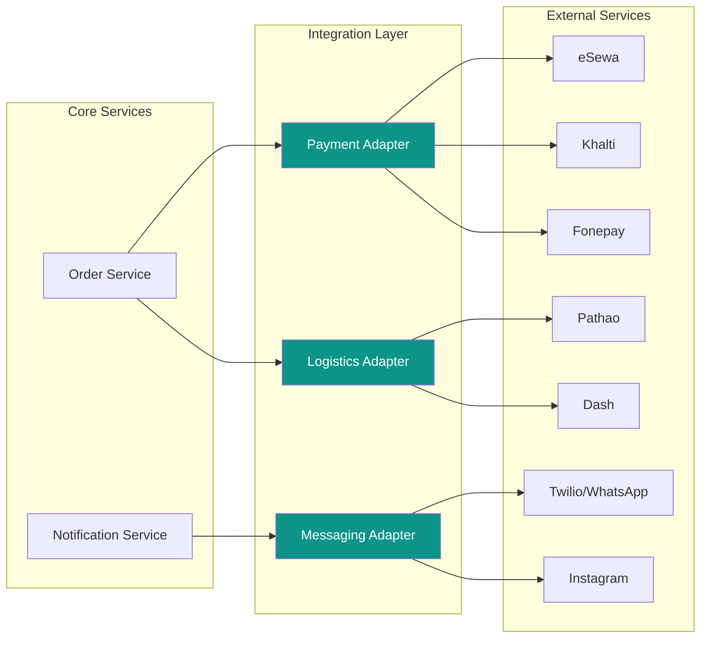

# Integration Layer

[← Back to Core Services](./core-services.md) | [Next: Dashboard →](../05-frontend/dashboard.md)

---

## Overview

The integration layer provides pluggable adapters for external services.



---

## Payment Gateway Adapter

### Interface

```javascript
// integrations/payment/interface.js
class PaymentGateway {
  async initiate(order, returnUrls) {
    throw new Error('Not implemented');
  }

  async verify(transactionData) {
    throw new Error('Not implemented');
  }

  async refund(transactionId, amount) {
    throw new Error('Not implemented');
  }

  async getStatus(transactionId) {
    throw new Error('Not implemented');
  }
}
```

### eSewa Provider

```javascript
// integrations/payment/esewa.provider.js
class EsewaProvider extends PaymentGateway {
  constructor(config) {
    super();
    this.merchantId = config.merchantId;
    this.secretKey = config.secretKey;
    this.baseUrl = config.testMode
      ? 'https://rc-epay.esewa.com.np'
      : 'https://epay.esewa.com.np';
  }

  async initiate(order, returnUrls) {
    const params = {
      amount: order.totals.subtotal,
      tax_amount: order.totals.tax,
      total_amount: order.totals.total,
      transaction_uuid: order._id.toString(),
      product_code: this.merchantId,
      product_service_charge: 0,
      product_delivery_charge: order.totals.shipping,
      success_url: returnUrls.success,
      failure_url: returnUrls.failure,
      signed_field_names: 'total_amount,transaction_uuid,product_code'
    };

    // Generate signature
    const signatureString = `total_amount=${params.total_amount},transaction_uuid=${params.transaction_uuid},product_code=${params.product_code}`;
    params.signature = this.generateSignature(signatureString);

    return {
      method: 'POST',
      url: `${this.baseUrl}/api/epay/main/v2/form`,
      params
    };
  }

  async verify(transactionData) {
    const { data, signature } = transactionData;

    // Verify signature
    const expectedSignature = this.generateSignature(data);
    if (signature !== expectedSignature) {
      throw new Error('Invalid signature');
    }

    // Check transaction status
    const response = await axios.get(
      `${this.baseUrl}/api/epay/transaction/status`,
      {
        params: {
          product_code: this.merchantId,
          total_amount: data.total_amount,
          transaction_uuid: data.transaction_uuid
        },
        headers: {
          Authorization: `Bearer ${this.secretKey}`
        }
      }
    );

    return {
      success: response.data.status === 'COMPLETE',
      transactionId: response.data.transaction_code,
      amount: parseFloat(response.data.total_amount),
      raw: response.data
    };
  }

  generateSignature(message) {
    return crypto
      .createHmac('sha256', this.secretKey)
      .update(message)
      .digest('base64');
  }
}
```

### Khalti Provider

```javascript
// integrations/payment/khalti.provider.js
class KhaltiProvider extends PaymentGateway {
  constructor(config) {
    super();
    this.secretKey = config.secretKey;
    this.publicKey = config.publicKey;
    this.baseUrl = config.testMode
      ? 'https://a.khalti.com'
      : 'https://khalti.com';
  }

  async initiate(order, returnUrls) {
    const response = await axios.post(
      `${this.baseUrl}/api/v2/epayment/initiate/`,
      {
        return_url: returnUrls.success,
        website_url: returnUrls.website,
        amount: order.totals.total * 100, // In paisa
        purchase_order_id: order.orderNumber,
        purchase_order_name: `Order ${order.orderNumber}`,
        customer_info: {
          name: `${order.customer.firstName} ${order.customer.lastName}`,
          email: order.customer.email,
          phone: order.customer.phone
        }
      },
      {
        headers: {
          Authorization: `Key ${this.secretKey}`
        }
      }
    );

    return {
      method: 'REDIRECT',
      url: response.data.payment_url,
      pidx: response.data.pidx
    };
  }

  async verify(transactionData) {
    const response = await axios.post(
      `${this.baseUrl}/api/v2/epayment/lookup/`,
      { pidx: transactionData.pidx },
      {
        headers: {
          Authorization: `Key ${this.secretKey}`
        }
      }
    );

    return {
      success: response.data.status === 'Completed',
      transactionId: response.data.transaction_id,
      amount: response.data.total_amount / 100,
      raw: response.data
    };
  }
}
```

### Payment Factory

```javascript
// integrations/payment/factory.js
class PaymentFactory {
  static create(provider, config) {
    switch (provider) {
      case 'esewa':
        return new EsewaProvider(config);
      case 'khalti':
        return new KhaltiProvider(config);
      case 'fonepay':
        return new FonepayProvider(config);
      default:
        throw new Error(`Unknown payment provider: ${provider}`);
    }
  }
}

// Usage
const gateway = PaymentFactory.create('esewa', store.integrations.payment.esewa);
const paymentUrl = await gateway.initiate(order, returnUrls);
```

---

## Logistics Adapter

### Interface

```javascript
// integrations/logistics/interface.js
class LogisticsProvider {
  async getRates(origin, destination, package) {
    throw new Error('Not implemented');
  }

  async createShipment(order, service) {
    throw new Error('Not implemented');
  }

  async getLabel(shipmentId) {
    throw new Error('Not implemented');
  }

  async track(trackingNumber) {
    throw new Error('Not implemented');
  }

  async cancelShipment(shipmentId) {
    throw new Error('Not implemented');
  }
}
```

### Pathao Provider

```javascript
// integrations/logistics/pathao.provider.js
class PathaoProvider extends LogisticsProvider {
  constructor(config) {
    super();
    this.apiKey = config.apiKey;
    this.secretKey = config.secretKey;
    this.pickupAddress = config.pickupAddress;
    this.baseUrl = 'https://api-hermes.pathao.com';
    this.accessToken = null;
  }

  async authenticate() {
    if (this.accessToken) return;

    const response = await axios.post(
      `${this.baseUrl}/aladdin/api/v1/issue-token`,
      {
        client_id: this.apiKey,
        client_secret: this.secretKey,
        grant_type: 'client_credentials'
      }
    );

    this.accessToken = response.data.access_token;
  }

  async getRates(origin, destination, pkg) {
    await this.authenticate();

    const response = await axios.post(
      `${this.baseUrl}/aladdin/api/v1/orders/price-calculation`,
      {
        store_id: this.storeId,
        item_type: pkg.itemType || 1,
        delivery_type: 48, // Normal delivery
        item_weight: pkg.weight,
        recipient_city: destination.cityId,
        recipient_zone: destination.zoneId
      },
      { headers: this.getHeaders() }
    );

    return {
      provider: 'pathao',
      rates: [
        {
          service: 'normal',
          price: response.data.data.price,
          estimatedDays: 2
        }
      ]
    };
  }

  async createShipment(order, service) {
    await this.authenticate();

    const response = await axios.post(
      `${this.baseUrl}/aladdin/api/v1/orders`,
      {
        store_id: this.storeId,
        merchant_order_id: order.orderNumber,
        recipient_name: `${order.customer.firstName} ${order.customer.lastName}`,
        recipient_phone: order.customer.phone,
        recipient_address: order.shippingAddress.street,
        recipient_city: order.shippingAddress.cityId,
        recipient_zone: order.shippingAddress.zoneId,
        delivery_type: 48,
        item_type: 2, // Parcel
        item_quantity: order.items.reduce((sum, i) => sum + i.quantity, 0),
        item_weight: 0.5,
        amount_to_collect: order.payment.method === 'cod' ? order.totals.total : 0,
        item_description: order.items.map(i => i.name).join(', ')
      },
      { headers: this.getHeaders() }
    );

    return {
      shipmentId: response.data.data.consignment_id,
      trackingNumber: response.data.data.consignment_id,
      trackingUrl: `https://pathao.com/tracking?consignment_id=${response.data.data.consignment_id}`,
      label: null // Pathao doesn't provide downloadable labels via API
    };
  }

  async track(trackingNumber) {
    await this.authenticate();

    const response = await axios.get(
      `${this.baseUrl}/aladdin/api/v1/orders/${trackingNumber}`,
      { headers: this.getHeaders() }
    );

    const data = response.data.data;
    return {
      status: this.mapStatus(data.order_status),
      currentLocation: data.current_location,
      events: data.history?.map(h => ({
        status: h.status,
        location: h.location,
        timestamp: h.created_at
      })) || []
    };
  }

  mapStatus(pathaoStatus) {
    const statusMap = {
      'Pending': 'pending',
      'Picked': 'picked_up',
      'In Transit': 'in_transit',
      'Delivered': 'delivered',
      'Returned': 'returned'
    };
    return statusMap[pathaoStatus] || 'unknown';
  }

  getHeaders() {
    return {
      Authorization: `Bearer ${this.accessToken}`,
      'Content-Type': 'application/json'
    };
  }
}
```

---

## Messaging Adapter

### Interface

```javascript
// integrations/messaging/interface.js
class MessagingProvider {
  async sendText(recipient, message) {
    throw new Error('Not implemented');
  }

  async sendTemplate(recipient, templateName, params) {
    throw new Error('Not implemented');
  }

  async sendProduct(recipient, product) {
    throw new Error('Not implemented');
  }

  async handleWebhook(payload) {
    throw new Error('Not implemented');
  }
}
```

### Twilio WhatsApp Provider

```javascript
// integrations/messaging/twilio-whatsapp.provider.js
class TwilioWhatsAppProvider extends MessagingProvider {
  constructor(config) {
    super();
    this.client = twilio(config.accountSid, config.authToken);
    this.fromNumber = `whatsapp:${config.phoneNumber}`;
  }

  async sendText(recipient, message) {
    const response = await this.client.messages.create({
      from: this.fromNumber,
      to: `whatsapp:${recipient}`,
      body: message
    });

    return {
      messageId: response.sid,
      status: response.status
    };
  }

  async sendTemplate(recipient, templateName, params) {
    // Twilio Content Templates
    const response = await this.client.messages.create({
      from: this.fromNumber,
      to: `whatsapp:${recipient}`,
      contentSid: this.templates[templateName],
      contentVariables: JSON.stringify(params)
    });

    return {
      messageId: response.sid,
      status: response.status
    };
  }

  async sendOrderConfirmation(recipient, order) {
    return this.sendTemplate(recipient, 'order_confirmation', {
      1: order.orderNumber,
      2: order.customer.firstName,
      3: `NPR ${order.totals.total.toLocaleString()}`,
      4: order.items.length.toString()
    });
  }

  async sendShippingUpdate(recipient, order, tracking) {
    return this.sendTemplate(recipient, 'shipping_update', {
      1: order.orderNumber,
      2: tracking.trackingNumber,
      3: tracking.trackingUrl
    });
  }

  handleWebhook(payload) {
    return {
      from: payload.From.replace('whatsapp:', ''),
      to: payload.To.replace('whatsapp:', ''),
      body: payload.Body,
      messageId: payload.MessageSid,
      media: payload.NumMedia > 0 ? [{
        url: payload.MediaUrl0,
        type: payload.MediaContentType0
      }] : []
    };
  }
}
```

### Instagram Provider

```javascript
// integrations/messaging/instagram.provider.js
class InstagramProvider extends MessagingProvider {
  constructor(config) {
    super();
    this.pageId = config.pageId;
    this.accessToken = config.accessToken;
    this.baseUrl = 'https://graph.facebook.com/v18.0';
  }

  async sendText(recipient, message) {
    const response = await axios.post(
      `${this.baseUrl}/${this.pageId}/messages`,
      {
        recipient: { id: recipient },
        message: { text: message }
      },
      {
        params: { access_token: this.accessToken }
      }
    );

    return {
      messageId: response.data.message_id,
      status: 'sent'
    };
  }

  async sendProduct(recipient, product) {
    const response = await axios.post(
      `${this.baseUrl}/${this.pageId}/messages`,
      {
        recipient: { id: recipient },
        message: {
          attachment: {
            type: 'template',
            payload: {
              template_type: 'generic',
              elements: [{
                title: product.name,
                subtitle: `NPR ${product.price.toLocaleString()}`,
                image_url: product.images[0]?.url,
                buttons: [{
                  type: 'web_url',
                  url: product.url,
                  title: 'View Product'
                }]
              }]
            }
          }
        }
      },
      {
        params: { access_token: this.accessToken }
      }
    );

    return { messageId: response.data.message_id };
  }

  handleWebhook(payload) {
    const entry = payload.entry?.[0];
    const messaging = entry?.messaging?.[0];

    if (!messaging) return null;

    return {
      from: messaging.sender.id,
      to: messaging.recipient.id,
      body: messaging.message?.text,
      messageId: messaging.message?.mid,
      timestamp: messaging.timestamp
    };
  }
}
```

---

## Notification Service

Orchestrates sending notifications across channels.

```javascript
// services/notification.service.js
class NotificationService {
  constructor(config) {
    this.whatsapp = new TwilioWhatsAppProvider(config.whatsapp);
    this.email = new EmailProvider(config.email);
    this.push = new PushProvider(config.push);
  }

  async orderPlaced(order) {
    const tasks = [];

    // WhatsApp to customer
    if (order.customer.phone) {
      tasks.push(
        this.whatsapp.sendOrderConfirmation(order.customer.phone, order)
      );
    }

    // Email to customer
    if (order.customer.email) {
      tasks.push(
        this.email.send({
          to: order.customer.email,
          template: 'order-confirmation',
          data: { order }
        })
      );
    }

    // Push to merchant dashboard
    tasks.push(
      this.push.send(order.storeId, {
        type: 'new_order',
        title: 'New Order',
        body: `Order ${order.orderNumber} received`,
        data: { orderId: order._id }
      })
    );

    await Promise.allSettled(tasks);
  }

  async orderShipped(order) {
    if (order.customer.phone) {
      await this.whatsapp.sendShippingUpdate(
        order.customer.phone,
        order,
        order.shipping
      );
    }
  }

  async orderDelivered(order) {
    // Send delivery confirmation
    // Request review after delay
  }
}
```

---

## Job Queue Integration

Background processing for notifications and syncs.

```javascript
// jobs/notification.job.js
const notificationQueue = new Queue('notifications', {
  connection: redisConnection,
  defaultJobOptions: {
    attempts: 3,
    backoff: { type: 'exponential', delay: 1000 }
  }
});

// Producer
const queueNotification = async (type, data) => {
  await notificationQueue.add(type, data, {
    priority: type === 'order_placed' ? 1 : 2
  });
};

// Consumer
const notificationWorker = new Worker('notifications', async (job) => {
  const notificationService = new NotificationService(config);

  switch (job.name) {
    case 'order_placed':
      await notificationService.orderPlaced(job.data.order);
      break;
    case 'order_shipped':
      await notificationService.orderShipped(job.data.order);
      break;
    // ... other notification types
  }
}, { connection: redisConnection });
```

---

[Next: Dashboard →](../05-frontend/dashboard.md)
