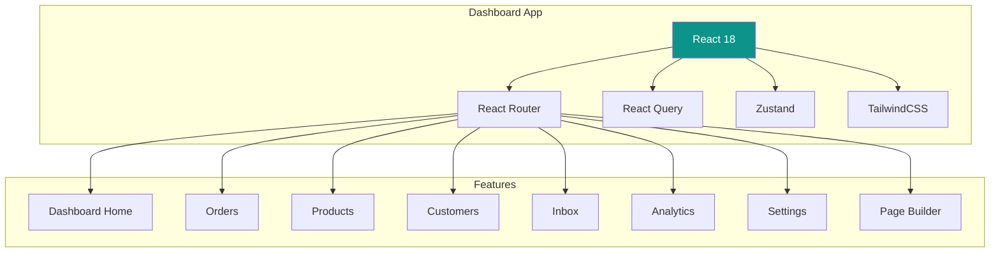

# Merchant Dashboard

[← Back to Integration Layer](../04-services/integration-layer.md) | [Next: Storefront →](./storefront.md)

---

## Overview

React SPA for merchants to manage their store.



---

## Project Structure

```
/dashboard
├── /src
│   ├── /components
│   │   ├── /ui              # Base UI components
│   │   │   ├── Button.jsx
│   │   │   ├── Input.jsx
│   │   │   ├── Modal.jsx
│   │   │   ├── Table.jsx
│   │   │   └── ...
│   │   ├── /layout
│   │   │   ├── Sidebar.jsx
│   │   │   ├── Header.jsx
│   │   │   └── Layout.jsx
│   │   └── /features        # Feature-specific components
│   │       ├── /orders
│   │       ├── /products
│   │       └── ...
│   │
│   ├── /pages
│   │   ├── Dashboard.jsx
│   │   ├── Orders.jsx
│   │   ├── OrderDetail.jsx
│   │   ├── Products.jsx
│   │   ├── ProductEdit.jsx
│   │   ├── Customers.jsx
│   │   ├── Inbox.jsx
│   │   ├── Analytics.jsx
│   │   ├── Settings.jsx
│   │   └── PageBuilder.jsx
│   │
│   ├── /hooks
│   │   ├── useOrders.js
│   │   ├── useProducts.js
│   │   └── ...
│   │
│   ├── /services
│   │   ├── api.js
│   │   └── auth.js
│   │
│   ├── /store
│   │   ├── authStore.js
│   │   └── uiStore.js
│   │
│   ├── /lib
│   │   └── utils.js
│   │
│   ├── App.jsx
│   └── main.jsx
│
├── index.html
├── vite.config.js
├── tailwind.config.js
└── package.json
```

---

## Core Components

### Layout

```jsx
// components/layout/Layout.jsx
export function Layout({ children }) {
  const [sidebarOpen, setSidebarOpen] = useState(false);

  return (
    <div className="min-h-screen bg-gray-50">
      {/* Mobile sidebar */}
      <MobileSidebar open={sidebarOpen} onClose={() => setSidebarOpen(false)} />

      {/* Desktop sidebar */}
      <aside className="hidden lg:fixed lg:inset-y-0 lg:flex lg:w-64 lg:flex-col">
        <Sidebar />
      </aside>

      {/* Main content */}
      <div className="lg:pl-64">
        <Header onMenuClick={() => setSidebarOpen(true)} />
        <main className="py-6 px-4 sm:px-6 lg:px-8">
          {children}
        </main>
      </div>
    </div>
  );
}
```

### Sidebar Navigation

```jsx
// components/layout/Sidebar.jsx
const navigation = [
  { name: 'Dashboard', href: '/', icon: HomeIcon },
  { name: 'Orders', href: '/orders', icon: ShoppingCartIcon, badge: 'ordersCount' },
  { name: 'Products', href: '/products', icon: CubeIcon },
  { name: 'Customers', href: '/customers', icon: UsersIcon },
  { name: 'Inbox', href: '/inbox', icon: ChatBubbleIcon, badge: 'unreadCount' },
  { name: 'Analytics', href: '/analytics', icon: ChartBarIcon },
  { name: 'Pages', href: '/pages', icon: DocumentIcon },
  { name: 'Settings', href: '/settings', icon: CogIcon },
];

export function Sidebar() {
  const location = useLocation();
  const { store } = useAuth();

  return (
    <div className="flex flex-col h-full bg-teal-700">
      {/* Store Logo */}
      <div className="flex items-center h-16 px-4 bg-teal-800">
        
        <span className="ml-2 text-white font-semibold truncate">
          {store.name}
        </span>
      </div>

      {/* Navigation */}
      <nav className="flex-1 px-2 py-4 space-y-1 overflow-y-auto">
        {navigation.map((item) => {
          const isActive = location.pathname === item.href;
          return (
            <Link
              key={item.name}
              to={item.href}
              className={cn(
                isActive
                  ? 'bg-teal-800 text-white'
                  : 'text-teal-100 hover:bg-teal-600',
                'group flex items-center px-3 py-2 text-sm font-medium rounded-md'
              )}
            >
              <item.icon className="mr-3 h-5 w-5" />
              {item.name}
              {item.badge && <Badge value={item.badge} />}
            </Link>
          );
        })}
      </nav>

      {/* Store URL */}
      <div className="p-4 border-t border-teal-600">
        <a
          href={`https://${store.subdomain}.baazarify.com`}
          target="_blank"
          rel="noopener"
          className="flex items-center text-teal-200 hover:text-white text-sm"
        >
          <ExternalLinkIcon className="h-4 w-4 mr-2" />
          View Store
        </a>
      </div>
    </div>
  );
}
```

---

## Dashboard Home

```jsx
// pages/Dashboard.jsx
export function Dashboard() {
  const { data: stats, isLoading } = useQuery({
    queryKey: ['dashboard-stats'],
    queryFn: () => api.get('/stores/me/stats?period=30d')
  });

  const { data: recentOrders } = useQuery({
    queryKey: ['recent-orders'],
    queryFn: () => api.get('/orders?limit=5&sort=-createdAt')
  });

  if (isLoading) return <DashboardSkeleton />;

  return (
    <div className="space-y-6">
      <h1 className="text-2xl font-bold text-gray-900">Dashboard</h1>

      {/* Stats Cards */}
      <div className="grid grid-cols-1 gap-4 sm:grid-cols-2 lg:grid-cols-4">
        <StatCard
          title="Total Revenue"
          value={formatCurrency(stats.summary.totalRevenue)}
          change={stats.comparison.revenue.change}
          icon={CurrencyIcon}
        />
        <StatCard
          title="Orders"
          value={stats.summary.totalOrders}
          change={stats.comparison.orders.change}
          icon={ShoppingCartIcon}
        />
        <StatCard
          title="Avg Order Value"
          value={formatCurrency(stats.summary.averageOrderValue)}
          change={stats.comparison.aov.change}
          icon={TrendingUpIcon}
        />
        <StatCard
          title="Conversion Rate"
          value={`${stats.summary.conversionRate}%`}
          icon={ChartIcon}
        />
      </div>

      {/* Charts */}
      <div className="grid grid-cols-1 gap-6 lg:grid-cols-2">
        <Card title="Revenue">
          <RevenueChart data={stats.charts.revenue} />
        </Card>
        <Card title="Orders by Source">
          <SourcePieChart data={stats.ordersBySource} />
        </Card>
      </div>

      {/* Recent Orders */}
      <Card title="Recent Orders" action={<Link to="/orders">View all</Link>}>
        <OrdersTable orders={recentOrders.data} compact />
      </Card>

      {/* Quick Actions */}
      <div className="grid grid-cols-2 gap-4 sm:grid-cols-4">
        <QuickAction
          icon={PlusIcon}
          label="Add Product"
          href="/products/new"
        />
        <QuickAction
          icon={PlusIcon}
          label="Create Order"
          href="/orders/new"
        />
        <QuickAction
          icon={PencilIcon}
          label="Edit Pages"
          href="/pages"
        />
        <QuickAction
          icon={ShareIcon}
          label="Share Store"
          onClick={handleShare}
        />
      </div>
    </div>
  );
}
```

---

## Orders Management

```jsx
// pages/Orders.jsx
export function Orders() {
  const [filters, setFilters] = useState({
    status: '',
    source: '',
    search: ''
  });

  const { data, isLoading, fetchNextPage, hasNextPage } = useInfiniteQuery({
    queryKey: ['orders', filters],
    queryFn: ({ pageParam = 1 }) =>
      api.get('/orders', { params: { ...filters, page: pageParam } }),
    getNextPageParam: (lastPage) =>
      lastPage.meta.page < lastPage.meta.totalPages
        ? lastPage.meta.page + 1
        : undefined
  });

  const updateStatus = useMutation({
    mutationFn: ({ id, status }) =>
      api.put(`/orders/${id}/status`, { status }),
    onSuccess: () => {
      queryClient.invalidateQueries(['orders']);
    }
  });

  return (
    <div className="space-y-4">
      <div className="flex justify-between items-center">
        <h1 className="text-2xl font-bold">Orders</h1>
        <Button onClick={() => navigate('/orders/new')}>
          <PlusIcon className="h-4 w-4 mr-2" />
          New Order
        </Button>
      </div>

      {/* Filters */}
      <div className="flex flex-wrap gap-4">
        <SearchInput
          value={filters.search}
          onChange={(search) => setFilters({ ...filters, search })}
          placeholder="Search orders..."
        />
        <Select
          value={filters.status}
          onChange={(status) => setFilters({ ...filters, status })}
          options={ORDER_STATUSES}
          placeholder="All Statuses"
        />
        <Select
          value={filters.source}
          onChange={(source) => setFilters({ ...filters, source })}
          options={ORDER_SOURCES}
          placeholder="All Sources"
        />
      </div>

      {/* Status Tabs */}
      <StatusTabs
        counts={data?.statusCounts}
        active={filters.status}
        onChange={(status) => setFilters({ ...filters, status })}
      />

      {/* Orders Table */}
      <div className="bg-white rounded-lg shadow overflow-hidden">
        <table className="min-w-full divide-y divide-gray-200">
          <thead className="bg-gray-50">
            <tr>
              <th className="px-6 py-3 text-left text-xs font-medium text-gray-500 uppercase">
                Order
              </th>
              <th className="px-6 py-3 text-left text-xs font-medium text-gray-500 uppercase">
                Customer
              </th>
              <th className="px-6 py-3 text-left text-xs font-medium text-gray-500 uppercase">
                Status
              </th>
              <th className="px-6 py-3 text-left text-xs font-medium text-gray-500 uppercase">
                Source
              </th>
              <th className="px-6 py-3 text-right text-xs font-medium text-gray-500 uppercase">
                Total
              </th>
              <th className="px-6 py-3"></th>
            </tr>
          </thead>
          <tbody className="divide-y divide-gray-200">
            {data?.pages.flatMap((page) =>
              page.data.map((order) => (
                <OrderRow
                  key={order.id}
                  order={order}
                  onStatusChange={(status) =>
                    updateStatus.mutate({ id: order.id, status })
                  }
                />
              ))
            )}
          </tbody>
        </table>

        {hasNextPage && (
          <div className="px-6 py-4 border-t">
            <Button variant="ghost" onClick={() => fetchNextPage()}>
              Load More
            </Button>
          </div>
        )}
      </div>
    </div>
  );
}
```

---

## Products Management

```jsx
// pages/Products.jsx
export function Products() {
  const [view, setView] = useState('grid'); // 'grid' | 'list'

  const { data, isLoading } = useQuery({
    queryKey: ['products'],
    queryFn: () => api.get('/products')
  });

  const deleteProduct = useMutation({
    mutationFn: (id) => api.delete(`/products/${id}`),
    onSuccess: () => queryClient.invalidateQueries(['products'])
  });

  return (
    <div className="space-y-4">
      <div className="flex justify-between items-center">
        <h1 className="text-2xl font-bold">Products</h1>
        <div className="flex gap-2">
          <ViewToggle value={view} onChange={setView} />
          <Button onClick={() => navigate('/products/new')}>
            <PlusIcon className="h-4 w-4 mr-2" />
            Add Product
          </Button>
        </div>
      </div>

      {view === 'grid' ? (
        <div className="grid grid-cols-2 md:grid-cols-3 lg:grid-cols-4 gap-4">
          {data?.data.map((product) => (
            <ProductCard
              key={product.id}
              product={product}
              onEdit={() => navigate(`/products/${product.id}`)}
              onDelete={() => deleteProduct.mutate(product.id)}
            />
          ))}
        </div>
      ) : (
        <ProductsTable
          products={data?.data}
          onEdit={(id) => navigate(`/products/${id}`)}
          onDelete={(id) => deleteProduct.mutate(id)}
        />
      )}
    </div>
  );
}
```

---

## Inbox (Social Conversations)

```jsx
// pages/Inbox.jsx
export function Inbox() {
  const [selected, setSelected] = useState(null);

  const { data: conversations } = useQuery({
    queryKey: ['conversations'],
    queryFn: () => api.get('/conversations'),
    refetchInterval: 10000 // Poll every 10s
  });

  const sendReply = useMutation({
    mutationFn: ({ id, message }) =>
      api.post(`/conversations/${id}/reply`, { type: 'text', content: message }),
    onSuccess: () => queryClient.invalidateQueries(['conversations'])
  });

  return (
    <div className="flex h-[calc(100vh-8rem)] bg-white rounded-lg shadow overflow-hidden">
      {/* Conversation List */}
      <div className="w-80 border-r overflow-y-auto">
        <div className="p-4 border-b">
          <SearchInput placeholder="Search conversations..." />
        </div>
        {conversations?.data.map((conv) => (
          <ConversationItem
            key={conv.id}
            conversation={conv}
            selected={selected?.id === conv.id}
            onClick={() => setSelected(conv)}
          />
        ))}
      </div>

      {/* Conversation Detail */}
      <div className="flex-1 flex flex-col">
        {selected ? (
          <>
            <ConversationHeader
              conversation={selected}
              onConvert={() => handleConvert(selected)}
            />
            <MessageList messages={selected.messages} />
            <MessageInput
              onSend={(message) =>
                sendReply.mutate({ id: selected.id, message })
              }
            />
          </>
        ) : (
          <EmptyState message="Select a conversation" />
        )}
      </div>
    </div>
  );
}
```

---

## API Service

```javascript
// services/api.js
import axios from 'axios';
import { useAuthStore } from '../store/authStore';

const api = axios.create({
  baseURL: import.meta.env.VITE_API_URL || 'https://api.baazarify.com/v1'
});

// Request interceptor
api.interceptors.request.use((config) => {
  const { accessToken } = useAuthStore.getState();
  if (accessToken) {
    config.headers.Authorization = `Bearer ${accessToken}`;
  }
  return config;
});

// Response interceptor
api.interceptors.response.use(
  (response) => response.data,
  async (error) => {
    if (error.response?.status === 401) {
      const { refreshToken, setTokens, logout } = useAuthStore.getState();

      if (refreshToken) {
        try {
          const response = await axios.post(
            `${api.defaults.baseURL}/auth/refresh`,
            { refreshToken }
          );
          setTokens(response.data.data);
          return api(error.config);
        } catch {
          logout();
        }
      }
    }
    return Promise.reject(error.response?.data || error);
  }
);

export default api;
```

---

## State Management

```javascript
// store/authStore.js
import { create } from 'zustand';
import { persist } from 'zustand/middleware';

export const useAuthStore = create(
  persist(
    (set) => ({
      user: null,
      store: null,
      accessToken: null,
      refreshToken: null,

      setAuth: ({ user, store, accessToken, refreshToken }) =>
        set({ user, store, accessToken, refreshToken }),

      setTokens: ({ accessToken, refreshToken }) =>
        set({ accessToken, refreshToken }),

      logout: () =>
        set({
          user: null,
          store: null,
          accessToken: null,
          refreshToken: null
        })
    }),
    {
      name: 'auth-storage',
      partialize: (state) => ({
        accessToken: state.accessToken,
        refreshToken: state.refreshToken
      })
    }
  )
);
```

---

[Next: Storefront →](./storefront.md)
