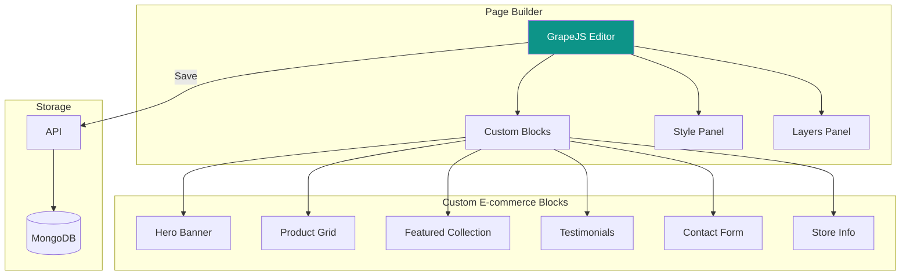

# Page Builder

[← Back to Storefront](./storefront.md) | [Next: Deployment →](../06-infrastructure/deployment.md)

---

## Overview

GrapeJS-powered drag-and-drop page builder for creating custom store pages.



---

## GrapeJS Integration

### Editor Setup

```jsx
// components/PageBuilder/Editor.jsx
import grapesjs from 'grapesjs';
import gjsPresetWebpage from 'grapesjs-preset-webpage';
import gjsBlocksBasic from 'grapesjs-blocks-basic';
import { useEffect, useRef } from 'react';

export function PageBuilderEditor({ pageData, onSave }) {
  const editorRef = useRef(null);

  useEffect(() => {
    const editor = grapesjs.init({
      container: '#gjs-editor',
      height: '100%',
      width: 'auto',

      // Load existing content
      components: pageData?.content?.components || '',
      style: pageData?.content?.styles || '',

      // Storage
      storageManager: false, // We handle storage manually

      // Plugins
      plugins: [gjsPresetWebpage, gjsBlocksBasic, ecommerceBlocks],

      // Canvas
      canvas: {
        styles: ['https://cdn.jsdelivr.net/npm/tailwindcss@2/dist/tailwind.min.css'],
      },

      // Panels
      panels: {
        defaults: [
          {
            id: 'panel-devices',
            buttons: [
              { id: 'desktop', command: 'set-device-desktop', active: true },
              { id: 'tablet', command: 'set-device-tablet' },
              { id: 'mobile', command: 'set-device-mobile' },
            ],
          },
        ],
      },

      // Device Manager
      deviceManager: {
        devices: [
          { name: 'Desktop', width: '' },
          { name: 'Tablet', width: '768px' },
          { name: 'Mobile', width: '375px' },
        ],
      },

      // Block Manager
      blockManager: {
        appendTo: '#blocks-panel',
      },

      // Style Manager
      styleManager: {
        appendTo: '#styles-panel',
        sectors: [
          {
            name: 'Layout',
            open: true,
            properties: ['display', 'flex-direction', 'justify-content', 'align-items', 'gap'],
          },
          {
            name: 'Spacing',
            properties: ['margin', 'padding'],
          },
          {
            name: 'Typography',
            properties: ['font-family', 'font-size', 'font-weight', 'color', 'text-align'],
          },
          {
            name: 'Background',
            properties: ['background-color', 'background-image'],
          },
          {
            name: 'Border',
            properties: ['border', 'border-radius'],
          },
        ],
      },
    });

    editorRef.current = editor;

    // Custom save command
    editor.Commands.add('save-page', {
      run: () => {
        const html = editor.getHtml();
        const css = editor.getCss();
        const components = editor.getComponents();
        const styles = editor.getStyle();

        onSave({
          html,
          css,
          components: JSON.stringify(components),
          styles: JSON.stringify(styles),
        });
      },
    });

    return () => {
      editor.destroy();
    };
  }, []);

  return (
    <div className="flex h-screen">
      {/* Left Panel - Blocks */}
      <div className="w-64 bg-gray-100 border-r overflow-y-auto">
        <div className="p-4">
          <h3 className="font-semibold mb-4">Blocks</h3>
          <div id="blocks-panel" />
        </div>
      </div>

      {/* Canvas */}
      <div className="flex-1">
        <div id="gjs-editor" className="h-full" />
      </div>

      {/* Right Panel - Styles */}
      <div className="w-72 bg-gray-100 border-l overflow-y-auto">
        <div className="p-4">
          <h3 className="font-semibold mb-4">Styles</h3>
          <div id="styles-panel" />
        </div>
      </div>
    </div>
  );
}
```

---

## Custom E-commerce Blocks

```javascript
// plugins/ecommerce-blocks.js
export default function ecommerceBlocks(editor) {
  const blockManager = editor.BlockManager;
  const components = editor.DomComponents;

  // Hero Banner Block
  blockManager.add('hero-banner', {
    label: 'Hero Banner',
    category: 'E-commerce',
    content: `
      <section class="hero-banner relative h-96 bg-gradient-to-r from-teal-600 to-teal-800">
        <div class="container mx-auto px-4 h-full flex items-center">
          <div class="max-w-xl text-white">
            <h1 class="text-4xl font-bold mb-4" data-gjs-editable="true">
              Welcome to Our Store
            </h1>
            <p class="text-xl mb-6" data-gjs-editable="true">
              Discover amazing products at great prices
            </p>
            <a href="/products" class="inline-block bg-white text-teal-700 px-6 py-3 rounded-lg font-semibold hover:bg-gray-100">
              Shop Now
            </a>
          </div>
        </div>
      </section>
    `,
    attributes: { class: 'fa fa-image' },
  });

  // Product Grid Block
  blockManager.add('product-grid', {
    label: 'Product Grid',
    category: 'E-commerce',
    content: {
      type: 'product-grid',
      attributes: {
        'data-products': '8',
        'data-category': '',
        'data-columns': '4',
      },
    },
    attributes: { class: 'fa fa-th' },
  });

  // Register Product Grid Component
  components.addType('product-grid', {
    model: {
      defaults: {
        tagName: 'div',
        droppable: false,
        attributes: {
          class: 'product-grid',
        },
        traits: [
          {
            type: 'number',
            name: 'data-products',
            label: 'Products to show',
            default: 8,
          },
          {
            type: 'select',
            name: 'data-category',
            label: 'Category',
            options: [], // Populated dynamically
          },
          {
            type: 'select',
            name: 'data-columns',
            label: 'Columns',
            options: [
              { value: '2', name: '2 Columns' },
              { value: '3', name: '3 Columns' },
              { value: '4', name: '4 Columns' },
            ],
          },
        ],
      },
    },
    view: {
      onRender() {
        const count = this.model.getAttributes()['data-products'] || 8;
        const cols = this.model.getAttributes()['data-columns'] || 4;

        this.el.innerHTML = `
          <div class="grid grid-cols-${cols} gap-4 p-4">
            ${Array(parseInt(count))
              .fill(0)
              .map(
                (_, i) => `
              <div class="bg-gray-100 rounded-lg p-4">
                <div class="aspect-square bg-gray-200 rounded mb-4"></div>
                <div class="h-4 bg-gray-200 rounded w-3/4 mb-2"></div>
                <div class="h-4 bg-gray-200 rounded w-1/2"></div>
              </div>
            `
              )
              .join('')}
          </div>
        `;
      },
    },
  });

  // Featured Collection Block
  blockManager.add('featured-collection', {
    label: 'Featured Collection',
    category: 'E-commerce',
    content: `
      <section class="py-12 bg-gray-50">
        <div class="container mx-auto px-4">
          <h2 class="text-2xl font-bold text-center mb-8" data-gjs-editable="true">
            Featured Collection
          </h2>
          <div class="grid grid-cols-3 gap-6" data-gjs-type="product-grid" data-products="6"></div>
        </div>
      </section>
    `,
    attributes: { class: 'fa fa-star' },
  });

  // Testimonials Block
  blockManager.add('testimonials', {
    label: 'Testimonials',
    category: 'E-commerce',
    content: `
      <section class="py-12">
        <div class="container mx-auto px-4">
          <h2 class="text-2xl font-bold text-center mb-8" data-gjs-editable="true">
            What Our Customers Say
          </h2>
          <div class="grid grid-cols-3 gap-6">
            ${[1, 2, 3]
              .map(
                () => `
              <div class="bg-white p-6 rounded-lg shadow">
                <div class="flex items-center mb-4">
                  <div class="w-12 h-12 bg-gray-200 rounded-full mr-4"></div>
                  <div>
                    <div class="font-semibold" data-gjs-editable="true">Customer Name</div>
                    <div class="text-yellow-500">★★★★★</div>
                  </div>
                </div>
                <p class="text-gray-600" data-gjs-editable="true">
                  "Amazing products and fast delivery. Highly recommended!"
                </p>
              </div>
            `
              )
              .join('')}
          </div>
        </div>
      </section>
    `,
    attributes: { class: 'fa fa-comments' },
  });

  // Store Info Block
  blockManager.add('store-info', {
    label: 'Store Info',
    category: 'E-commerce',
    content: `
      <section class="py-12 bg-teal-700 text-white">
        <div class="container mx-auto px-4">
          <div class="grid grid-cols-3 gap-8 text-center">
            <div>
              <div class="text-4xl mb-2">🚚</div>
              <h3 class="font-semibold mb-2" data-gjs-editable="true">Free Delivery</h3>
              <p class="text-teal-200" data-gjs-editable="true">On orders above NPR 2000</p>
            </div>
            <div>
              <div class="text-4xl mb-2">💳</div>
              <h3 class="font-semibold mb-2" data-gjs-editable="true">Secure Payment</h3>
              <p class="text-teal-200" data-gjs-editable="true">eSewa, Khalti, COD</p>
            </div>
            <div>
              <div class="text-4xl mb-2">📞</div>
              <h3 class="font-semibold mb-2" data-gjs-editable="true">24/7 Support</h3>
              <p class="text-teal-200" data-gjs-editable="true">Call us anytime</p>
            </div>
          </div>
        </div>
      </section>
    `,
    attributes: { class: 'fa fa-info-circle' },
  });

  // Contact Form Block
  blockManager.add('contact-form', {
    label: 'Contact Form',
    category: 'E-commerce',
    content: `
      <section class="py-12">
        <div class="container mx-auto px-4 max-w-lg">
          <h2 class="text-2xl font-bold text-center mb-8" data-gjs-editable="true">
            Contact Us
          </h2>
          <form class="space-y-4" data-gjs-type="contact-form">
            <input type="text" placeholder="Your Name" class="w-full px-4 py-2 border rounded-lg" />
            <input type="email" placeholder="Your Email" class="w-full px-4 py-2 border rounded-lg" />
            <textarea placeholder="Your Message" rows="4" class="w-full px-4 py-2 border rounded-lg"></textarea>
            <button type="submit" class="w-full bg-teal-600 text-white py-3 rounded-lg font-semibold hover:bg-teal-700">
              Send Message
            </button>
          </form>
        </div>
      </section>
    `,
    attributes: { class: 'fa fa-envelope' },
  });
}
```

---

## Page Renderer (Storefront)

```tsx
// components/store/PageRenderer.tsx
import { useMemo } from 'react';

interface PageContent {
  html: string;
  css: string;
}

export function PageRenderer({ page, store }: { page: { content: PageContent }; store: Store }) {
  const processedHtml = useMemo(() => {
    let html = page.content.html;

    // Replace product grid placeholders with actual products
    html = html.replace(/<div[^>]*data-gjs-type="product-grid"[^>]*><\/div>/g, (match) => {
      const count = match.match(/data-products="(\d+)"/)?.[1] || '8';
      return `<product-grid data-count="${count}"></product-grid>`;
    });

    return html;
  }, [page.content.html]);

  return (
    <>
      <style dangerouslySetInnerHTML={{ __html: page.content.css }} />
      <div dangerouslySetInnerHTML={{ __html: processedHtml }} className="page-content" />
      <ProductGridHydrator />
    </>
  );
}

// Client component to hydrate product grids
('use client');

function ProductGridHydrator() {
  useEffect(() => {
    const grids = document.querySelectorAll('product-grid');

    grids.forEach(async (grid) => {
      const count = grid.getAttribute('data-count') || '8';
      const products = await fetchProducts({ limit: count });

      grid.innerHTML = `
        <div class="grid grid-cols-4 gap-4">
          ${products.map(renderProductCard).join('')}
        </div>
      `;
    });
  }, []);

  return null;
}
```

---

## Page Builder Page

```jsx
// pages/PageBuilder.jsx (Dashboard)
import { useState } from 'react';
import { useQuery, useMutation } from '@tanstack/react-query';
import { PageBuilderEditor } from '@/components/PageBuilder/Editor';

export function PageBuilder() {
  const [selectedPage, setSelectedPage] = useState('home');

  const { data: pages } = useQuery({
    queryKey: ['pages'],
    queryFn: () => api.get('/pages'),
  });

  const { data: pageData } = useQuery({
    queryKey: ['page', selectedPage],
    queryFn: () => api.get(`/pages/${selectedPage}`),
  });

  const savePage = useMutation({
    mutationFn: (content) => api.put(`/pages/${selectedPage}`, { content }),
    onSuccess: () => {
      toast.success('Page saved successfully');
    },
  });

  return (
    <div className="h-screen flex flex-col">
      {/* Toolbar */}
      <div className="h-14 bg-white border-b flex items-center justify-between px-4">
        <div className="flex items-center gap-4">
          <select
            value={selectedPage}
            onChange={(e) => setSelectedPage(e.target.value)}
            className="border rounded px-3 py-1.5"
          >
            {pages?.data.map((page) => (
              <option key={page.slug} value={page.slug}>
                {page.title}
              </option>
            ))}
          </select>
          <Button variant="outline" onClick={handleNewPage}>
            <PlusIcon className="h-4 w-4 mr-2" />
            New Page
          </Button>
        </div>

        <div className="flex items-center gap-2">
          <Button variant="outline" onClick={handlePreview}>
            <EyeIcon className="h-4 w-4 mr-2" />
            Preview
          </Button>
          <Button onClick={() => savePage.mutate()} loading={savePage.isPending}>
            <SaveIcon className="h-4 w-4 mr-2" />
            Save
          </Button>
          <Button variant="primary" onClick={handlePublish}>
            Publish
          </Button>
        </div>
      </div>

      {/* Editor */}
      <div className="flex-1">
        {pageData && (
          <PageBuilderEditor
            key={selectedPage}
            pageData={pageData}
            onSave={(content) => savePage.mutate(content)}
          />
        )}
      </div>
    </div>
  );
}
```

---

## Storage Format

```javascript
// Page document in MongoDB
{
  _id: ObjectId('...'),
  storeId: ObjectId('...'),
  slug: 'home',
  title: 'Home Page',
  content: {
    // GrapeJS component JSON
    components: '[{"type":"section",...}]',
    // GrapeJS style JSON
    styles: '[{"selectors":["#hero"],...}]',
    // Rendered HTML (for SSR)
    html: '<section class="hero-banner">...</section>',
    // Rendered CSS
    css: '.hero-banner { ... }'
  },
  isPublished: true,
  publishedAt: ISODate('...'),
  updatedAt: ISODate('...')
}
```

---

[Next: Deployment →](../06-infrastructure/deployment.md)
