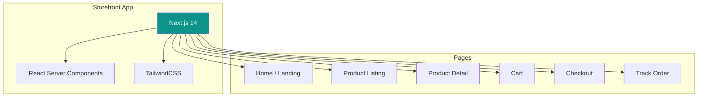

# Customer Storefront

[← Back to Dashboard](./dashboard.md) | [Next: Page Builder →](./page-builder.md)

---

## Overview

Next.js application for customer-facing storefronts with SSR for SEO.



---

## Project Structure

```
/storefront
├── /src
│   ├── /app
│   │   ├── /[subdomain]          # Dynamic subdomain routing
│   │   │   ├── page.tsx          # Home page
│   │   │   ├── layout.tsx        # Store layout
│   │   │   ├── /products
│   │   │   │   └── page.tsx      # Product listing
│   │   │   ├── /p
│   │   │   │   └── /[slug]
│   │   │   │       └── page.tsx  # Product detail
│   │   │   ├── /cart
│   │   │   │   └── page.tsx
│   │   │   ├── /checkout
│   │   │   │   └── page.tsx
│   │   │   ├── /track
│   │   │   │   └── page.tsx
│   │   │   └── /[...slug]
│   │   │       └── page.tsx      # Dynamic pages (about, contact)
│   │   │
│   │   ├── layout.tsx            # Root layout
│   │   └── not-found.tsx
│   │
│   ├── /components
│   │   ├── /ui
│   │   ├── /store
│   │   │   ├── Header.tsx
│   │   │   ├── Footer.tsx
│   │   │   ├── ProductCard.tsx
│   │   │   ├── Cart.tsx
│   │   │   └── ...
│   │   └── /checkout
│   │
│   ├── /lib
│   │   ├── api.ts
│   │   ├── cart.ts
│   │   └── utils.ts
│   │
│   └── /styles
│       └── globals.css
│
├── next.config.js
├── tailwind.config.js
└── package.json
```

---

## Subdomain Routing

### Middleware

```typescript
// middleware.ts
import { NextResponse } from 'next/server';
import type { NextRequest } from 'next/server';

export function middleware(request: NextRequest) {
  const url = request.nextUrl;
  const hostname = request.headers.get('host') || '';

  // Get subdomain
  const subdomain = getSubdomain(hostname);

  // Skip for main domain
  if (!subdomain || subdomain === 'www') {
    return NextResponse.next();
  }

  // Rewrite to subdomain route
  url.pathname = `/${subdomain}${url.pathname}`;
  return NextResponse.rewrite(url);
}

function getSubdomain(hostname: string): string | null {
  const parts = hostname.split('.');

  // localhost:3000 -> null
  if (hostname.includes('localhost')) {
    return null;
  }

  // store.baazarify.com -> store
  if (parts.length >= 3) {
    return parts[0];
  }

  return null;
}

export const config = {
  matcher: ['/((?!api|_next/static|_next/image|favicon.ico).*)'],
};
```

### Store Layout

```tsx
// app/[subdomain]/layout.tsx
import { getStore } from '@/lib/api';
import { StoreProvider } from '@/components/store/StoreProvider';
import { Header } from '@/components/store/Header';
import { Footer } from '@/components/store/Footer';

export async function generateMetadata({ params }: Props) {
  const store = await getStore(params.subdomain);

  return {
    title: store.name,
    description: store.settings.description,
    icons: { icon: store.settings.favicon },
  };
}

export default async function StoreLayout({
  children,
  params,
}: {
  children: React.ReactNode;
  params: { subdomain: string };
}) {
  const store = await getStore(params.subdomain);

  if (!store) {
    notFound();
  }

  return (
    <StoreProvider store={store}>
      <div
        style={
          {
            '--color-primary': store.theme.colors.primary,
            '--color-secondary': store.theme.colors.secondary,
            '--color-accent': store.theme.colors.accent,
          } as React.CSSProperties
        }
      >
        <Header />
        <main className="min-h-screen">{children}</main>
        <Footer />
      </div>
    </StoreProvider>
  );
}
```

---

## Home Page (Page Builder Rendered)

```tsx
// app/[subdomain]/page.tsx
import { getStore, getPage } from '@/lib/api';
import { PageRenderer } from '@/components/store/PageRenderer';

export default async function HomePage({ params }: { params: { subdomain: string } }) {
  const [store, page] = await Promise.all([
    getStore(params.subdomain),
    getPage(params.subdomain, 'home'),
  ]);

  return <PageRenderer page={page} store={store} />;
}
```

---

## Product Listing

```tsx
// app/[subdomain]/products/page.tsx
import { getProducts, getCategories } from '@/lib/api';
import { ProductGrid } from '@/components/store/ProductGrid';
import { CategoryFilter } from '@/components/store/CategoryFilter';

export default async function ProductsPage({
  params,
  searchParams,
}: {
  params: { subdomain: string };
  searchParams: { category?: string; search?: string };
}) {
  const [products, categories] = await Promise.all([
    getProducts(params.subdomain, searchParams),
    getCategories(params.subdomain),
  ]);

  return (
    <div className="container mx-auto px-4 py-8">
      <div className="flex gap-8">
        {/* Sidebar Filters */}
        <aside className="hidden lg:block w-64 flex-shrink-0">
          <CategoryFilter categories={categories} selected={searchParams.category} />
        </aside>

        {/* Products */}
        <div className="flex-1">
          <div className="flex justify-between items-center mb-6">
            <h1 className="text-2xl font-bold">{searchParams.category || 'All Products'}</h1>
            <span className="text-gray-500">{products.meta.total} products</span>
          </div>

          <ProductGrid products={products.data} />

          {/* Pagination */}
          {products.meta.totalPages > 1 && (
            <Pagination current={products.meta.page} total={products.meta.totalPages} />
          )}
        </div>
      </div>
    </div>
  );
}
```

---

## Product Detail

```tsx
// app/[subdomain]/p/[slug]/page.tsx
import { getProduct } from '@/lib/api';
import { ProductGallery } from '@/components/store/ProductGallery';
import { ProductInfo } from '@/components/store/ProductInfo';
import { AddToCart } from '@/components/store/AddToCart';

export async function generateMetadata({ params }: Props) {
  const product = await getProduct(params.subdomain, params.slug);

  return {
    title: `${product.name} | Store`,
    description: product.shortDescription,
    openGraph: {
      images: [product.images[0]?.url],
    },
  };
}

export default async function ProductPage({
  params,
}: {
  params: { subdomain: string; slug: string };
}) {
  const product = await getProduct(params.subdomain, params.slug);

  const jsonLd = {
    '@context': 'https://schema.org',
    '@type': 'Product',
    name: product.name,
    description: product.description,
    image: product.images.map((i) => i.url),
    offers: {
      '@type': 'Offer',
      price: product.price,
      priceCurrency: 'NPR',
      availability:
        product.stock > 0 ? 'https://schema.org/InStock' : 'https://schema.org/OutOfStock',
    },
  };

  return (
    <>
      <script
        type="application/ld+json"
        dangerouslySetInnerHTML={{ __html: JSON.stringify(jsonLd) }}
      />

      <div className="container mx-auto px-4 py-8">
        <div className="grid grid-cols-1 lg:grid-cols-2 gap-8">
          <ProductGallery images={product.images} />

          <div className="space-y-6">
            <ProductInfo product={product} />
            <AddToCart product={product} />
          </div>
        </div>

        {/* Related Products */}
        <section className="mt-16">
          <h2 className="text-xl font-bold mb-6">You may also like</h2>
          <RelatedProducts subdomain={params.subdomain} productId={product.id} />
        </section>
      </div>
    </>
  );
}
```

---

## Cart (Client Component)

```tsx
// components/store/Cart.tsx
'use client';

import { useCart } from '@/lib/cart';
import { formatCurrency } from '@/lib/utils';

export function Cart() {
  const { items, updateQuantity, removeItem, total, isOpen, close } = useCart();

  return (
    <Sheet open={isOpen} onOpenChange={close}>
      <SheetContent className="w-full sm:max-w-lg">
        <SheetHeader>
          <SheetTitle>Shopping Cart ({items.length})</SheetTitle>
        </SheetHeader>

        {items.length === 0 ? (
          <div className="flex-1 flex items-center justify-center">
            <p className="text-gray-500">Your cart is empty</p>
          </div>
        ) : (
          <>
            <div className="flex-1 overflow-y-auto py-4">
              {items.map((item) => (
                <CartItem
                  key={item.id}
                  item={item}
                  onUpdateQuantity={(qty) => updateQuantity(item.id, qty)}
                  onRemove={() => removeItem(item.id)}
                />
              ))}
            </div>

            <div className="border-t pt-4 space-y-4">
              <div className="flex justify-between text-lg font-semibold">
                <span>Subtotal</span>
                <span>{formatCurrency(total)}</span>
              </div>
              <Button className="w-full" size="lg" asChild>
                <Link href="/checkout">Proceed to Checkout</Link>
              </Button>
            </div>
          </>
        )}
      </SheetContent>
    </Sheet>
  );
}
```

---

## Checkout

```tsx
// app/[subdomain]/checkout/page.tsx
'use client';

import { useState } from 'react';
import { useCart } from '@/lib/cart';
import { createOrder } from '@/lib/api';

export default function CheckoutPage() {
  const { items, total, clear } = useCart();
  const [step, setStep] = useState<'info' | 'payment'>('info');
  const [formData, setFormData] = useState({});

  const handleSubmit = async () => {
    const order = await createOrder({
      customer: formData.customer,
      shippingAddress: formData.address,
      items: items.map((i) => ({
        productId: i.productId,
        variantId: i.variantId,
        quantity: i.quantity,
      })),
      payment: { method: formData.paymentMethod },
    });

    if (order.payment.redirectUrl) {
      // Redirect to payment gateway
      window.location.href = order.payment.redirectUrl;
    } else {
      // COD - show confirmation
      clear();
      router.push(`/order-confirmed/${order.orderNumber}`);
    }
  };

  return (
    <div className="container mx-auto px-4 py-8">
      <div className="grid grid-cols-1 lg:grid-cols-3 gap-8">
        {/* Checkout Form */}
        <div className="lg:col-span-2 space-y-6">
          {step === 'info' && (
            <CustomerInfoForm
              onSubmit={(data) => {
                setFormData({ ...formData, ...data });
                setStep('payment');
              }}
            />
          )}

          {step === 'payment' && (
            <PaymentForm
              onSubmit={(method) => {
                setFormData({ ...formData, paymentMethod: method });
                handleSubmit();
              }}
              onBack={() => setStep('info')}
            />
          )}
        </div>

        {/* Order Summary */}
        <div className="lg:col-span-1">
          <OrderSummary items={items} total={total} />
        </div>
      </div>
    </div>
  );
}
```

---

## Cart State (Zustand)

```typescript
// lib/cart.ts
import { create } from 'zustand';
import { persist } from 'zustand/middleware';

interface CartItem {
  id: string;
  productId: string;
  variantId?: string;
  name: string;
  price: number;
  quantity: number;
  image: string;
}

interface CartStore {
  items: CartItem[];
  isOpen: boolean;
  addItem: (item: Omit<CartItem, 'id'>) => void;
  updateQuantity: (id: string, quantity: number) => void;
  removeItem: (id: string) => void;
  clear: () => void;
  open: () => void;
  close: () => void;
  total: number;
}

export const useCart = create<CartStore>()(
  persist(
    (set, get) => ({
      items: [],
      isOpen: false,

      addItem: (item) => {
        const id = item.variantId ? `${item.productId}-${item.variantId}` : item.productId;

        set((state) => {
          const existing = state.items.find((i) => i.id === id);

          if (existing) {
            return {
              items: state.items.map((i) =>
                i.id === id ? { ...i, quantity: i.quantity + item.quantity } : i
              ),
              isOpen: true,
            };
          }

          return {
            items: [...state.items, { ...item, id }],
            isOpen: true,
          };
        });
      },

      updateQuantity: (id, quantity) => {
        if (quantity <= 0) {
          get().removeItem(id);
          return;
        }
        set((state) => ({
          items: state.items.map((i) => (i.id === id ? { ...i, quantity } : i)),
        }));
      },

      removeItem: (id) => {
        set((state) => ({
          items: state.items.filter((i) => i.id !== id),
        }));
      },

      clear: () => set({ items: [] }),

      open: () => set({ isOpen: true }),
      close: () => set({ isOpen: false }),

      get total() {
        return get().items.reduce((sum, item) => sum + item.price * item.quantity, 0);
      },
    }),
    {
      name: 'cart-storage',
    }
  )
);
```

---

## API Client

```typescript
// lib/api.ts
const API_URL = process.env.NEXT_PUBLIC_API_URL || 'https://api.baazarify.com/v1';

async function fetchApi<T>(endpoint: string, options?: RequestInit): Promise<T> {
  const res = await fetch(`${API_URL}${endpoint}`, {
    ...options,
    headers: {
      'Content-Type': 'application/json',
      ...options?.headers,
    },
    next: { revalidate: 60 }, // Cache for 1 minute
  });

  if (!res.ok) {
    throw new Error(`API error: ${res.status}`);
  }

  const data = await res.json();
  return data.data;
}

export async function getStore(subdomain: string) {
  return fetchApi(`/storefront/${subdomain}`);
}

export async function getProducts(
  subdomain: string,
  params?: { category?: string; search?: string; page?: number }
) {
  const query = new URLSearchParams(params as any).toString();
  return fetchApi(`/storefront/${subdomain}/products?${query}`);
}

export async function getProduct(subdomain: string, slug: string) {
  return fetchApi(`/storefront/${subdomain}/products/${slug}`);
}

export async function getPage(subdomain: string, slug: string) {
  return fetchApi(`/storefront/${subdomain}/pages/${slug}`);
}

export async function createOrder(data: CreateOrderInput) {
  return fetchApi('/storefront/orders', {
    method: 'POST',
    body: JSON.stringify(data),
    cache: 'no-store',
  });
}
```

---

[Next: Page Builder →](./page-builder.md)
