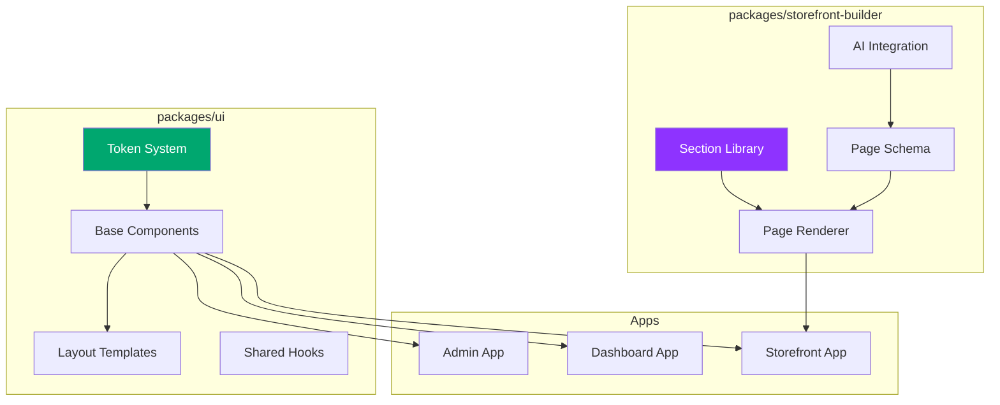

# UI System Design

[← Back to Dashboard](./dashboard.md) | [Next: Page Builder →](./page-builder.md)

---

## Overview

This document defines the architecture for Baazarify's UI system, including:

1. **Design Token System** - Customizable theme tokens with constraints
2. **Shared UI Package** - Reusable components across all apps
3. **Storefront Builder** - AI-assisted section-based landing page builder
4. **Theme Persistence** - Per-store theme storage and runtime application



---

## Architecture Decisions

### Styling Approach: Tailwind CSS + CSS Custom Properties

**Decision**: Stay with Tailwind CSS v4, structured around CSS custom properties (design tokens).

**Rationale**:

- Apps already use Tailwind - no migration needed
- CSS variables enable runtime theme switching without JS re-renders
- Lighter bundle than MUI's CSS-in-JS approach
- Better SSR performance with Next.js
- Tailwind v4 has first-class CSS variable support

**Trade-offs**:

- Need to port Minima component patterns to Tailwind (one-time effort)
- Less out-of-box component variety than MUI

### Component Source: Selective Port from Minima MUI

**Decision**: Extract component patterns and layouts from Minima, rewrite styling with Tailwind.

**What to port**:

- Component structure and prop APIs
- Layout patterns (dashboard, auth, simple)
- Hook patterns (useBoolean, useResponsive, etc.)
- Form integration patterns (React Hook Form wrappers)

**What NOT to port**:

- MUI-specific styling (sx props, Emotion)
- Heavy dependencies (ApexCharts, FullCalendar, Mapbox, etc.)
- Auth provider integrations (we have our own)

---

## Package Structure

### 1. `@baazarify/ui` - Core Design System

```
packages/ui/
├── src/
│   ├── tokens/
│   │   ├── schema.ts           # Token definitions with constraints
│   │   ├── defaults.ts         # Default theme values
│   │   ├── presets.ts          # Pre-built theme presets
│   │   ├── types.ts            # TypeScript types for tokens
│   │   └── index.ts
│   │
│   ├── theme/
│   │   ├── provider.tsx        # ThemeProvider component
│   │   ├── context.ts          # Theme context
│   │   ├── css-generator.ts    # Generates CSS custom properties
│   │   ├── use-theme.ts        # Hook to access/modify theme
│   │   └── index.ts
│   │
│   ├── components/
│   │   ├── button/
│   │   │   ├── button.tsx
│   │   │   ├── button.styles.ts  # Tailwind class variants
│   │   │   └── index.ts
│   │   ├── card/
│   │   ├── input/
│   │   ├── select/
│   │   ├── checkbox/
│   │   ├── radio/
│   │   ├── switch/
│   │   ├── textarea/
│   │   ├── avatar/
│   │   ├── badge/
│   │   ├── label/
│   │   ├── modal/
│   │   ├── popover/
│   │   ├── dropdown/
│   │   ├── toast/
│   │   ├── table/
│   │   ├── pagination/
│   │   ├── tabs/
│   │   ├── breadcrumbs/
│   │   ├── skeleton/
│   │   ├── empty-state/
│   │   ├── loading/
│   │   ├── progress/
│   │   ├── upload/
│   │   └── index.ts
│   │
│   ├── layouts/
│   │   ├── dashboard/
│   │   │   ├── dashboard-layout.tsx
│   │   │   ├── sidebar.tsx
│   │   │   ├── header.tsx
│   │   │   ├── nav-item.tsx
│   │   │   └── index.ts
│   │   ├── auth/
│   │   │   ├── auth-layout.tsx
│   │   │   └── index.ts
│   │   ├── simple/
│   │   │   ├── simple-layout.tsx
│   │   │   └── index.ts
│   │   └── index.ts
│   │
│   ├── hooks/
│   │   ├── use-boolean.ts
│   │   ├── use-responsive.ts
│   │   ├── use-debounce.ts
│   │   ├── use-local-storage.ts
│   │   ├── use-copy-to-clipboard.ts
│   │   └── index.ts
│   │
│   ├── utils/
│   │   ├── cn.ts               # clsx + tailwind-merge utility
│   │   ├── color.ts            # Color manipulation functions
│   │   └── index.ts
│   │
│   └── index.ts                # Main entry point
│
├── tailwind.config.ts          # Shared Tailwind config
├── package.json
└── tsconfig.json
```

### 2. `@baazarify/storefront-builder` - Landing Page Builder

```
packages/storefront-builder/
├── src/
│   ├── sections/
│   │   ├── hero/
│   │   │   ├── hero-section.tsx
│   │   │   ├── hero-schema.ts      # Props schema for AI
│   │   │   ├── hero-variants.ts    # Pre-built variants
│   │   │   └── index.ts
│   │   ├── features/
│   │   ├── product-grid/
│   │   ├── testimonials/
│   │   ├── about/
│   │   ├── contact/
│   │   ├── newsletter/
│   │   ├── gallery/
│   │   ├── stats/
│   │   ├── cta/
│   │   ├── faq/
│   │   ├── team/
│   │   ├── pricing/
│   │   ├── logo-cloud/
│   │   └── index.ts
│   │
│   ├── schema/
│   │   ├── page-schema.ts          # Page configuration schema
│   │   ├── section-registry.ts     # All available sections
│   │   ├── validators.ts           # Validate page configs
│   │   └── index.ts
│   │
│   ├── renderer/
│   │   ├── page-renderer.tsx       # Renders page from config
│   │   ├── section-renderer.tsx    # Renders individual sections
│   │   ├── edit-mode.tsx           # Edit mode wrapper
│   │   └── index.ts
│   │
│   ├── ai/
│   │   ├── prompts.ts              # AI prompt templates
│   │   ├── section-docs.ts         # Documentation for AI context
│   │   ├── generator.ts            # Generate page config from prompt
│   │   └── index.ts
│   │
│   └── index.ts
│
├── package.json
└── tsconfig.json
```

---

## Token System Design

### Token Schema with Constraints

```typescript
// packages/ui/src/tokens/schema.ts

export interface TokenConstraint<T> {
  type: 'color' | 'number' | 'string' | 'select';
  default: T;
  label: string;
  description?: string;
  // Constraints
  min?: number; // For numbers
  max?: number; // For numbers
  step?: number; // For numbers
  unit?: string; // px, rem, etc.
  options?: T[]; // For select type
  pattern?: RegExp; // For string validation
}

export interface TokenSchema {
  colors: {
    primary: TokenConstraint<string>;
    secondary: TokenConstraint<string>;
    accent: TokenConstraint<string>;
    background: TokenConstraint<string>;
    surface: TokenConstraint<string>;
    text: {
      primary: TokenConstraint<string>;
      secondary: TokenConstraint<string>;
      muted: TokenConstraint<string>;
    };
    border: TokenConstraint<string>;
    error: TokenConstraint<string>;
    warning: TokenConstraint<string>;
    success: TokenConstraint<string>;
    info: TokenConstraint<string>;
  };

  radius: {
    none: TokenConstraint<number>;
    sm: TokenConstraint<number>;
    md: TokenConstraint<number>;
    lg: TokenConstraint<number>;
    xl: TokenConstraint<number>;
    full: TokenConstraint<number>;
  };

  spacing: {
    xs: TokenConstraint<number>;
    sm: TokenConstraint<number>;
    md: TokenConstraint<number>;
    lg: TokenConstraint<number>;
    xl: TokenConstraint<number>;
    '2xl': TokenConstraint<number>;
  };

  typography: {
    fontFamily: {
      display: TokenConstraint<string>;
      body: TokenConstraint<string>;
      mono: TokenConstraint<string>;
    };
    fontSize: {
      xs: TokenConstraint<number>;
      sm: TokenConstraint<number>;
      base: TokenConstraint<number>;
      lg: TokenConstraint<number>;
      xl: TokenConstraint<number>;
      '2xl': TokenConstraint<number>;
      '3xl': TokenConstraint<number>;
      '4xl': TokenConstraint<number>;
    };
    fontWeight: {
      normal: TokenConstraint<number>;
      medium: TokenConstraint<number>;
      semibold: TokenConstraint<number>;
      bold: TokenConstraint<number>;
    };
    lineHeight: {
      tight: TokenConstraint<number>;
      normal: TokenConstraint<number>;
      relaxed: TokenConstraint<number>;
    };
  };

  shadows: {
    none: TokenConstraint<string>;
    sm: TokenConstraint<string>;
    md: TokenConstraint<string>;
    lg: TokenConstraint<string>;
    xl: TokenConstraint<string>;
  };

  transitions: {
    fast: TokenConstraint<number>;
    normal: TokenConstraint<number>;
    slow: TokenConstraint<number>;
  };
}

// Actual schema definition
export const tokenSchema: TokenSchema = {
  colors: {
    primary: {
      type: 'color',
      default: '#00A76F',
      label: 'Primary Color',
      description: 'Main brand color used for buttons, links, and accents',
    },
    secondary: {
      type: 'color',
      default: '#8E33FF',
      label: 'Secondary Color',
      description: 'Supporting color for highlights and secondary actions',
    },
    accent: {
      type: 'color',
      default: '#FFAB00',
      label: 'Accent Color',
      description: 'Eye-catching color for badges, notifications, and promotions',
    },
    background: {
      type: 'color',
      default: '#FFFFFF',
      label: 'Background',
      description: 'Main page background color',
    },
    surface: {
      type: 'color',
      default: '#F9FAFB',
      label: 'Surface',
      description: 'Card and elevated surface background',
    },
    text: {
      primary: {
        type: 'color',
        default: '#1A1A1A',
        label: 'Primary Text',
        description: 'Main text color',
      },
      secondary: {
        type: 'color',
        default: '#6B7280',
        label: 'Secondary Text',
        description: 'Less prominent text',
      },
      muted: {
        type: 'color',
        default: '#9CA3AF',
        label: 'Muted Text',
        description: 'Hints, placeholders, disabled text',
      },
    },
    border: {
      type: 'color',
      default: '#E5E7EB',
      label: 'Border',
      description: 'Default border color',
    },
    error: {
      type: 'color',
      default: '#EF4444',
      label: 'Error',
      description: 'Error states and destructive actions',
    },
    warning: {
      type: 'color',
      default: '#F59E0B',
      label: 'Warning',
      description: 'Warning states and alerts',
    },
    success: {
      type: 'color',
      default: '#22C55E',
      label: 'Success',
      description: 'Success states and confirmations',
    },
    info: {
      type: 'color',
      default: '#3B82F6',
      label: 'Info',
      description: 'Informational states',
    },
  },

  radius: {
    none: { type: 'number', default: 0, min: 0, max: 0, unit: 'px', label: 'None' },
    sm: { type: 'number', default: 4, min: 0, max: 8, unit: 'px', label: 'Small' },
    md: { type: 'number', default: 8, min: 4, max: 16, unit: 'px', label: 'Medium' },
    lg: { type: 'number', default: 12, min: 8, max: 24, unit: 'px', label: 'Large' },
    xl: { type: 'number', default: 16, min: 12, max: 32, unit: 'px', label: 'Extra Large' },
    full: { type: 'number', default: 9999, min: 9999, max: 9999, unit: 'px', label: 'Full (Pill)' },
  },

  spacing: {
    xs: { type: 'number', default: 4, min: 2, max: 8, unit: 'px', label: 'Extra Small' },
    sm: { type: 'number', default: 8, min: 4, max: 12, unit: 'px', label: 'Small' },
    md: { type: 'number', default: 16, min: 12, max: 24, unit: 'px', label: 'Medium' },
    lg: { type: 'number', default: 24, min: 20, max: 32, unit: 'px', label: 'Large' },
    xl: { type: 'number', default: 32, min: 24, max: 48, unit: 'px', label: 'Extra Large' },
    '2xl': { type: 'number', default: 48, min: 40, max: 64, unit: 'px', label: '2X Large' },
  },

  typography: {
    fontFamily: {
      display: {
        type: 'select',
        default: 'Playfair Display',
        options: ['Playfair Display', 'Poppins', 'Inter', 'Montserrat', 'Roboto Slab'],
        label: 'Display Font',
        description: 'Used for headings and hero text',
      },
      body: {
        type: 'select',
        default: 'DM Sans',
        options: ['DM Sans', 'Inter', 'Open Sans', 'Roboto', 'Lato', 'Source Sans Pro'],
        label: 'Body Font',
        description: 'Used for body text and UI elements',
      },
      mono: {
        type: 'select',
        default: 'JetBrains Mono',
        options: ['JetBrains Mono', 'Fira Code', 'Source Code Pro', 'Roboto Mono'],
        label: 'Monospace Font',
        description: 'Used for code and technical content',
      },
    },
    fontSize: {
      xs: { type: 'number', default: 12, min: 10, max: 14, unit: 'px', label: 'Extra Small' },
      sm: { type: 'number', default: 14, min: 12, max: 16, unit: 'px', label: 'Small' },
      base: { type: 'number', default: 16, min: 14, max: 18, unit: 'px', label: 'Base' },
      lg: { type: 'number', default: 18, min: 16, max: 22, unit: 'px', label: 'Large' },
      xl: { type: 'number', default: 20, min: 18, max: 26, unit: 'px', label: 'Extra Large' },
      '2xl': { type: 'number', default: 24, min: 22, max: 32, unit: 'px', label: '2X Large' },
      '3xl': { type: 'number', default: 30, min: 26, max: 40, unit: 'px', label: '3X Large' },
      '4xl': { type: 'number', default: 36, min: 32, max: 48, unit: 'px', label: '4X Large' },
    },
    fontWeight: {
      normal: { type: 'number', default: 400, min: 400, max: 400, unit: '', label: 'Normal' },
      medium: { type: 'number', default: 500, min: 500, max: 500, unit: '', label: 'Medium' },
      semibold: { type: 'number', default: 600, min: 600, max: 600, unit: '', label: 'Semibold' },
      bold: { type: 'number', default: 700, min: 700, max: 700, unit: '', label: 'Bold' },
    },
    lineHeight: {
      tight: { type: 'number', default: 1.25, min: 1.1, max: 1.3, unit: '', label: 'Tight' },
      normal: { type: 'number', default: 1.5, min: 1.4, max: 1.6, unit: '', label: 'Normal' },
      relaxed: { type: 'number', default: 1.75, min: 1.6, max: 2, unit: '', label: 'Relaxed' },
    },
  },

  shadows: {
    none: { type: 'string', default: 'none', label: 'None' },
    sm: { type: 'string', default: '0 1px 2px 0 rgb(0 0 0 / 0.05)', label: 'Small' },
    md: { type: 'string', default: '0 4px 6px -1px rgb(0 0 0 / 0.1)', label: 'Medium' },
    lg: { type: 'string', default: '0 10px 15px -3px rgb(0 0 0 / 0.1)', label: 'Large' },
    xl: { type: 'string', default: '0 20px 25px -5px rgb(0 0 0 / 0.1)', label: 'Extra Large' },
  },

  transitions: {
    fast: { type: 'number', default: 150, min: 100, max: 200, unit: 'ms', label: 'Fast' },
    normal: { type: 'number', default: 200, min: 150, max: 300, unit: 'ms', label: 'Normal' },
    slow: { type: 'number', default: 300, min: 250, max: 500, unit: 'ms', label: 'Slow' },
  },
};
```

### Theme Presets

```typescript
// packages/ui/src/tokens/presets.ts

import type { ThemeTokens } from './types';

export const presets: Record<string, Partial<ThemeTokens>> = {
  default: {
    colors: {
      primary: '#00A76F',
      secondary: '#8E33FF',
      accent: '#FFAB00',
    },
  },

  ocean: {
    colors: {
      primary: '#0EA5E9',
      secondary: '#6366F1',
      accent: '#14B8A6',
    },
  },

  sunset: {
    colors: {
      primary: '#F97316',
      secondary: '#EC4899',
      accent: '#FBBF24',
    },
  },

  forest: {
    colors: {
      primary: '#22C55E',
      secondary: '#84CC16',
      accent: '#A3E635',
    },
  },

  minimal: {
    colors: {
      primary: '#1A1A1A',
      secondary: '#525252',
      accent: '#A3A3A3',
    },
    radius: {
      sm: 0,
      md: 0,
      lg: 0,
      xl: 0,
    },
  },

  playful: {
    colors: {
      primary: '#EC4899',
      secondary: '#8B5CF6',
      accent: '#06B6D4',
    },
    radius: {
      sm: 8,
      md: 16,
      lg: 24,
      xl: 32,
    },
  },
};
```

### CSS Variable Generator

```typescript
// packages/ui/src/theme/css-generator.ts

import type { ThemeTokens } from '../tokens/types';

export function generateCSSVariables(tokens: ThemeTokens): string {
  const lines: string[] = [':root {'];

  // Colors
  Object.entries(tokens.colors).forEach(([key, value]) => {
    if (typeof value === 'string') {
      lines.push(`  --color-${key}: ${value};`);
    } else if (typeof value === 'object') {
      Object.entries(value).forEach(([subKey, subValue]) => {
        lines.push(`  --color-${key}-${subKey}: ${subValue};`);
      });
    }
  });

  // Radius
  Object.entries(tokens.radius).forEach(([key, value]) => {
    lines.push(`  --radius-${key}: ${value}px;`);
  });

  // Spacing
  Object.entries(tokens.spacing).forEach(([key, value]) => {
    lines.push(`  --spacing-${key}: ${value}px;`);
  });

  // Typography
  const { fontFamily, fontSize, fontWeight, lineHeight } = tokens.typography;
  Object.entries(fontFamily).forEach(([key, value]) => {
    lines.push(`  --font-${key}: '${value}', system-ui, sans-serif;`);
  });
  Object.entries(fontSize).forEach(([key, value]) => {
    lines.push(`  --text-${key}: ${value}px;`);
  });
  Object.entries(fontWeight).forEach(([key, value]) => {
    lines.push(`  --font-weight-${key}: ${value};`);
  });
  Object.entries(lineHeight).forEach(([key, value]) => {
    lines.push(`  --leading-${key}: ${value};`);
  });

  // Shadows
  Object.entries(tokens.shadows).forEach(([key, value]) => {
    lines.push(`  --shadow-${key}: ${value};`);
  });

  // Transitions
  Object.entries(tokens.transitions).forEach(([key, value]) => {
    lines.push(`  --transition-${key}: ${value}ms;`);
  });

  lines.push('}');
  return lines.join('\n');
}

export function generateCSSObject(tokens: ThemeTokens): Record<string, string> {
  const vars: Record<string, string> = {};

  // Generate all CSS custom property key-value pairs
  // Used for inline style injection via ThemeProvider

  Object.entries(tokens.colors).forEach(([key, value]) => {
    if (typeof value === 'string') {
      vars[`--color-${key}`] = value;
    } else if (typeof value === 'object') {
      Object.entries(value).forEach(([subKey, subValue]) => {
        vars[`--color-${key}-${subKey}`] = subValue as string;
      });
    }
  });

  Object.entries(tokens.radius).forEach(([key, value]) => {
    vars[`--radius-${key}`] = `${value}px`;
  });

  // ... rest of tokens

  return vars;
}
```

### Theme Provider

```typescript
// packages/ui/src/theme/provider.tsx
'use client';

import { createContext, useContext, useEffect, useMemo, useState } from 'react';
import type { ThemeTokens, DeepPartial } from '../tokens/types';
import { defaultTokens } from '../tokens/defaults';
import { generateCSSObject } from './css-generator';
import { deepMerge } from '../utils';

interface ThemeContextValue {
  tokens: ThemeTokens;
  setTokens: (tokens: DeepPartial<ThemeTokens>) => void;
  resetTokens: () => void;
}

const ThemeContext = createContext<ThemeContextValue | null>(null);

interface ThemeProviderProps {
  children: React.ReactNode;
  initialTokens?: DeepPartial<ThemeTokens>;
  onTokensChange?: (tokens: ThemeTokens) => void;
}

export function ThemeProvider({
  children,
  initialTokens,
  onTokensChange,
}: ThemeProviderProps) {
  const [tokens, setTokensState] = useState<ThemeTokens>(() =>
    initialTokens ? deepMerge(defaultTokens, initialTokens) : defaultTokens
  );

  const setTokens = (newTokens: DeepPartial<ThemeTokens>) => {
    setTokensState((prev) => {
      const merged = deepMerge(prev, newTokens);
      onTokensChange?.(merged);
      return merged;
    });
  };

  const resetTokens = () => {
    setTokensState(defaultTokens);
    onTokensChange?.(defaultTokens);
  };

  const cssVars = useMemo(() => generateCSSObject(tokens), [tokens]);

  return (
    <ThemeContext.Provider value={{ tokens, setTokens, resetTokens }}>
      <div style={cssVars}>{children}</div>
    </ThemeContext.Provider>
  );
}

export function useTheme() {
  const context = useContext(ThemeContext);
  if (!context) {
    throw new Error('useTheme must be used within a ThemeProvider');
  }
  return context;
}
```

---

## Storefront Builder - Section-Based Architecture

### Page Schema

```typescript
// packages/storefront-builder/src/schema/page-schema.ts

export interface SectionConfig {
  id: string; // Unique section instance ID
  type: string; // Section type (e.g., 'hero', 'features')
  props: Record<string, any>; // Section-specific props
  visible: boolean; // Toggle visibility
}

export interface PageConfig {
  id: string;
  slug: string; // URL slug (e.g., 'home')
  title: string;
  sections: SectionConfig[];
  seo: {
    title?: string;
    description?: string;
    image?: string;
  };
  updatedAt: string;
  publishedAt?: string;
}

// Example page configuration
const examplePageConfig: PageConfig = {
  id: 'page_123',
  slug: 'home',
  title: 'Home Page',
  sections: [
    {
      id: 'section_1',
      type: 'hero',
      visible: true,
      props: {
        variant: 'centered',
        headline: 'Welcome to Our Store',
        subheadline: 'Discover amazing products at great prices',
        ctaText: 'Shop Now',
        ctaLink: '/products',
        backgroundImage: '/images/hero-bg.jpg',
        overlayOpacity: 0.5,
      },
    },
    {
      id: 'section_2',
      type: 'product-grid',
      visible: true,
      props: {
        title: 'Featured Products',
        productSource: 'featured', // 'featured' | 'category' | 'custom'
        limit: 8,
        columns: 4,
      },
    },
    {
      id: 'section_3',
      type: 'testimonials',
      visible: true,
      props: {
        title: 'What Our Customers Say',
        layout: 'carousel', // 'grid' | 'carousel'
        testimonials: [
          {
            name: 'John Doe',
            role: 'Customer',
            content: 'Amazing products and fast delivery!',
            rating: 5,
            avatar: '/images/avatar-1.jpg',
          },
          // ... more testimonials
        ],
      },
    },
  ],
  seo: {
    title: 'Welcome | MyStore',
    description: 'Your one-stop shop for amazing products',
  },
  updatedAt: '2024-01-15T10:30:00Z',
  publishedAt: '2024-01-15T11:00:00Z',
};
```

### Section Registry

```typescript
// packages/storefront-builder/src/schema/section-registry.ts

import { HeroSection, HeroSchema } from '../sections/hero';
import { FeaturesSection, FeaturesSchema } from '../sections/features';
import { ProductGridSection, ProductGridSchema } from '../sections/product-grid';
import { TestimonialsSection, TestimonialsSchema } from '../sections/testimonials';
import { AboutSection, AboutSchema } from '../sections/about';
import { ContactSection, ContactSchema } from '../sections/contact';
import { NewsletterSection, NewsletterSchema } from '../sections/newsletter';
import { GallerySection, GallerySchema } from '../sections/gallery';
import { StatsSection, StatsSchema } from '../sections/stats';
import { CTASection, CTASchema } from '../sections/cta';
import { FAQSection, FAQSchema } from '../sections/faq';
import { TeamSection, TeamSchema } from '../sections/team';
import { LogoCloudSection, LogoCloudSchema } from '../sections/logo-cloud';

export interface SectionDefinition {
  type: string;
  name: string;
  description: string;
  icon: string;
  component: React.ComponentType<any>;
  schema: Record<string, any>; // Props schema for validation
  defaultProps: Record<string, any>; // Default prop values
  variants?: string[]; // Available layout variants
  category: 'content' | 'commerce' | 'social' | 'utility';
}

export const sectionRegistry: Record<string, SectionDefinition> = {
  hero: {
    type: 'hero',
    name: 'Hero Banner',
    description: 'Large banner with headline, subtext, and call-to-action',
    icon: 'image',
    component: HeroSection,
    schema: HeroSchema,
    defaultProps: {
      variant: 'centered',
      headline: 'Welcome to Our Store',
      subheadline: 'Discover amazing products',
      ctaText: 'Shop Now',
      ctaLink: '/products',
    },
    variants: ['centered', 'left-aligned', 'split', 'video-background'],
    category: 'content',
  },

  features: {
    type: 'features',
    name: 'Features',
    description: 'Highlight key features or benefits',
    icon: 'grid-3x3',
    component: FeaturesSection,
    schema: FeaturesSchema,
    defaultProps: {
      title: 'Why Choose Us',
      layout: 'grid',
      features: [],
    },
    variants: ['grid', 'list', 'cards'],
    category: 'content',
  },

  'product-grid': {
    type: 'product-grid',
    name: 'Product Grid',
    description: 'Display products from your catalog',
    icon: 'shopping-bag',
    component: ProductGridSection,
    schema: ProductGridSchema,
    defaultProps: {
      title: 'Featured Products',
      productSource: 'featured',
      limit: 8,
      columns: 4,
    },
    category: 'commerce',
  },

  testimonials: {
    type: 'testimonials',
    name: 'Testimonials',
    description: 'Customer reviews and testimonials',
    icon: 'message-square',
    component: TestimonialsSection,
    schema: TestimonialsSchema,
    defaultProps: {
      title: 'What Our Customers Say',
      layout: 'carousel',
      testimonials: [],
    },
    variants: ['carousel', 'grid', 'masonry'],
    category: 'social',
  },

  about: {
    type: 'about',
    name: 'About',
    description: 'Tell your brand story',
    icon: 'info',
    component: AboutSection,
    schema: AboutSchema,
    defaultProps: {
      title: 'Our Story',
      content: '',
      image: null,
      layout: 'image-left',
    },
    variants: ['image-left', 'image-right', 'centered'],
    category: 'content',
  },

  contact: {
    type: 'contact',
    name: 'Contact Form',
    description: 'Contact form with store info',
    icon: 'mail',
    component: ContactSection,
    schema: ContactSchema,
    defaultProps: {
      title: 'Get in Touch',
      showMap: false,
    },
    category: 'utility',
  },

  newsletter: {
    type: 'newsletter',
    name: 'Newsletter',
    description: 'Email subscription form',
    icon: 'newspaper',
    component: NewsletterSection,
    schema: NewsletterSchema,
    defaultProps: {
      title: 'Subscribe to Our Newsletter',
      description: 'Get the latest updates and offers',
    },
    category: 'utility',
  },

  gallery: {
    type: 'gallery',
    name: 'Image Gallery',
    description: 'Showcase images in a gallery layout',
    icon: 'images',
    component: GallerySection,
    schema: GallerySchema,
    defaultProps: {
      title: 'Gallery',
      layout: 'grid',
      images: [],
    },
    variants: ['grid', 'masonry', 'carousel'],
    category: 'content',
  },

  stats: {
    type: 'stats',
    name: 'Statistics',
    description: 'Display key numbers and metrics',
    icon: 'bar-chart',
    component: StatsSection,
    schema: StatsSchema,
    defaultProps: {
      stats: [
        { label: 'Happy Customers', value: '10,000+' },
        { label: 'Products', value: '500+' },
        { label: 'Years in Business', value: '5+' },
      ],
    },
    category: 'content',
  },

  cta: {
    type: 'cta',
    name: 'Call to Action',
    description: 'Prominent call-to-action section',
    icon: 'megaphone',
    component: CTASection,
    schema: CTASchema,
    defaultProps: {
      headline: 'Ready to Get Started?',
      description: 'Join thousands of happy customers',
      buttonText: 'Get Started',
      buttonLink: '/products',
    },
    category: 'content',
  },

  faq: {
    type: 'faq',
    name: 'FAQ',
    description: 'Frequently asked questions',
    icon: 'help-circle',
    component: FAQSection,
    schema: FAQSchema,
    defaultProps: {
      title: 'Frequently Asked Questions',
      items: [],
    },
    category: 'content',
  },

  team: {
    type: 'team',
    name: 'Team',
    description: 'Showcase team members',
    icon: 'users',
    component: TeamSection,
    schema: TeamSchema,
    defaultProps: {
      title: 'Meet Our Team',
      members: [],
    },
    category: 'content',
  },

  'logo-cloud': {
    type: 'logo-cloud',
    name: 'Logo Cloud',
    description: 'Display partner or client logos',
    icon: 'building',
    component: LogoCloudSection,
    schema: LogoCloudSchema,
    defaultProps: {
      title: 'Trusted By',
      logos: [],
    },
    category: 'social',
  },
};

export function getSectionByType(type: string): SectionDefinition | undefined {
  return sectionRegistry[type];
}

export function getAllSections(): SectionDefinition[] {
  return Object.values(sectionRegistry);
}

export function getSectionsByCategory(category: string): SectionDefinition[] {
  return Object.values(sectionRegistry).filter((s) => s.category === category);
}
```

### Page Renderer

```typescript
// packages/storefront-builder/src/renderer/page-renderer.tsx

import { sectionRegistry } from '../schema/section-registry';
import type { PageConfig, SectionConfig } from '../schema/page-schema';

interface PageRendererProps {
  config: PageConfig;
  editMode?: boolean;
  onSectionClick?: (sectionId: string) => void;
}

export function PageRenderer({
  config,
  editMode = false,
  onSectionClick,
}: PageRendererProps) {
  return (
    <div className="page-content">
      {config.sections
        .filter((section) => section.visible)
        .map((section) => (
          <SectionRenderer
            key={section.id}
            section={section}
            editMode={editMode}
            onClick={() => onSectionClick?.(section.id)}
          />
        ))}
    </div>
  );
}

interface SectionRendererProps {
  section: SectionConfig;
  editMode?: boolean;
  onClick?: () => void;
}

function SectionRenderer({ section, editMode, onClick }: SectionRendererProps) {
  const definition = sectionRegistry[section.type];

  if (!definition) {
    console.warn(`Unknown section type: ${section.type}`);
    return null;
  }

  const Component = definition.component;

  if (editMode) {
    return (
      <div
        className="relative group cursor-pointer"
        onClick={onClick}
      >
        <div className="absolute inset-0 border-2 border-transparent group-hover:border-primary opacity-0 group-hover:opacity-100 transition-opacity z-10 pointer-events-none" />
        <div className="absolute top-2 right-2 opacity-0 group-hover:opacity-100 transition-opacity z-20">
          <span className="bg-primary text-white text-xs px-2 py-1 rounded">
            {definition.name}
          </span>
        </div>
        <Component {...section.props} />
      </div>
    );
  }

  return <Component {...section.props} />;
}
```

---

## AI Integration for Landing Page Builder

### Section Documentation for AI Context

```typescript
// packages/storefront-builder/src/ai/section-docs.ts

export const sectionDocumentation = `
# Available Sections for Landing Page Builder

You can create landing pages using the following sections:

## Content Sections

### Hero (type: "hero")
Large banner at the top of the page.
Props:
- variant: "centered" | "left-aligned" | "split" | "video-background"
- headline: string (main heading)
- subheadline: string (supporting text)
- ctaText: string (button text)
- ctaLink: string (button URL)
- backgroundImage?: string (image URL)
- overlayOpacity?: number (0-1)

### Features (type: "features")
Grid of feature cards highlighting benefits.
Props:
- title: string
- layout: "grid" | "list" | "cards"
- features: Array<{
    icon: string (icon name)
    title: string
    description: string
  }>

### About (type: "about")
Brand story section with image.
Props:
- title: string
- content: string (HTML supported)
- image?: string
- layout: "image-left" | "image-right" | "centered"

### Stats (type: "stats")
Display impressive numbers.
Props:
- stats: Array<{
    label: string
    value: string
  }>

### CTA (type: "cta")
Call-to-action banner.
Props:
- headline: string
- description: string
- buttonText: string
- buttonLink: string
- variant?: "simple" | "gradient" | "image"

### FAQ (type: "faq")
Frequently asked questions accordion.
Props:
- title: string
- items: Array<{
    question: string
    answer: string
  }>

## Commerce Sections

### Product Grid (type: "product-grid")
Display products from the store catalog.
Props:
- title: string
- productSource: "featured" | "category" | "new" | "bestsellers"
- categoryId?: string (if productSource is "category")
- limit: number (4-12)
- columns: 2 | 3 | 4

## Social Proof Sections

### Testimonials (type: "testimonials")
Customer reviews.
Props:
- title: string
- layout: "carousel" | "grid" | "masonry"
- testimonials: Array<{
    name: string
    role?: string
    content: string
    rating: 1-5
    avatar?: string
  }>

### Logo Cloud (type: "logo-cloud")
Partner/client logos.
Props:
- title?: string
- logos: Array<{
    name: string
    image: string
    url?: string
  }>

## Utility Sections

### Contact (type: "contact")
Contact form.
Props:
- title: string
- showMap?: boolean
- showSocialLinks?: boolean

### Newsletter (type: "newsletter")
Email subscription.
Props:
- title: string
- description: string
- placeholder?: string

### Gallery (type: "gallery")
Image gallery.
Props:
- title?: string
- layout: "grid" | "masonry" | "carousel"
- images: Array<{
    src: string
    alt: string
    caption?: string
  }>

---

# Page Structure Guidelines

1. Start with a Hero section for impact
2. Follow with 2-3 content sections
3. Include at least one commerce section (Product Grid)
4. Add social proof (Testimonials or Logo Cloud)
5. End with a CTA or Contact section

Example page structure for an online fashion store:
1. Hero - "New Summer Collection" with model image
2. Product Grid - Featured items
3. Features - Free shipping, easy returns, secure payment
4. Testimonials - Happy customer reviews
5. Newsletter - "Get 10% off your first order"
`;
```

### AI Page Generator

```typescript
// packages/storefront-builder/src/ai/generator.ts

import type { PageConfig } from '../schema/page-schema';
import { sectionDocumentation } from './section-docs';
import { validatePageConfig } from '../schema/validators';

export interface GeneratePageInput {
  businessType: string; // e.g., "fashion store", "electronics shop"
  tone?: string; // e.g., "professional", "playful", "minimal"
  targetAudience?: string; // e.g., "young adults", "families"
  keyMessages?: string[]; // Key points to communicate
  existingContent?: {
    // Content the merchant has already
    headline?: string;
    description?: string;
    features?: string[];
  };
}

export function buildAIPrompt(input: GeneratePageInput): string {
  return `
You are an expert web designer creating a landing page for an e-commerce store.

Business Type: ${input.businessType}
Tone: ${input.tone || 'professional and trustworthy'}
Target Audience: ${input.targetAudience || 'general consumers'}

${input.keyMessages?.length ? `Key Messages to Communicate:\n${input.keyMessages.map((m) => `- ${m}`).join('\n')}` : ''}

${input.existingContent ? `Existing Content:\n${JSON.stringify(input.existingContent, null, 2)}` : ''}

${sectionDocumentation}

Generate a JSON page configuration using the sections documented above.
The output must be valid JSON matching the PageConfig schema.

Important:
- Create engaging, conversion-focused copy
- Use appropriate sections for the business type
- Include 5-7 sections total
- Make sure product-grid sections use valid productSource values
- Include social proof elements
- End with a clear call-to-action

Return ONLY the JSON, no explanation.
`;
}

export async function generatePageWithAI(
  input: GeneratePageInput,
  aiClient: any // Your AI SDK client
): Promise<PageConfig> {
  const prompt = buildAIPrompt(input);

  const response = await aiClient.generateJSON({
    prompt,
    schema: PageConfigSchema, // Zod schema for validation
  });

  // Validate the generated config
  const validated = validatePageConfig(response);

  if (!validated.success) {
    throw new Error(`Invalid page config generated: ${validated.errors.join(', ')}`);
  }

  return response;
}
```

---

## Theme Persistence

### Database Schema (MongoDB)

```typescript
// Store theme stored in Store document
interface Store {
  _id: ObjectId;
  subdomain: string;
  name: string;
  // ... other store fields

  theme: {
    tokens: Partial<ThemeTokens>; // Only overridden tokens
    preset?: string; // Base preset name
    updatedAt: Date;
  };

  landingPage: {
    config: PageConfig;
    draftConfig?: PageConfig; // Unpublished changes
    updatedAt: Date;
    publishedAt?: Date;
  };
}
```

### API Endpoints

```typescript
// Theme endpoints
GET    /api/stores/:subdomain/theme     // Get store theme
PUT    /api/stores/:subdomain/theme     // Update theme tokens
POST   /api/stores/:subdomain/theme/reset  // Reset to default

// Landing page endpoints
GET    /api/stores/:subdomain/landing-page          // Get published page
GET    /api/stores/:subdomain/landing-page/draft    // Get draft
PUT    /api/stores/:subdomain/landing-page/draft    // Save draft
POST   /api/stores/:subdomain/landing-page/publish  // Publish draft
POST   /api/stores/:subdomain/landing-page/generate // AI generate
```

### Storefront Theme Loading

```typescript
// apps/storefront/src/app/[subdomain]/layout.tsx

import { ThemeProvider } from '@baazarify/ui';
import { getStore } from '@/lib/api';

export default async function StoreLayout({
  children,
  params,
}: {
  children: React.ReactNode;
  params: { subdomain: string };
}) {
  const store = await getStore(params.subdomain);

  if (!store) {
    notFound();
  }

  return (
    <ThemeProvider initialTokens={store.theme.tokens}>
      <StoreHeader store={store} />
      <main>{children}</main>
      <StoreFooter store={store} />
    </ThemeProvider>
  );
}
```

---

## Component List (Selective Port from Minima)

### Core Components (Priority 1)

| Component | Source Pattern             | Notes                                   |
| --------- | -------------------------- | --------------------------------------- |
| Button    | Minima Button              | Multiple variants, sizes, loading state |
| Input     | Minima TextField           | With label, error, helper text          |
| Select    | Minima Select              | Native + custom dropdown                |
| Checkbox  | Minima Checkbox            | With label, indeterminate               |
| Radio     | Minima RadioGroup          | Grouped radios                          |
| Switch    | Minima Switch              | Toggle switch                           |
| Textarea  | Minima TextField multiline | Auto-resize option                      |

### Data Display (Priority 1)

| Component   | Source Pattern          | Notes                            |
| ----------- | ----------------------- | -------------------------------- |
| Card        | Minima Card             | Header, body, footer slots       |
| Badge       | Minima Label            | Color variants                   |
| Avatar      | Minima Avatar           | Image, initials, group           |
| Table       | Minima Table components | Head, body, pagination           |
| Empty State | Minima EmptyContent     | Icon, title, description, action |
| Skeleton    | Minima Skeleton         | Various shapes                   |

### Navigation (Priority 1)

| Component   | Source Pattern           | Notes                            |
| ----------- | ------------------------ | -------------------------------- |
| Sidebar     | Minima NavVertical       | Collapsible, icons, badges       |
| Header      | Minima Dashboard Header  | Search, user menu, notifications |
| Tabs        | Custom                   | Underline and pill variants      |
| Breadcrumbs | Minima CustomBreadcrumbs | Auto-generate from path          |

### Overlay (Priority 1)

| Component | Source Pattern       | Notes                   |
| --------- | -------------------- | ----------------------- |
| Modal     | Minima CustomDialog  | Sizes, header, footer   |
| Popover   | Minima CustomPopover | Positioning, arrow      |
| Dropdown  | Custom               | Menu items, nested      |
| Toast     | Minima Snackbar      | Via notistack or sonner |

### Feedback (Priority 2)

| Component | Source Pattern       | Notes                         |
| --------- | -------------------- | ----------------------------- |
| Loading   | Minima LoadingScreen | Spinner, skeleton             |
| Progress  | Minima Progress      | Bar, circular                 |
| Alert     | Custom               | Info, success, warning, error |

### Form Extensions (Priority 2)

| Component  | Source Pattern       | Notes                 |
| ---------- | -------------------- | --------------------- |
| Upload     | Minima Upload        | Drag & drop, preview  |
| DatePicker | Custom with date-fns | Range support         |
| Combobox   | Custom               | Autocomplete + create |

---

## Implementation Phases

### Phase 1: Foundation (Week 1-2)

1. Create `packages/ui` package structure
2. Implement token schema and defaults
3. Build ThemeProvider with CSS variable injection
4. Port core components (Button, Input, Select, Card)
5. Set up shared Tailwind config

### Phase 2: Components (Week 2-3)

1. Port remaining Priority 1 components
2. Build dashboard layout components
3. Create auth layout
4. Add form validation patterns (React Hook Form integration)

### Phase 3: Storefront Builder (Week 3-4)

1. Create `packages/storefront-builder`
2. Implement section registry and page schema
3. Build 5-6 core sections (Hero, Product Grid, Testimonials, Features, CTA, Newsletter)
4. Create page renderer

### Phase 4: Customization & AI (Week 4-5)

1. Build theme editor UI in dashboard
2. Add theme persistence to API
3. Create AI prompt templates
4. Implement AI page generator
5. Add section editor UI

### Phase 5: Polish (Week 5-6)

1. Add remaining sections
2. Theme presets
3. Documentation
4. Testing and optimization

---

## Migration Strategy

### For Existing Apps

1. Install `@baazarify/ui` package
2. Wrap app with ThemeProvider
3. Replace globals.css with shared Tailwind config
4. Gradually replace existing components with UI package components
5. Keep page-specific components in app

### Tailwind Config Sharing

```typescript
// packages/ui/tailwind.config.ts
export default {
  content: [
    // UI package components
    './src/**/*.{ts,tsx}',
  ],
  theme: {
    extend: {
      colors: {
        primary: 'var(--color-primary)',
        secondary: 'var(--color-secondary)',
        // ... all token-based colors
      },
      borderRadius: {
        sm: 'var(--radius-sm)',
        md: 'var(--radius-md)',
        // ... all token-based radii
      },
      // ... other token mappings
    },
  },
};

// apps/dashboard/tailwind.config.ts
import uiConfig from '@baazarify/ui/tailwind.config';

export default {
  presets: [uiConfig],
  content: [
    './src/**/*.{ts,tsx}',
    '../../packages/ui/src/**/*.{ts,tsx}', // Include UI package
  ],
};
```

---

[Next: Page Builder →](./page-builder.md)
