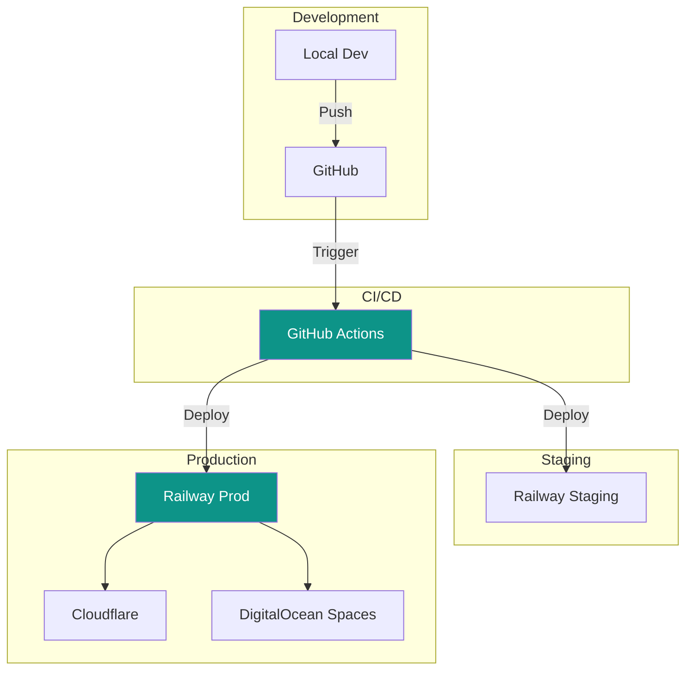

# Deployment

[← Back to Page Builder](../05-frontend/page-builder.md) | [Next: Monitoring →](./monitoring.md)

---

## Deployment Strategy



---

## Environment Architecture

| Environment | Purpose     | URL                     |
| ----------- | ----------- | ----------------------- |
| Local       | Development | `localhost:3000`        |
| Staging     | Testing     | `staging.baazarify.com` |
| Production  | Live        | `baazarify.com`         |

---

## Railway Configuration

### API Service

```yaml
# railway.toml
[build]
builder = "nixpacks"
buildCommand = "pnpm install && pnpm build"

[deploy]
startCommand = "pnpm start"
healthcheckPath = "/health"
healthcheckTimeout = 300
restartPolicyType = "on_failure"
restartPolicyMaxRetries = 3

[env]
NODE_ENV = "production"
PORT = "3000"
```

### Worker Service

```yaml
# railway.toml (worker)
[build]
builder = "nixpacks"
buildCommand = "pnpm install && pnpm build"

[deploy]
startCommand = "pnpm worker"
numReplicas = 2
```

### Environment Variables

```bash
# Database
MONGODB_URI=mongodb+srv://...
REDIS_URL=redis://...

# Auth
JWT_SECRET=your-secret-key
JWT_REFRESH_SECRET=your-refresh-secret

# Storage
S3_ENDPOINT=https://sgp1.digitaloceanspaces.com
S3_BUCKET=baazarify-assets
S3_ACCESS_KEY=...
S3_SECRET_KEY=...

# Integrations
TWILIO_ACCOUNT_SID=...
TWILIO_AUTH_TOKEN=...

# App
API_URL=https://api.baazarify.com
FRONTEND_URL=https://baazarify.com
```

---

## GitHub Actions CI/CD

```yaml
# .github/workflows/deploy.yml
name: Deploy

on:
  push:
    branches: [main, staging]

jobs:
  test:
    runs-on: ubuntu-latest
    steps:
      - uses: actions/checkout@v4

      - name: Setup pnpm
        uses: pnpm/action-setup@v2
        with:
          version: 8

      - name: Setup Node.js
        uses: actions/setup-node@v4
        with:
          node-version: '20'
          cache: 'pnpm'

      - name: Install dependencies
        run: pnpm install

      - name: Run linter
        run: pnpm lint

      - name: Run tests
        run: pnpm test
        env:
          MONGODB_URI: ${{ secrets.TEST_MONGODB_URI }}

  deploy-staging:
    needs: test
    if: github.ref == 'refs/heads/staging'
    runs-on: ubuntu-latest
    steps:
      - uses: actions/checkout@v4

      - name: Deploy to Railway (Staging)
        uses: railway/deploy-action@v1
        with:
          railway-token: ${{ secrets.RAILWAY_TOKEN }}
          service: baazarify-api-staging

  deploy-production:
    needs: test
    if: github.ref == 'refs/heads/main'
    runs-on: ubuntu-latest
    steps:
      - uses: actions/checkout@v4

      - name: Deploy to Railway (Production)
        uses: railway/deploy-action@v1
        with:
          railway-token: ${{ secrets.RAILWAY_TOKEN }}
          service: baazarify-api-prod

      - name: Deploy Storefront to Vercel
        uses: amondnet/vercel-action@v25
        with:
          vercel-token: ${{ secrets.VERCEL_TOKEN }}
          vercel-org-id: ${{ secrets.VERCEL_ORG_ID }}
          vercel-project-id: ${{ secrets.VERCEL_PROJECT_ID }}
          vercel-args: '--prod'

      - name: Deploy Dashboard to Cloudflare Pages
        uses: cloudflare/pages-action@v1
        with:
          apiToken: ${{ secrets.CLOUDFLARE_API_TOKEN }}
          accountId: ${{ secrets.CLOUDFLARE_ACCOUNT_ID }}
          projectName: baazarify-dashboard
          directory: dashboard/dist
          branch: main
```

---

## Cloudflare Configuration

### DNS Records

```
Type    Name                    Content                     TTL
A       baazarify.com           <Railway IP>                Auto
CNAME   www                     baazarify.com               Auto
CNAME   api                     baazarify-api.railway.app   Auto
CNAME   *.baazarify.com         baazarify-api.railway.app   Auto
```

### Page Rules

```
URL Pattern: *.baazarify.com/*
Settings:
  - SSL: Full (strict)
  - Cache Level: Standard
  - Edge Cache TTL: 1 month
  - Browser Cache TTL: 4 hours
```

### Cache Rules

```javascript
// For static assets
match: /\.(js|css|png|jpg|gif|svg|woff2)$/
cache: 1 year
immutable: true

// For API
match: /^\/api\//
cache: bypass

// For storefronts
match: *.baazarify.com
edge_ttl: 5 minutes
browser_ttl: 0
```

---

## Docker Configuration

For local development and future Kubernetes migration:

```dockerfile
# Dockerfile
FROM node:20-alpine AS base

# Install pnpm
RUN corepack enable && corepack prepare pnpm@8 --activate

WORKDIR /app

# Dependencies
FROM base AS deps
COPY package.json pnpm-lock.yaml ./
RUN pnpm install --frozen-lockfile

# Build
FROM base AS builder
COPY --from=deps /app/node_modules ./node_modules
COPY . .
RUN pnpm build

# Production
FROM base AS runner
ENV NODE_ENV=production

COPY --from=builder /app/dist ./dist
COPY --from=builder /app/node_modules ./node_modules
COPY --from=builder /app/package.json ./

EXPOSE 3000

CMD ["node", "dist/index.js"]
```

```yaml
# docker-compose.yml
version: '3.8'

services:
  api:
    build: .
    ports:
      - '3000:3000'
    environment:
      - MONGODB_URI=mongodb://mongo:27017/baazarify
      - REDIS_URL=redis://redis:6379
    depends_on:
      - mongo
      - redis

  worker:
    build: .
    command: ['node', 'dist/worker.js']
    environment:
      - MONGODB_URI=mongodb://mongo:27017/baazarify
      - REDIS_URL=redis://redis:6379
    depends_on:
      - mongo
      - redis

  mongo:
    image: mongo:7
    volumes:
      - mongo_data:/data/db
    ports:
      - '27017:27017'

  redis:
    image: redis:7-alpine
    ports:
      - '6379:6379'

volumes:
  mongo_data:
```

---

## Database Backups

### MongoDB Atlas (Managed)

- Continuous backups enabled
- Point-in-time recovery (last 7 days)
- Daily snapshots retained for 30 days

### Manual Backup Script

```bash
#!/bin/bash
# backup.sh

DATE=$(date +%Y-%m-%d)
BACKUP_DIR="/backups/${DATE}"

# Dump MongoDB
mongodump --uri="${MONGODB_URI}" --out="${BACKUP_DIR}"

# Compress
tar -czvf "${BACKUP_DIR}.tar.gz" "${BACKUP_DIR}"

# Upload to S3
aws s3 cp "${BACKUP_DIR}.tar.gz" "s3://baazarify-backups/${DATE}.tar.gz"

# Cleanup local
rm -rf "${BACKUP_DIR}" "${BACKUP_DIR}.tar.gz"

# Delete backups older than 30 days
aws s3 ls s3://baazarify-backups/ | awk '{print $4}' | while read file; do
  file_date=$(echo $file | cut -d'.' -f1)
  if [[ $(date -d "$file_date" +%s) -lt $(date -d "30 days ago" +%s) ]]; then
    aws s3 rm "s3://baazarify-backups/$file"
  fi
done
```

---

## SSL/TLS

### Cloudflare SSL

- Full (strict) mode
- Automatic HTTPS rewrites
- Minimum TLS 1.2

### Custom Domain SSL

For merchant custom domains:

```javascript
// services/domain.service.js
const provisionSSL = async (domain) => {
  // Using Cloudflare for SaaS
  const response = await cloudflare.customHostnames.create({
    zone_id: CLOUDFLARE_ZONE_ID,
    hostname: domain,
    ssl: {
      method: 'http',
      type: 'dv',
      settings: {
        min_tls_version: '1.2',
      },
    },
  });

  return response;
};
```

---

## Scaling Strategy

### Phase 1: MVP (0-50 stores)

```
┌─────────────────┐
│ Railway         │
│ ├── API (1x)    │
│ ├── Worker (1x) │
│ ├── MongoDB     │
│ └── Redis       │
└─────────────────┘
```

Cost: ~$30/month

### Phase 2: Growth (50-500 stores)

```
┌─────────────────────────────────────┐
│ Railway                              │
│ ├── API (2x replicas)               │
│ ├── Worker (2x replicas)            │
│ └── Redis                           │
├─────────────────────────────────────┤
│ MongoDB Atlas (M10)                 │
├─────────────────────────────────────┤
│ Cloudflare (Pro)                    │
│ DigitalOcean Spaces                 │
└─────────────────────────────────────┘
```

Cost: ~$150/month

### Phase 3: Scale (500+ stores)

```
┌─────────────────────────────────────┐
│ Kubernetes (DigitalOcean)           │
│ ├── API (3-5 pods, auto-scale)      │
│ ├── Worker (2-4 pods)               │
│ ├── Redis Cluster                   │
│ └── Load Balancer                   │
├─────────────────────────────────────┤
│ MongoDB Atlas (M30+, Replica Set)   │
├─────────────────────────────────────┤
│ Cloudflare (Business)               │
│ AWS S3                              │
└─────────────────────────────────────┘
```

Cost: ~$500+/month

---

## Zero-Downtime Deployment

```yaml
# Railway automatically handles this, but for K8s:
apiVersion: apps/v1
kind: Deployment
metadata:
  name: baazarify-api
spec:
  replicas: 3
  strategy:
    type: RollingUpdate
    rollingUpdate:
      maxSurge: 1
      maxUnavailable: 0
  template:
    spec:
      containers:
        - name: api
          readinessProbe:
            httpGet:
              path: /health
              port: 3000
            initialDelaySeconds: 5
            periodSeconds: 5
          livenessProbe:
            httpGet:
              path: /health
              port: 3000
            initialDelaySeconds: 15
            periodSeconds: 20
```

---

[Next: Monitoring →](./monitoring.md)
