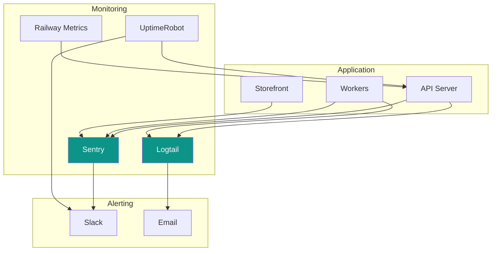

# Monitoring & Observability

[← Back to Deployment](./deployment.md) | [Next: Phase 1 MVP →](../07-roadmap/phase-1-mvp.md)

---

## Monitoring Stack



---

## Error Tracking (Sentry)

### Setup

```javascript
// lib/sentry.js
import * as Sentry from '@sentry/node';

Sentry.init({
  dsn: process.env.SENTRY_DSN,
  environment: process.env.NODE_ENV,
  release: process.env.COMMIT_SHA,

  // Performance monitoring
  tracesSampleRate: 0.1, // 10% of transactions

  // Filter sensitive data
  beforeSend(event) {
    // Remove sensitive headers
    if (event.request?.headers) {
      delete event.request.headers.authorization;
      delete event.request.headers.cookie;
    }
    return event;
  },

  // Ignore common errors
  ignoreErrors: ['Network request failed', 'Failed to fetch', 'Load failed'],
});

export { Sentry };
```

### Express Integration

```javascript
// app.js
import { Sentry } from './lib/sentry';

const app = express();

// Request handler must be first
app.use(Sentry.Handlers.requestHandler());

// TracingHandler for performance
app.use(Sentry.Handlers.tracingHandler());

// ... routes ...

// Error handler must be last
app.use(Sentry.Handlers.errorHandler());
```

### Custom Error Context

```javascript
// middleware/errorHandler.js
const errorHandler = (err, req, res, next) => {
  // Add context to Sentry
  Sentry.withScope((scope) => {
    scope.setTag('store_id', req.tenant?.id);
    scope.setTag('user_id', req.user?.id);
    scope.setTag('endpoint', `${req.method} ${req.path}`);

    scope.setContext('request', {
      body: req.body,
      query: req.query,
      params: req.params,
    });

    Sentry.captureException(err);
  });

  // ... send error response
};
```

---

## Logging (Logtail)

### Setup

```javascript
// lib/logger.js
import { Logtail } from '@logtail/node';
import { LogtailTransport } from '@logtail/winston';
import winston from 'winston';

const logtail = new Logtail(process.env.LOGTAIL_TOKEN);

const logger = winston.createLogger({
  level: process.env.LOG_LEVEL || 'info',
  format: winston.format.combine(
    winston.format.timestamp(),
    winston.format.errors({ stack: true }),
    winston.format.json()
  ),
  defaultMeta: {
    service: 'baazarify-api',
    environment: process.env.NODE_ENV,
  },
  transports: [
    new winston.transports.Console({
      format: winston.format.simple(),
    }),
    new LogtailTransport(logtail),
  ],
});

export { logger };
```

### Request Logging

```javascript
// middleware/requestLogger.js
import { logger } from '../lib/logger';

const requestLogger = (req, res, next) => {
  const start = Date.now();

  res.on('finish', () => {
    const duration = Date.now() - start;

    logger.info('HTTP Request', {
      method: req.method,
      path: req.path,
      status: res.statusCode,
      duration,
      store_id: req.tenant?.id,
      user_id: req.user?.id,
      ip: req.ip,
      user_agent: req.get('user-agent'),
    });
  });

  next();
};
```

### Structured Logging

```javascript
// Usage examples
logger.info('Order created', {
  order_id: order._id,
  store_id: order.storeId,
  total: order.totals.total,
  source: order.source,
});

logger.error('Payment failed', {
  order_id: orderId,
  provider: 'esewa',
  error: err.message,
  stack: err.stack,
});

logger.warn('Rate limit approaching', {
  store_id: storeId,
  current: 95,
  limit: 100,
});
```

---

## Uptime Monitoring (UptimeRobot)

### Monitors

| Monitor    | URL                                | Check Interval |
| ---------- | ---------------------------------- | -------------- |
| API Health | `https://api.baazarify.com/health` | 1 min          |
| Dashboard  | `https://dashboard.baazarify.com`  | 5 min          |
| Storefront | `https://demo.baazarify.com`       | 5 min          |

### Health Endpoint

```javascript
// routes/health.js
router.get('/health', async (req, res) => {
  const checks = {
    uptime: process.uptime(),
    timestamp: Date.now(),
    mongodb: 'unknown',
    redis: 'unknown',
  };

  try {
    // Check MongoDB
    await mongoose.connection.db.admin().ping();
    checks.mongodb = 'healthy';
  } catch {
    checks.mongodb = 'unhealthy';
  }

  try {
    // Check Redis
    await redis.ping();
    checks.redis = 'healthy';
  } catch {
    checks.redis = 'unhealthy';
  }

  const isHealthy = checks.mongodb === 'healthy' && checks.redis === 'healthy';

  res.status(isHealthy ? 200 : 503).json({
    status: isHealthy ? 'healthy' : 'unhealthy',
    checks,
  });
});
```

---

## Application Metrics

### Custom Metrics

```javascript
// lib/metrics.js
class Metrics {
  constructor() {
    this.counters = new Map();
    this.gauges = new Map();
    this.histograms = new Map();
  }

  increment(name, tags = {}) {
    const key = this.getKey(name, tags);
    const current = this.counters.get(key) || 0;
    this.counters.set(key, current + 1);
  }

  gauge(name, value, tags = {}) {
    const key = this.getKey(name, tags);
    this.gauges.set(key, value);
  }

  histogram(name, value, tags = {}) {
    const key = this.getKey(name, tags);
    const values = this.histograms.get(key) || [];
    values.push(value);
    this.histograms.set(key, values);
  }

  // Flush to logging/monitoring service
  flush() {
    const data = {
      counters: Object.fromEntries(this.counters),
      gauges: Object.fromEntries(this.gauges),
      histograms: this.calculateHistogramStats(),
    };

    logger.info('Metrics flush', data);

    // Reset
    this.counters.clear();
    this.histograms.clear();
  }
}

export const metrics = new Metrics();

// Flush every minute
setInterval(() => metrics.flush(), 60000);
```

### Usage

```javascript
// Track API latency
const start = Date.now();
await processRequest();
metrics.histogram('api.latency', Date.now() - start, {
  endpoint: req.path,
  method: req.method,
});

// Track orders
metrics.increment('orders.created', {
  store_id: storeId,
  source: 'website',
});

// Track active stores
metrics.gauge('stores.active', await getActiveStoreCount());
```

---

## Alerting

### Slack Integration

```javascript
// lib/alerts.js
import { WebClient } from '@slack/web-api';

const slack = new WebClient(process.env.SLACK_TOKEN);

const sendAlert = async (level, message, details = {}) => {
  const colors = {
    critical: '#dc2626', // red
    warning: '#f59e0b', // yellow
    info: '#0d9488', // teal
  };

  await slack.chat.postMessage({
    channel: '#baazarify-alerts',
    attachments: [
      {
        color: colors[level],
        title: `${level.toUpperCase()}: ${message}`,
        fields: Object.entries(details).map(([key, value]) => ({
          title: key,
          value: String(value),
          short: true,
        })),
        ts: Math.floor(Date.now() / 1000),
      },
    ],
  });
};

// Usage
await sendAlert('critical', 'Database connection lost', {
  host: 'mongodb.example.com',
  error: err.message,
});
```

### Alert Rules

| Condition                      | Severity | Action      |
| ------------------------------ | -------- | ----------- |
| API down > 1 min               | Critical | Slack + SMS |
| Error rate > 5%                | Critical | Slack       |
| Response time > 2s (p95)       | Warning  | Slack       |
| MongoDB slow query > 5s        | Warning  | Slack       |
| Disk usage > 80%               | Warning  | Slack       |
| Failed payment > 3 consecutive | Warning  | Slack       |

---

## Dashboard

### Key Metrics to Display

```
┌────────────────────────────────────────────────────────────┐
│                     BAAZARIFY DASHBOARD                     │
├─────────────────────┬──────────────────────────────────────┤
│ Active Stores: 156  │ Orders Today: 423                    │
│ Error Rate: 0.12%   │ Revenue Today: NPR 1,250,000         │
├─────────────────────┴──────────────────────────────────────┤
│                                                             │
│  ┌─────────────────────────────────────────────────────┐   │
│  │ Response Time (p95)                                  │   │
│  │ ▂▃▃▄▅▃▂▂▃▄▅▆▅▄▃▂▂▃▃▄▅▄▃▂▂▃▄▅▄▃▂ 145ms              │   │
│  └─────────────────────────────────────────────────────┘   │
│                                                             │
│  ┌─────────────────────────────────────────────────────┐   │
│  │ Requests/min                                         │   │
│  │ ▁▂▃▄▅▆▇█▇▆▅▄▃▂▁▂▃▄▅▆▇▆▅▄▃▂▁▂▃▄ 850 req/min         │   │
│  └─────────────────────────────────────────────────────┘   │
│                                                             │
│  ┌───────────────────────┐ ┌───────────────────────────┐   │
│  │ Top Errors (24h)      │ │ Slow Endpoints            │   │
│  │ • DB timeout: 12      │ │ • POST /orders: 850ms     │   │
│  │ • Auth failed: 45     │ │ • GET /analytics: 1.2s    │   │
│  │ • Validation: 89      │ │ • POST /products: 450ms   │   │
│  └───────────────────────┘ └───────────────────────────┘   │
└────────────────────────────────────────────────────────────┘
```

---

## Performance Monitoring

### Database Query Logging

```javascript
// Enable MongoDB profiling
mongoose.set('debug', (collectionName, methodName, ...args) => {
  logger.debug('MongoDB Query', {
    collection: collectionName,
    method: methodName,
    query: JSON.stringify(args[0]),
    duration: args[args.length - 1],
  });
});

// Slow query alert
mongoose.plugin((schema) => {
  schema.pre(/^find/, function () {
    this._startTime = Date.now();
  });

  schema.post(/^find/, function () {
    const duration = Date.now() - this._startTime;
    if (duration > 1000) {
      logger.warn('Slow MongoDB query', {
        collection: this.mongooseCollection.name,
        query: this.getQuery(),
        duration,
      });
    }
  });
});
```

### Redis Monitoring

```javascript
// Track Redis latency
const redisWithMetrics = {
  async get(key) {
    const start = Date.now();
    const result = await redis.get(key);
    metrics.histogram('redis.latency', Date.now() - start, {
      operation: 'get',
    });
    return result;
  },
  // ... other methods
};
```

---

## Incident Response

### Runbook Template

```markdown
# Incident: [Title]

## Detection

- Time detected:
- How detected: (alert/customer report/monitoring)
- Affected systems:

## Impact

- Users affected:
- Revenue impact:
- Duration:

## Timeline

- HH:MM - Issue detected
- HH:MM - Investigation started
- HH:MM - Root cause identified
- HH:MM - Fix deployed
- HH:MM - Issue resolved

## Root Cause

[Description of what went wrong]

## Resolution

[What was done to fix it]

## Prevention

[What will be done to prevent recurrence]
```

---

[Next: Phase 1 MVP →](../07-roadmap/phase-1-mvp.md)
