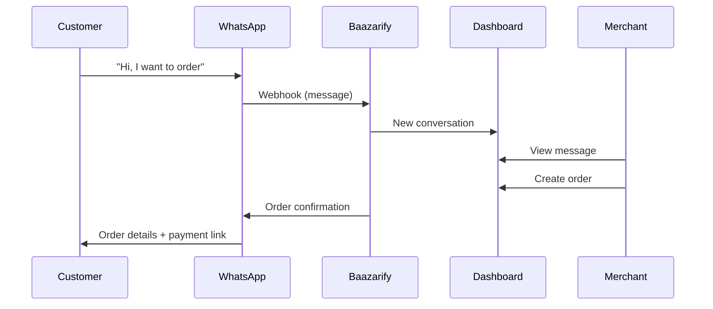

# Phase 2: Growth

[← Back to Phase 1 MVP](./phase-1-mvp.md) | [Next: Phase 3 Scale →](./phase-3-scale.md)

---

## Overview

Expand features to support 500+ merchants and increase platform stickiness.

**Timeline:** 3-4 months (after MVP)

**Goal:** Become the go-to e-commerce platform for Nepali businesses.

---

## Phase 2 Features

### High Priority

| Feature | Value | Effort |
|---------|-------|--------|
| Page builder (GrapeJS) | Brand differentiation | 3 weeks |
| WhatsApp integration | Order capture | 2 weeks |
| Instagram integration | Order capture | 2 weeks |
| Khalti + Fonepay | More payment options | 1 week |
| Product variants | Complex products | 1.5 weeks |
| Staff accounts | Team collaboration | 1 week |

### Medium Priority

| Feature | Value | Effort |
|---------|-------|--------|
| Pathao logistics | Shipping automation | 1.5 weeks |
| SMS notifications | Customer engagement | 1 week |
| Discount codes | Marketing tool | 1 week |
| Custom domains | Branding | 1 week |
| Advanced analytics | Insights | 1.5 weeks |
| Bulk operations | Efficiency | 1 week |

### Lower Priority

| Feature | Value | Effort |
|---------|-------|--------|
| Product reviews | Social proof | 1 week |
| Wishlist | Engagement | 0.5 week |
| Multi-language | Accessibility | 1 week |
| Export/import | Data management | 1 week |

---

## Feature Details

### Page Builder

Full GrapeJS integration with e-commerce blocks:

```
Components:
├── Hero Banner (customizable)
├── Product Grid (dynamic)
├── Featured Products
├── Category Showcase
├── Testimonials
├── Contact Form
├── Store Info
├── Custom HTML
└── Image Gallery
```

**User Flow:**
1. Merchant opens Page Builder
2. Drags blocks onto canvas
3. Customizes text, colors, images
4. Previews on mobile/tablet/desktop
5. Publishes page

### Social Commerce Integration

**WhatsApp Flow:**



**Instagram Flow:**
- Connect Instagram Business account
- Receive DMs in unified inbox
- Convert conversations to orders
- Send product cards

### Product Variants

```javascript
// Variant structure
{
  name: "Color / Size",
  sku: "TSH-RED-L",
  price: 850,  // Override or null
  stock: 25,
  attributes: [
    { name: "Color", value: "Red" },
    { name: "Size", value: "L" }
  ]
}
```

**UI:**
- Variant generator (Color × Size matrix)
- Individual SKU/price/stock per variant
- Variant images

### Staff Accounts

```
Roles:
├── Owner (full access)
├── Manager (all except settings)
├── Staff (orders + customers)
└── Viewer (read-only)

Permissions:
├── orders.read, orders.write, orders.delete
├── products.read, products.write, products.delete
├── customers.read, customers.write
├── inventory.read, inventory.write
├── analytics.read
├── settings.read, settings.write
└── staff.manage
```

### Logistics Integration

**Pathao Integration:**

```javascript
// Create shipment flow
1. Order status → "Ready for Pickup"
2. Call Pathao API → Create order
3. Store tracking number
4. Schedule pickup
5. Notify customer with tracking link
```

**Supported Providers (Phase 2):**
- Pathao
- Dash

**Webhook Events:**
- `shipment.picked_up`
- `shipment.in_transit`
- `shipment.delivered`
- `shipment.failed`

### Discount Codes

```javascript
// Discount types
{
  type: 'percentage' | 'fixed',
  value: 10,  // 10% or NPR 100
  code: 'SAVE10',
  minOrderValue: 1000,
  maxDiscount: 500,
  usageLimit: 100,
  perCustomerLimit: 1,
  validFrom: Date,
  validTo: Date,
  appliesTo: 'all' | 'categories' | 'products'
}
```

### Custom Domains

```
Setup Flow:
1. Merchant enters domain (shop.example.com)
2. System provides CNAME record
3. Merchant updates DNS
4. System verifies DNS
5. Provision SSL via Cloudflare for SaaS
6. Domain goes live
```

---

## Development Timeline

### Month 1: Core Enhancements

```
Week 1-2: Product Variants
├── Variant data model
├── Variant API endpoints
├── Variant UI (create/edit)
├── Storefront variant picker
└── Inventory per variant

Week 3-4: Staff Accounts
├── User roles & permissions
├── Staff invitation flow
├── Permission middleware
├── Staff management UI
└── Audit logging
```

### Month 2: Page Builder

```
Week 1: GrapeJS Setup
├── Editor integration
├── Custom blocks
├── Storage adapter
└── Preview system

Week 2: E-commerce Blocks
├── Product grid block
├── Dynamic data loading
├── Hero customization
└── Testimonials

Week 3: Polish & Pages
├── Multiple pages support
├── Page management UI
├── Publish flow
└── SEO settings

Week 4: Renderer
├── Storefront rendering
├── Component hydration
├── Performance optimization
└── Mobile responsiveness
```

### Month 3: Social & Payments

```
Week 1-2: WhatsApp Integration
├── Twilio setup
├── Webhook handling
├── Conversation inbox
├── Order conversion
└── Template messages

Week 3: Instagram Integration
├── Graph API connection
├── DM handling
├── Product cards
└── Unified inbox

Week 4: Additional Payments
├── Khalti integration
├── Fonepay integration
├── Payment selector UI
└── Transaction history
```

### Month 4: Logistics & Polish

```
Week 1-2: Logistics
├── Pathao integration
├── Rate calculator
├── Shipment creation
├── Tracking sync
└── Webhook handling

Week 3: Features
├── Discount codes
├── SMS notifications
├── Custom domains
└── Advanced analytics

Week 4: Testing & Launch
├── Feature testing
├── Performance optimization
├── Documentation
└── Merchant migration
```

---

## Technical Changes

### Database Updates

```javascript
// New collections
conversations: {
  storeId, channel, contact, messages[], status, orderId
}

discounts: {
  storeId, code, type, value, conditions, usage
}

// Updated collections
users: {
  + permissions[]
  + invitedBy
}

stores: {
  + pages[]  // GrapeJS data
  + customDomain
  + sslStatus
  + integrations.whatsapp
  + integrations.instagram
  + integrations.logistics
}

products: {
  + hasVariants
  + variants[]
}
```

### API Additions

```
Staff:
  GET    /stores/me/staff
  POST   /stores/me/staff
  PUT    /stores/me/staff/:id
  DELETE /stores/me/staff/:id

Conversations:
  GET    /conversations
  GET    /conversations/:id
  POST   /conversations/:id/reply
  POST   /conversations/:id/convert
  PUT    /conversations/:id/status

Pages:
  GET    /pages
  POST   /pages
  GET    /pages/:slug
  PUT    /pages/:slug
  DELETE /pages/:slug

Discounts:
  GET    /discounts
  POST   /discounts
  PUT    /discounts/:id
  DELETE /discounts/:id
  POST   /discounts/validate

Logistics:
  POST   /integrations/logistics/configure
  POST   /integrations/logistics/rates
  POST   /integrations/logistics/shipments
  GET    /integrations/logistics/track/:id

Domains:
  POST   /stores/me/domain
  POST   /stores/me/domain/verify
  DELETE /stores/me/domain
```

---

## Infrastructure Scaling

### Before Phase 2

```
Railway:
├── API (1 instance)
├── Worker (1 instance)
├── MongoDB (shared M2)
└── Redis (shared)
```

### After Phase 2

```
Railway:
├── API (2 instances, auto-scale)
├── Worker (2 instances)
└── Redis (dedicated)

MongoDB Atlas:
└── M10 (dedicated)

Cloudflare:
└── Pro plan (for SaaS SSL)

DigitalOcean:
└── Spaces (increased storage)
```

**Monthly Cost:** ~$100-150

---

## Success Metrics

| Metric | Target |
|--------|--------|
| Active stores | 500 |
| Monthly orders | 25,000 |
| WhatsApp orders | 30% of total |
| Page builder adoption | 50% of stores |
| Staff accounts | 200 |
| Custom domains | 50 |

---

## Migration Plan

### Existing Merchants

1. Announce new features via email
2. Enable features gradually (feature flags)
3. Provide tutorials and documentation
4. Offer migration support for complex setups

### Data Migration

- No breaking changes to existing schema
- New fields have defaults
- Variants opt-in (existing products unchanged)

---

[Next: Phase 3 Scale →](./phase-3-scale.md)
