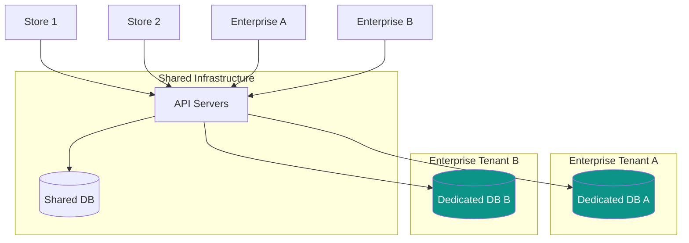
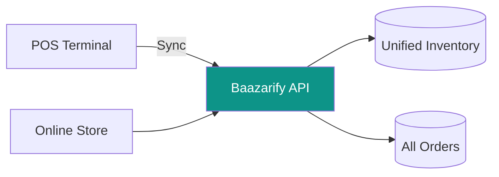

# Phase 3: Scale

[← Back to Phase 2 Growth](./phase-2-growth.md) | [Back to Index →](../index.md)

---

## Overview

Enterprise features and infrastructure scaling for 1000+ merchants.

**Timeline:** 6+ months (ongoing)

**Goal:** Platform sustainability and enterprise market penetration.

---

## Phase 3 Features

### Enterprise Features

| Feature | Value | Effort |
|---------|-------|--------|
| Dedicated databases | Data isolation | 2 weeks |
| White-label | Agency reselling | 3 weeks |
| API access | Custom integrations | 2 weeks |
| POS integration | Omnichannel retail | 4 weeks |
| B2B features | Wholesale support | 3 weeks |
| Multi-store | Brand portfolios | 2 weeks |

### Platform Features

| Feature | Value | Effort |
|---------|-------|--------|
| Marketplace | Cross-store discovery | 4 weeks |
| App ecosystem | Third-party plugins | 4 weeks |
| Advanced analytics | BI dashboards | 3 weeks |
| AI features | Smart automation | Ongoing |

### Infrastructure

| Feature | Value | Effort |
|---------|-------|--------|
| Kubernetes migration | Scalability | 3 weeks |
| Multi-region | Performance | 2 weeks |
| Read replicas | Query performance | 1 week |
| CDN optimization | Global speed | 1 week |

---

## Enterprise Features Detail

### Dedicated Databases

For Platinum/Enterprise plans:



**Benefits:**
- Complete data isolation
- Custom backup schedules
- Dedicated resources
- Compliance requirements

### White-Label Solution

Allow agencies to resell Baazarify:

```
White-Label Features:
├── Custom branding
│   ├── Logo replacement
│   ├── Color scheme
│   └── Email templates
├── Custom domain
│   ├── dashboard.agency.com
│   └── *.agency.com (storefronts)
├── Billing management
│   ├── Agency sets pricing
│   ├── Agency collects payment
│   └── Revenue share model
└── Client management
    ├── Sub-merchant creation
    ├── Usage monitoring
    └── Support escalation
```

### API Access

Public API for custom integrations:

```
API Features:
├── REST API (v1)
├── Webhooks
│   ├── order.created
│   ├── order.updated
│   ├── product.updated
│   ├── inventory.low
│   └── payment.received
├── Rate limits by plan
│   ├── Basic: 100/min
│   ├── Premium: 500/min
│   └── Enterprise: 2000/min
├── API keys management
└── Usage analytics
```

### POS Integration

Connect physical retail with online:

```
POS Features:
├── Barcode scanning
├── Quick product lookup
├── Unified inventory
├── Walk-in orders
├── Receipt printing
├── Cash drawer integration
├── Daily reconciliation
└── Staff time tracking
```

**Architecture:**



### B2B Features

Wholesale and business customer support:

```
B2B Capabilities:
├── Tiered pricing
│   ├── Retail price
│   ├── Wholesale price
│   └── Custom price lists
├── Minimum order quantities
├── Net payment terms
├── Quote requests
├── Bulk ordering
├── Purchase orders
└── Credit accounts
```

### Multi-Store

Manage multiple brands from one account:

```
Multi-Store Structure:
├── Parent Account
│   ├── Store A (Fashion)
│   ├── Store B (Electronics)
│   └── Store C (Home)
├── Shared resources
│   ├── Inventory pool
│   ├── Customer database
│   └── Staff accounts
└── Separate branding
    ├── Individual domains
    ├── Different themes
    └── Unique storefronts
```

---

## Platform Features Detail

### Marketplace

Cross-store product discovery:

```
Marketplace Model:
├── Featured stores
├── Category browsing
├── Search across stores
├── Unified checkout
├── Commission model
└── Store ratings
```

### App Ecosystem

Third-party plugin support:

```
Plugin System:
├── Plugin manifest (JSON)
├── Webhook subscriptions
├── API access (scoped)
├── Dashboard widgets
├── Storefront blocks
└── Revenue sharing

Example Plugins:
├── Accounting (sync to ERPNext)
├── Marketing (email campaigns)
├── Shipping (new providers)
├── Analytics (advanced reports)
└── Customer support (chat widgets)
```

### AI Features

Intelligent automation:

```
AI Capabilities:
├── Product descriptions
│   └── Generate from images
├── Pricing suggestions
│   └── Based on market data
├── Inventory forecasting
│   └── Predict stock needs
├── Customer support
│   └── Auto-reply to common questions
├── Fraud detection
│   └── Flag suspicious orders
└── Personalization
    └── Product recommendations
```

---

## Infrastructure Scaling

### Kubernetes Migration

```yaml
# Deployment architecture
Kubernetes Cluster:
├── Namespace: production
│   ├── Deployment: api (3-10 replicas)
│   ├── Deployment: worker (2-5 replicas)
│   ├── Deployment: storefront (3-10 replicas)
│   ├── Service: api-lb
│   ├── Service: storefront-lb
│   ├── HPA: api (CPU > 70%)
│   └── HPA: worker (queue length > 100)
├── Namespace: staging
└── Namespace: monitoring
    ├── Prometheus
    ├── Grafana
    └── Alertmanager
```

### Multi-Region

```
Regions:
├── Primary: Singapore (closest to Nepal)
│   ├── Full stack
│   └── Write operations
├── Secondary: Mumbai
│   ├── Read replicas
│   └── CDN edge
└── CDN: Cloudflare (global)
```

### Database Scaling

```
MongoDB Architecture:
├── Replica Set (3 nodes)
│   ├── Primary (writes)
│   ├── Secondary (reads)
│   └── Secondary (analytics)
├── Read preference
│   ├── Writes → Primary
│   ├── Dashboard → Secondary
│   └── Analytics → Secondary (analytics)
└── Sharding (future)
    └── Shard by storeId
```

---

## Pricing Evolution

### Phase 3 Pricing (Proposed)

| Plan | Price/Year | Features |
|------|------------|----------|
| Free | NPR 0 | 15 products, basic |
| Starter | NPR 12,000 | 500 products, 1 staff |
| Growth | NPR 24,000 | 2,000 products, 5 staff |
| Pro | NPR 48,000 | 5,000 products, 25 staff, API |
| Enterprise | Custom | Unlimited, dedicated, SLA |

### White-Label Pricing

```
Agency Partnership:
├── Setup fee: NPR 100,000
├── Monthly fee: NPR 25,000
├── Revenue share: 20%
└── Minimum commitment: 12 months
```

---

## Team Scaling

### Phase 1 (Solo)

```
You:
├── Full-stack development
├── DevOps
├── Customer support
└── Marketing
```

### Phase 2 (Small Team)

```
Team (3-4):
├── You: Lead + Backend
├── Frontend Developer
├── Customer Success
└── Marketing (part-time)
```

### Phase 3 (Growth Team)

```
Team (8-12):
├── Engineering (4-5)
│   ├── Backend Lead
│   ├── Frontend Lead
│   ├── Full-stack
│   └── DevOps
├── Product (2)
│   ├── Product Manager
│   └── Designer
├── Customer Success (2-3)
│   ├── Support Lead
│   ├── Success Manager
│   └── Onboarding Specialist
└── Business (2)
    ├── Sales
    └── Marketing
```

---

## Financial Projections

### Year 1 (MVP + Growth)

```
Stores: 500
Average Revenue/Store: NPR 2,000/month
Monthly Revenue: NPR 1,000,000 (≈$7,500)
Costs: NPR 200,000/month
Profit: NPR 800,000/month
```

### Year 2 (Scale)

```
Stores: 2,000
Average Revenue/Store: NPR 2,500/month
Monthly Revenue: NPR 5,000,000 (≈$37,500)
Costs: NPR 1,000,000/month
Profit: NPR 4,000,000/month
```

### Year 3 (Market Leader)

```
Stores: 5,000
Enterprise Clients: 50
Average Revenue/Store: NPR 3,000/month
Monthly Revenue: NPR 17,000,000 (≈$127,500)
```

---

## Exit Strategies

### Acquisition Targets

```
Potential Acquirers:
├── Regional e-commerce platforms (Daraz, etc.)
├── Payment companies (eSewa, Khalti)
├── International SaaS (Shopify, etc.)
└── Investment firms
```

### IPO Path

```
Requirements:
├── NPR 500M+ annual revenue
├── Profitability track record
├── Strong growth metrics
└── Corporate governance
```

### Sustainable Business

```
Long-term Independent:
├── Market leader in Nepal
├── Expand to other South Asian markets
├── Build technology moat
└── Strong brand value
```

---

## Long-Term Vision

```
Year 5 Vision:
├── 10,000+ active stores
├── NPR 50M+ monthly GMV
├── Expansion to Bangladesh, Sri Lanka
├── Full e-commerce ecosystem
│   ├── Marketplace
│   ├── Payments (Baazarify Pay)
│   ├── Logistics (Baazarify Ship)
│   └── Financing (Baazarify Capital)
└── The "Shopify of South Asia"
```

---

## Summary

Phase 3 transforms Baazarify from a product into a platform:

1. **Enterprise features** capture high-value customers
2. **White-label** enables channel partners
3. **API ecosystem** builds developer community
4. **Infrastructure scaling** ensures reliability
5. **Team growth** enables execution

The goal is sustainable, profitable growth while building a defensible market position in Nepal's e-commerce infrastructure.

---

[Back to Index →](../index.md)
