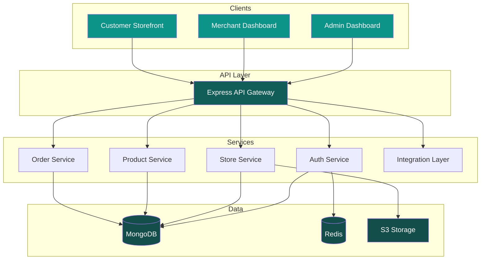

# Baazarify System Design

**Nepal's Modern E-Commerce Platform**

*Build your online store, manage orders, grow your business*

---

## Quick Navigation

| Section | Description |
|---------|-------------|
| [Overview](./01-overview/vision.md) | Product vision, architecture, tech stack |
| [Database](./02-database/schema.md) | Schema design, indexing, multi-tenancy |
| [API](./03-api/overview.md) | RESTful endpoints, authentication |
| [Services](./04-services/core-services.md) | Business logic, integrations |
| [Frontend](./05-frontend/dashboard.md) | Dashboard, storefront, page builder |
| [Infrastructure](./06-infrastructure/deployment.md) | Deployment, monitoring |
| [Roadmap](./07-roadmap/phase-1-mvp.md) | MVP → Growth → Scale |

---

## What is Baazarify?

Baazarify is a **multi-tenant e-commerce SaaS platform** built for the Nepali market. It enables merchants to:

- Create customizable online stores with drag-and-drop builder
- Manage orders from multiple channels (Website, WhatsApp, Instagram)
- Track inventory in real-time
- Accept payments via local gateways (eSewa, Khalti, Fonepay)
- Ship products through integrated logistics partners

---

## Architecture at a Glance

---

## Tech Stack Summary

| Layer | Technology |
|-------|------------|
| **Frontend** | React 18, Next.js 14 (storefront), TailwindCSS |
| **Page Builder** | GrapeJS with custom e-commerce blocks |
| **Backend** | Node.js, Express.js |
| **Database** | MongoDB (primary), Redis (cache/sessions) |
| **Storage** | S3-compatible (DigitalOcean Spaces / AWS S3) |
| **Messaging** | Twilio (WhatsApp), Instagram Graph API |
| **Payments** | Pluggable (eSewa, Khalti, Fonepay) |
| **Logistics** | Pluggable (Pathao, Dash, NCM) |
| **Hosting** | Railway / Render (MVP), VPS (scale) |

---

## Development Phases

### Phase 1: MVP
Core platform with essential features for first 50 merchants.

→ [Phase 1 Details](./07-roadmap/phase-1-mvp.md)

### Phase 2: Growth
Advanced features, more integrations, optimization.

→ [Phase 2 Details](./07-roadmap/phase-2-growth.md)

### Phase 3: Scale
Enterprise features, dedicated databases, white-label.

→ [Phase 3 Details](./07-roadmap/phase-3-scale.md)

---

## Design Principles

1. **Simplicity First** — Easy for merchants with zero technical knowledge
2. **Mobile-First** — 80%+ of Nepal's internet users are on mobile
3. **Offline-Resilient** — Graceful handling of poor connectivity
4. **Local-First** — Nepali payment gateways, logistics, language support
5. **Extensible** — Plugin architecture for future integrations

---

**[Get Started →](./01-overview/vision.md)**

